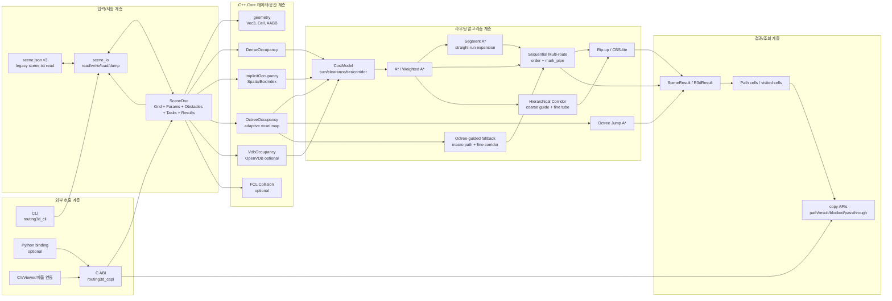

# Routing3D C++ 엔진 분석 및 API 사용설명서

분석 대상: `D:\DINNO\DEV\AI-AutoRouting\Routing3D\cpp`  
작성일: 2026-06-15  
갱신일시: 2026-06-21 00:00:00 KST
소스수정 버전: 2026.06.21-segment-octree-guide-route-split
소스수정 일시: 2026-06-21 00:00:00 KST
소스수정 내용: Segment A* JPS-3D-lite 후보 생성, Anytime A* 시간 budget/개선 API, TruckIn/Middle/Terminal 자동 분할 라우팅, chunk/portal HPA* route_hier 확장, Octree-guided macro path + fine corridor fallback, Trace Replay Viewer 경로/점유 샘플 표시 갱신
최근 업데이트: 2026-06-21, JPS-3D-lite, Anytime A*, TruckIn/Middle/Terminal 자동 분할, chunk/portal HPA* route_hier 확장 문서화
범위: C++ 코어 엔진, 점유맵 백엔드, A*/Segment A* 라우팅, 옥트리 점프/가이드 라우팅, 다중 배관 처리, CBS-lite 협상 라우팅, scene.json JSON 저장 포맷, C ABI, C# managed wrapper/tutorial, CLI, 선택 기능(OpenVDB/FCL/Python binding)

## 갱신내용

| 일시 | 구분 | 갱신 내용 | 영향 |
|---|---|---|---|
| 2026-06-21 00:00:00 KST | 소스 v2026.06.21 | `RouteParams.use_segment_astar`, `segment_max_cells`, `segment_jps_lite`, `astar_segmented()` 추가/보강. C API는 기존 `r3d_set_segment_astar()` 경로 사용 | Segment A*가 목표축 projection, forced-neighbor obstacle-edge, ray end만 후보로 넣는 JPS-3D-lite 방식으로 동작. 기본 OFF라 골든 경로는 유지 |
| 2026-06-21 00:00:00 KST | C API / 다중 라우팅 | `r3d_set_route_split()` 추가. 한 task를 TruckIn 수직 구간, Middle trunk 주행 구간, Terminal 수직 구간으로 자동 분할해 각 segment를 기존 Segment A*/Weighted A*로 순차 탐색 | 전체 탐색 깊이를 줄이고 TruckIn/Middle/Terminal 병렬화 전 단계의 deterministic task 분할을 제공. 기본 OFF, 실패 시 direct 라우팅 fallback |
| 2026-06-21 00:00:00 KST | C API / 단일 라우팅 | `r3d_route_task_anytime()`과 `route_anytime_weighted()` 추가. 초기 가중치에서 시작해 시간 budget 안에서 가중치를 낮추며 incumbent 경로를 개선 | 빠른 최초 경로와 점진 개선을 단일 API로 제공. 결과는 기존 `R3dResult`/`r3d_copy_path()`와 호환 |
| 2026-06-21 00:00:00 KST | C API / 계층 라우팅 | `route_hier()`를 chunk/portal 기반 HPA* macro guide로 확장. `hpa_macro_path()`가 portal graph를 먼저 찾고 실패 시 기존 coarse A*로 fallback | 대형 격자에서 coarse 전체 A* 전에 portal 추상 그래프를 사용해 guide path 탐색 범위를 축소. fine A* 검증은 기존과 동일 |
| 2026-06-21 00:00:00 KST | C API / 다중 라우팅 | `r3d_set_octree_guide()`와 `route_octree_guided()` 추가. probe 이후 Octree Jump A* macro path를 만들고 fine A*를 corridor 내부에서 재시도 | 대형/혼잡 공간에서 hierarchical corridor 전에 옥트리 기반 macro-guide를 opt-in fallback으로 사용할 수 있음 |
| 2026-06-21 00:00:00 KST | 진단/Viewer | Trace Replay Viewer 문서 갱신: `occupancy_sample`, `passthrough_sample`, `route_path`, Path Playback, 점유/통과 레이어 설명 추가 | 실패 원인, 최종 경로, 샘플 점유맵을 재생 기반으로 확인 가능 |
| 2026-06-21 00:00:00 KST | 문서 | 2026-06-20 WTNHJ02 CLEAN Exhaust 20개 배관 6방식(S1~S6) 비교와 적용부분 표 추가 | 기본 A*, PoC snap, stub, corridor, rack/bundle, follow-existing repair의 적용 단계와 운영 판단을 한눈에 확인 |
| 2026-06-19 12:22:02 KST | 소스 v2026.06.19-fix5 | 우선 보완 5건 반영: `cbs_expansions`, CBS 결과 진단값 보존, `r3d_route_task_octree()` visited length, `r3d_enum_octree_leaves()` size-query, `r3d_copy_blocked_sampled()`/Viewer sampled preview 개선 | 대형 scene UI preview 메모리 사용 감소, 옥트리/CBS 결과 조회 정확도 향상, C#/C API 계약 명확화 |
| 2026-06-19 11:49:50 KST | C API | `route_multi_impl()`의 CBS-lite 실행 조건에서 `large_grid` 제한이 제거됨 | `r3d_set_cbs_depth(depth>0)`가 켜져 있고 실패 task가 남아 있으면 소형/대형 격자 모두에서 blocker-of-blocker 재귀 양보를 시도 |
| 2026-06-19 11:49:50 KST | C# Viewer | `UseCbs` 옵션과 "협상 라우팅(CBS)" 체크박스 추가 | UI에서 CBS-lite를 opt-in으로 켜면 `SetCbsDepth(2)`, 끄면 `SetCbsDepth(0)` 적용 |
| 2026-06-19 11:49:50 KST | 문서 | CBS-lite 설명, 권장 사용 패턴, C# Viewer 연동 설명 갱신 | 대형 격자 fallback 전용이라는 오해를 제거하고 운영 옵션으로 정리 |

---

## 소프트웨어 구성도

Routing3D C++ 엔진은 `SceneDoc`를 중심 데이터 모델로 두고, 입력/저장 계층, 점유맵 계층, 라우팅 알고리즘 계층, 외부 연동 계층이 분리되어 동작한다. C API는 제품 연동용 facade 역할을 하며, 내부에서는 Dense/Implicit/OpenVDB/Octree 점유맵 중 빌드 옵션, 격자 규모, 호출 API에 맞는 백엔드를 선택한다.



구성 관점에서 핵심 의존성은 다음과 같다.

| 계층 | 대표 모듈 | 책임 | 주요 산출물 |
|---|---|---|---|
| 외부 호출 | `routing3d_cli`, `routing3d_capi` | 실행 파일/ABI 진입점 제공 | route 실행, scene dump/load, 결과 복사 |
| 저장/직렬화 | `scene_io.hpp/.cpp` | `scene.json` v3 쓰기/읽기, legacy `scene.txt` 읽기 | `SceneDoc` |
| 데이터 모델 | `geometry.hpp`, `route_task.hpp`, `cost.hpp` | 좌표, 작업, 비용 파라미터 표현 | `Vec3`, `Cell`, `AABB`, `RouteTask`, `RouteParams` |
| 점유맵 | `occupancy.hpp`, `octree_occupancy.hpp`, `vdb_occupancy.hpp`, `box_index.hpp` | 장애물/배관 점유 질의 및 복사 | Dense/Implicit/Octree/OpenVDB backend |
| 단일 경로 | `astar.hpp`, `cost.hpp` | weighted A*, Segment A* 탐색 및 비용 계산 | `AStarResult` |
| 다중 경로 | `multi_route.hpp`, C API 내부 orchestration | 작업 정렬, 순차 라우팅, 배관 점유 반영 | `MultiRouteResult`, `SceneResult` |
| 대형 격자 | `corridor.hpp`, `ImplicitOccupancy`, `OctreeOccupancy`, `VdbOccupancy` | coarse/fine corridor, sparse 점유, adaptive voxel 처리, octree macro-guide | 대형 격자 경로, 옥트리 leaf, 점유 셀 열거 |
| 선택 기능 | `fcl_scene.hpp`, OpenVDB/FCL build option | 정밀 충돌 검증, 압축 점유맵 | 충돌 검사 결과, active voxel |

## 1. 엔진 개요

Routing3D C++ 엔진은 3D 공간을 정육면체 격자(cell)로 이산화하고, 장애물 및 이미 배치된 배관을 점유 셀로 관리한 뒤, 시작점과 끝점을 6방향 직교 경로로 연결하는 라우팅 엔진이다.

주요 구성은 다음과 같다.

| 구분 | 주요 파일 | 역할 |
|---|---|---|
| 기하/좌표 | `include/routing3d/geometry.hpp` | `Vec3`, `Cell`, `AABB`, world-cell 변환 |
| 점유맵 | `include/routing3d/occupancy.hpp`, `src/occupancy.cpp`, `src/sparse_occupancy.cpp`, `include/routing3d/octree_occupancy.hpp`, `include/routing3d/vdb_occupancy.hpp`, `src/vdb_occupancy.cpp` | Dense/Sparse/Implicit/Octree/OpenVDB 기반 점유 질의 |
| 비용모델 | `include/routing3d/cost.hpp` | 회전, clearance, tier, corridor 비용 |
| 단일 경로탐색 | `include/routing3d/astar.hpp` | 균일 비용 A*, weighted A*, Segment A* |
| 다중 라우팅 | `include/routing3d/multi_route.hpp`, `capi/routing3d_capi.cpp` | 순차 라우팅, Segment A* opt-in, Octree-guided fallback, 배관 점유 반영, rip-up, CBS-lite |
| 계층 corridor | `include/routing3d/corridor.hpp` | coarse guide + fine tube 라우팅 |
| 저장/로드 | `include/routing3d/scene_io.hpp`, `src/scene_io.cpp` | `scene.json` 직렬화/역직렬화 |
| C API | `capi/routing3d_capi.h`, `capi/routing3d_capi.cpp` | C#/PInvoke/ctypes 연동용 ABI |
| CLI | `cli/routing3d_cli.cpp` | demo, route, summary |
| 선택 충돌검증 | `include/routing3d/fcl_scene.hpp`, `src/fcl_scene.cpp` | FCL 기반 정밀 충돌 검사 |

빌드 타깃은 `routing3d_core`, `routing3d_cli`, `routing3d_capi`가 기본이며, OpenVDB는 기본 ON, FCL과 Python binding은 옵션이다.

---

## 2. 전체 프로세스

### 2.1 입력 준비

1. 격자 설정
   - `cell_mm`: 셀 한 변 길이(mm)
   - `origin`: 격자 원점(mm)
   - `shape`: `(nx, ny, nz)` 셀 개수

2. 장애물 입력
   - 각 장애물은 world 좌표 AABB(`min_xyz`, `max_xyz`)로 입력된다.
   - 점유맵은 AABB와 겹치는 모든 셀을 점유로 처리한다.

3. 라우팅 작업 입력
   - `RouteTask`
   - 시작점 `start_mm`
   - 끝점 `end_mm`
   - utility, utility_group, 이름, GUID, diameter, goal_dir 등 메타데이터

4. 라우팅 파라미터 설정
   - `RouteParams`
   - 회전 비용, clearance 비용, 휴리스틱 가중치, corridor 비용 등

### 2.2 점유맵 생성

`SceneDoc` 또는 C API 입력으로부터 장애물을 점유맵에 반영한다.

OpenVDB 빌드일 때 C API의 다중 라우팅은 `VdbOccupancy`를 사용한다. OpenVDB가 없으면 전체 셀 수가 5,000,000개를 넘을 때 `ImplicitOccupancy`, 그 이하는 `DenseOccupancy`를 사용한다.

옥트리 경로 API를 호출하는 경우에는 `OctreeOccupancy::build(doc)`가 `SceneDoc`의 장애물 AABB를 adaptive octree로 구성한다. 빈 공간은 큰 leaf로 유지하고, 장애물과 경계가 섞인 영역만 fine cell까지 분할하므로 미세 격자에서 긴 직선 구간을 jump 단위로 탐색할 수 있다.

### 2.3 단일 라우팅

시작/끝 world 좌표를 cell 좌표로 변환하고, `astar_weighted()`를 수행한다.

흐름:

1. 시작/끝 셀이 점유인지 확인
2. 필요 시 `snap_to_free_cell()`로 주변 빈 셀에 스냅
3. priority queue 기반 A* 탐색
4. 목표 도달 시 `came` map을 역추적해 path 생성
5. 길이, 회전 수, 비용, 확장 노드 수, 실패 사유 기록

### 2.4 다중 라우팅

`route_sequential()` 또는 C API의 `r3d_route_multi()`가 수행한다.

흐름:

1. priority에 따라 작업 순서 정렬
2. 원본 점유맵을 복사해 작업 점유맵 생성
3. 각 task를 순서대로 라우팅
4. 성공한 경로를 `mark_pipe()`로 점유 처리
5. 다음 task는 기존 장애물 + 이미 배치된 배관을 회피
6. 전체 결과를 `SceneDoc.results` 또는 `R3dResult`로 조회

### 2.5 대형 공간 처리

대형 격자에서는 일반 dense 배열 기반 closed set이 메모리를 과도하게 사용한다. 이를 완화하기 위해 다음 전략을 사용한다.

| 전략 | 설명 |
|---|---|
| OpenVDB | 큰 sheet/solid 영역을 tile 압축으로 저장 |
| ImplicitOccupancy | 장애물을 voxelize하지 않고 AABB spatial index로 질의 |
| OctreeOccupancy | 빈 공간은 큰 leaf로 묶고 혼합 영역만 분할해 jump A*에 사용 |
| Segment A* / JPS-3D-lite | 인접 1셀 대신 목표축 projection, 장애물 edge forced-neighbor, ray end 같은 유의미한 직선 run endpoint만 후보로 확장하고 성공 시 fine-cell path로 복원 |
| Octree-guided fallback | probe 실패 후 옥트리 macro path를 만들고 fine A*를 해당 corridor 안에서 재시도 |
| TruckIn/Middle/Terminal split | 시작/목표를 trunk 높이로 올린 뒤 수평 Middle 구간을 별도 segment로 탐색하고 병합 |
| hashed A* | `corridor.hpp`에서 `occ.size()` 배열 대신 hash set 사용 |
| hierarchical corridor | coarse 격자에서 guide path를 찾고 fine 격자는 tube 내부만 탐색 |
| HPA* chunk/portal guide | coarse 격자를 chunk로 나누고 경계 portal을 추상 노드로 올려 macro guide를 먼저 탐색 |
| expansion cap | 대형 격자에서 `R3D_MAX_EXP` 기본 48,000,000 확장 제한 |

`r3d_route_task_octree()`는 단일 task를 옥트리 기반으로 라우팅하고, `r3d_enum_octree_leaves()`는 현재 scene의 leaf 목록을 world mm 좌표와 leaf 크기로 복사해 디버깅/뷰어 시각화에 사용할 수 있다.

### 2.6 후처리 및 개선 라우팅

C API 구현에는 core header보다 더 많은 제품용 개선 단계가 들어 있다.

| 기능 | API/설정 | 목적 |
|---|---|---|
| per-task radius | `r3d_set_per_task_radius()` | 배관 diameter 기반 점유 반경 자동 계산 |
| pipe gap | `r3d_set_pipe_gap()` | 배관 중심선 간 최소 간격 보장 |
| goal direction | `r3d_set_task_goal_dir()` | 말단부 특정 축 진입 강제 |
| unkink path | 내부 후처리 | weighted A*가 만든 불필요한 꺾임 단축 |
| min straight | `r3d_set_min_straight()` / `r3d_set_min_straight_mm()` | 코너 전후 최소 직선 길이 확보 |
| Segment A* / JPS-3D-lite | `r3d_set_segment_astar()` / `R3D_SEGMENT_ASTAR`, `R3D_SEGMENT_MAX` | 직선 run endpoint 중 목표축 projection, forced-neighbor, ray end만 큐에 넣어 긴 축방향 통로의 탐색량을 줄이는 opt-in 경로. 실패하면 기존 weighted A*로 fallback |
| Octree-guided fallback | `r3d_set_octree_guide()` / `R3D_OCTREE_GUIDE`, `R3D_OCTREE_CORR_RAD` | 직접 A* probe가 커진 task에서 옥트리 macro path를 guide로 만들고 fine corridor 안에서 재탐색 |
| TruckIn/Middle/Terminal split | `r3d_set_route_split()` / `R3D_ROUTE_SPLIT`, `R3D_TRUNK_Z_MM` | task를 `start -> TruckIn -> Middle trunk -> Terminal -> goal` waypoint로 자동 분할하고 각 구간은 기존 Segment A*/Weighted A*로 탐색. 실패하면 기존 direct 라우팅으로 fallback |
| rip-up | `r3d_route_ripup()`, 내부 fallback | 막힌 배관을 위해 기존 배관 일부 재배치 |
| CBS-lite 협상 라우팅 | `r3d_set_cbs_depth()` | rip-up 후 실패 task가 남으면 blocker와 blocker-of-blocker를 bounded depth로 재귀 양보. 2026-06-19부터 소형/대형 격자 모두 적용 |

### 2.7 2026-06-20 6가지 라우팅 알고리즘 적용부분

2026-06-20에는 DDW_AI_DB project 1 / WTNHJ02 / CLEAN 장비 주변 Exhaust 그룹 20개 배관을 대상으로 25mm 격자에서 6가지 적용 방식을 비교했다. 결과 원문은 `docs/routing3d_wtnhj02_clean_exhaust_6way_report_20260620.md`와 `docs/route_compare_wtnhj02_exhaust_20260620_133720/summary.csv`에 있다.

| ID | 방식 | 적용부분 | 적용 알고리즘/옵션 | 주요 함수/흐름 | 운영 판단 |
|---|---|---|---|---|---|
| S1 | Weighted A* baseline | 엔진 기본 다중 라우팅 기준선 | 학습/스텁/회랑 없이 `ImplicitOccupancy` + weighted orthogonal A* 순차 배치 | `r3d_route_multi_progress()` -> `route_multi_impl()` -> `astar_weighted()` -> `mark_pipe()` | 기능 의존성이 가장 적은 fallback 기준선. 성공률 확인에는 좋지만 25mm 실데이터에서는 탐색량과 길이/꺾임이 큼 |
| S2 | PoC snap + learned face | 입력 전처리/접속점 보정 단계 | 기존설계 패턴/ANN 면 추정, PoC를 접근 가능한 자유 셀로 snap한 뒤 기본 A* 수행 | Viewer DB route 전처리 -> PoC/face 보정 -> `r3d_set_task_endpoints()` 또는 task 생성 -> `r3d_route_multi_progress()` | 접속점이 설비 내부에 묻히는 문제를 줄이는 보조 전략. 단독으로는 S1 대비 개선이 작아 다른 전략의 전처리로 사용 |
| S3 | Stub endpoints + A* | 기존설계 매칭 후 task endpoint 축소 단계 | 매칭된 기존배관의 시작/종단 스텁 끝점을 새 A* 시작/목표로 사용 | 기존배관 stub 추출 -> task endpoint를 stub 끝으로 교체 -> 짧은 구간만 `astar_weighted()` | 이번 케이스 최우선 실전 전략. 전체 공간 탐색 대신 접속 구조를 먼저 고정해 시간/길이/꺾임을 크게 절감 |
| S4 | Existing-design corridor | 비용모델/회랑 바이어스 단계 | S3 stub에 기존설계 회랑 셀을 soft corridor로 추가, `w_corridor`로 기존 경로 추종 유도 | `r3d_set_corridor_cells()`/corridor seed -> `RouteParams.w_corridor` -> `CostModel::move_cost()` | 설계 유사도와 다발 정렬을 중시할 때 선택. 속도는 가장 빨랐고 bundle 밀집 지표가 가장 낮았으나 꺾임 1개 증가 |
| S5 | Learned rack + bundle | rack 높이 선호/번들 패턴 적용 단계 | S3 stub에 학습 rack z와 bundle 패턴을 적용해 같은 그룹 배관을 랙 높이와 다발 쪽으로 유도 | rack level/profile 적용 -> bundle corridor/ordering -> `route_multi_impl()` 순차 배치 | 다그룹/혼잡 구간의 기본 후보. 이번 단일 Exhaust에서는 S3와 길이/꺾임 동급, rackZ 지표 우수 |
| S6 | Follow existing + local repair | 기존설계 형상 복제 후 국소 수리 단계 | 기존설계 polyline을 먼저 복제하고, 막힌 구간만 local A* repair | existing path replay -> blocked segment detect -> local repair A* -> 결과 조립 | 사람 설계 형상 보존 가능성이 가장 크지만 9분 이상 시간초과. timeout/cap/구간 제한 전까지 대량 배치 기본값 부적합 |

정량 비교:

| ID | 방식 | 상태 | 성공 | 시간(s) | 총길이(mm) | 꺾임 | 평균길이(mm/배관) | 평균꺾임 | rackZ | 비고 |
|---|---|---:|---:|---:|---:|---:|---:|---:|---:|---|
| S1 | Weighted A* baseline | 완료 | 20/20 | 92.96 | 315,175 | 147 | 15,759 | 7.35 | 0.0% | fallback 기준선 |
| S2 | PoC snap + learned face | 완료 | 20/20 | 91.60 | 315,100 | 149 | 15,755 | 7.45 | 0.0% | 접속점 보정 전처리 |
| S3 | Stub endpoints + A* | 완료 | 20/20 | 3.53 | 67,650 | 31 | 3,383 | 1.55 | 93.1% | stub 20/20 |
| S4 | Existing-design corridor | 완료 | 20/20 | 3.29 | 67,650 | 32 | 3,383 | 1.60 | 88.8% | corridor 145,096 cells, `w_corridor=13` |
| S5 | Learned rack + bundle | 완료 | 20/20 | 3.31 | 67,650 | 31 | 3,383 | 1.55 | 93.1% | stub 20/20, rack/bundle 적용 |
| S6 | Follow existing + local repair | 시간초과 | - | - | - | - | - | - | - | 9분 이상 지속되어 수동 종료 |

적용 결론:

- Exhaust 단일 그룹은 S3 또는 S5를 우선 적용한다.
- 기존설계 유사도/다발 정렬 검토가 중요하면 S4를 병행 비교한다.
- S1/S2는 회귀 기준선과 접속점 전처리 검증용으로 유지한다.
- S6는 구간 길이 제한, task별 repair cap, timeout 제어가 들어가기 전까지 대량 자동설계 기본 전략으로 쓰지 않는다.

---

## 3. 데이터 모델

### 3.1 기본 기하 모델

| 타입 | 필드 | 설명 |
|---|---|---|
| `Cell` | `int i, j, k` | 격자 인덱스 |
| `Vec3` | `double x, y, z` | world 좌표 또는 길이(mm) |
| `AABB` | `Vec3 lo, hi` | 장애물/공간 박스. 각 축 `hi > lo` 필요 |
| `CellRange` | `Cell lo, hi` | `[lo, hi)` 반열림 셀 범위 |

좌표 변환 규칙:

| 함수 | 설명 |
|---|---|
| `grid_cell_to_world(c, origin, cell_mm)` | 셀 중심 world 좌표 반환 |
| `grid_world_to_cell(w, origin, cell_mm)` | world 좌표를 포함하는 셀 반환, floor 기반 |
| `grid_box_range(box, origin, cell_mm, shape)` | AABB가 차지하는 셀 범위 계산 |
| `grid_in_bounds(c, shape)` | 셀 범위 검사 |

중요한 규칙:

- 모든 단위는 mm이다.
- 격자 밖 셀은 점유로 간주한다.
- 라우팅 이동은 `NEIGHBORS_6` 기준 6방향 직교 이동이다.

### 3.2 RouteTask

파일: `include/routing3d/route_task.hpp`

| 필드 | 설명 |
|---|---|
| `start_mm`, `end_mm` | 시작/끝 world 좌표(mm) |
| `utility`, `utility_group` | utility 분류 |
| `start_name`, `end_name`, `end_instance_guid` | BIM/뷰어 연동 메타 |
| `diameter_mm` | 배관 지름. priority/반경 계산에 사용 |
| `goal_dir` | 목표 셀 진입 방향. `-1`이면 무제약, `0..5`는 `NEIGHBORS_6` 인덱스 |

`utility_label()`은 `[group] utility` 형태의 정렬 키를 생성한다. `nullopt` 또는 빈 문자열은 `?`로 처리된다.

### 3.3 RouteParams

파일: `include/routing3d/cost.hpp`

| 필드 | 기본값 | 설명 |
|---|---:|---|
| `cell_mm` | 50.0 | 셀 크기 |
| `w_turn` | 500.0 | 방향 전환 패널티 |
| `w_clear` | 10.0 | 장애물 근접 패널티 |
| `w_heur` | 1.0 | weighted A* 휴리스틱 가중치 |
| `w_heur_near` | 0.0 | 목표 근처 동적 휴리스틱 가중치 |
| `clearance_radius` | 2 | clearance 계산 최대 셀 반경 |
| `clearance_connectivity` | 6 | clearance BFS 연결성, 6 또는 26 |
| `w_tier` | empty | z level별 비용 |
| `w_corridor` | 0.0 | corridor 외부 패널티 |
| `corridor_radius` | 1 | 성공 경로 주변 corridor 확장 반경 |
| `rack_levels` | empty | 선호 z level |
| `min_straight_cells` | 0 | 코너 전후 최소 직선 길이. 0/1은 사실상 비활성 |
| `use_segment_astar` | false | `astar_segmented()`를 먼저 시도할지 여부. 기본 OFF로 기존 골든 경로 유지 |
| `segment_max_cells` | 64 | Segment A*가 한 번에 확장할 최대 직선 길이. C API에서는 4..512로 clamp |
| `segment_jps_lite` | true | Segment A* 내부 후보를 JPS-3D-lite endpoint로 제한할지 여부. `use_segment_astar=false`이면 영향 없음 |

### 3.4 결과 모델

| 타입/필드 | 설명 |
|---|---|
| `AStarResult.success` | 성공 여부 |
| `path` | `[start..goal]` 셀 목록 |
| `length_mm` | `(path.size - 1) * cell_mm` |
| `turns` | 방향 전환 횟수 |
| `expanded_nodes` | 확장한 노드/상태 수 |
| `cost_mm` | 패널티 포함 총 비용 |
| `elapsed_ms` | 탐색 시간 |
| `fail` | 실패 사유 |
| `visited` | 선택적으로 수집한 방문 셀 |

실패 사유 `RouteFail`:

| 값 | 의미 |
|---:|---|
| 0 | None |
| 1 | StartBlocked |
| 2 | GoalBlocked |
| 3 | CorridorMiss |
| 4 | ExpansionLimit |
| 5 | GoalDirBlocked |
| 6 | NoPath |

---

## 4. 점유맵 저장구조

### 4.1 DenseOccupancy

파일: `include/routing3d/occupancy.hpp`, `src/occupancy.cpp`

저장구조:

- `std::vector<uint8_t> grid_`
- 셀당 1 byte
- `lin = i + nx * (j + ny * k)`

장점:

- 단순하고 빠르다.
- 작은/중간 크기 ROI에 적합하다.

단점:

- 메모리 사용량이 전체 격자 크기에 비례한다.
- 대형 공간, 미세 격자에서는 부적합하다.

### 4.2 SparseOccupancy

파일: `include/routing3d/occupancy.hpp`, `src/sparse_occupancy.cpp`

저장구조:

- 점유 셀만 `std::unordered_set<uint64_t>`에 저장
- `pack(i,j,k)`는 각 축 21 bit를 사용한다.

장점:

- 점유 셀이 적을 때 메모리 효율적이다.

주의:

- 큰 sheet/floor처럼 점유 셀이 매우 많은 장애물은 해시셋이 커진다.
- `lin()`은 Dense와 같은 선형 인덱스라 초대형 격자 A* 배열에는 부적합하다.

### 4.3 ImplicitOccupancy

파일: `include/routing3d/occupancy.hpp`, `include/routing3d/box_index.hpp`

저장구조:

- 장애물 AABB를 voxelize하지 않고 `SpatialBoxIndex`에 저장
- 동적으로 마킹된 배관 셀만 `marked_` hash set에 저장

질의 방식:

- 셀 AABB와 장애물 AABB가 겹치면 점유
- 이미 배치된 배관 셀은 `marked_`로 점유

장점:

- 대형 공간에서 메모리 사용량이 장애물 수 + 배관 셀 수에 비례한다.
- `clearance_cells()`를 on-demand로 계산해 전체 distance transform 배열을 피한다.

단점/주의:

- 셀마다 broadphase 질의가 필요하므로 Dense보다 느릴 수 있다.
- `count_blocked()`는 동적 마킹 수만 반환하며, 정적 장애물의 논리 점유 셀 수와 다르다.

### 4.4 VdbOccupancy

파일: `include/routing3d/vdb_occupancy.hpp`, `src/vdb_occupancy.cpp`

저장구조:

- OpenVDB `BoolGrid`
- 활성 복셀 = 점유
- `fill()`을 사용해 꽉 찬 영역을 tile 압축

장점:

- 대형 floor/slab/sheet 장애물에 매우 적합하다.
- 헤더에는 OpenVDB 타입을 노출하지 않는 pimpl 구조이다.

주의:

- OpenVDB 의존성이 필요하다.
- `clearance_cells()`는 현재 반경 내 셀을 직접 검사한다.

### 4.5 SpatialBoxIndex

파일: `include/routing3d/box_index.hpp`

저장구조:

- world 좌표를 `bucket_mm` 단위 uniform grid bucket으로 나눔
- 각 bucket에 겹치는 AABB index 목록 저장

주요 함수:

| 함수 | 설명 |
|---|---|
| `add(lo, hi)` | AABB 등록 |
| `overlaps(qlo, qhi)` | 질의 AABB와 겹치는 장애물이 있는지 검사 |
| `nearest_dist(p, max_dist)` | 점에서 가장 가까운 AABB 표면 거리 |

### 4.6 OctreeOccupancy

파일: `include/routing3d/octree_occupancy.hpp`

목적:

- 장애물 AABB를 adaptive octree로 저장한다.
- 완전한 빈 공간은 큰 leaf 하나로 유지해 긴 직선 이동을 빠르게 건너뛴다.
- 장애물과 빈 공간이 섞인 영역만 8분할하며, 최종적으로 fine cell 단위까지 내려간다.
- 동적 배관 점유는 tree를 매번 재구성하지 않고 `marked_` hash set으로 별도 관리한다.

핵심 저장구조:

| 구조/필드 | 설명 |
|---|---|
| `OctNode.x0, y0, z0` | leaf 또는 내부 node의 시작 fine-cell 좌표 |
| `OctNode.side` | node 한 변의 fine-cell 개수. root는 shape를 감싸는 2의 거듭제곱 |
| `OctNode.state` | `-1=MIXED`, `0=FREE`, `1=BLOCKED` |
| `OctNode.children[8]` | 8분할 자식 node index. leaf이면 `-1` |
| `OctNode.parent` | 부모 node index |
| `OctreeOccupancy.nodes` | 전체 node 배열 |
| `OctreeOccupancy.marked_` | 라우팅 후 배관 또는 `block_cell()`로 추가된 동적 점유 셀 |

주요 함수:

| 함수 | 설명 |
|---|---|
| `build(doc)` | `SceneDoc`의 grid/obstacle을 기반으로 octree 구성 |
| `is_blocked(c)` | 격자 밖, 정적 장애물 leaf, 동적 `marked_` 셀을 점유로 판정 |
| `find_leaf(c)` | fine cell이 속한 leaf node index 반환 |
| `max_jump(c, axis, max_dist)` | 지정 축 방향으로 blocked/marked/경계 전까지 이동 가능한 최대 step 계산 |
| `face_neighbors(leaf_id, axis, out)` | leaf face와 접하는 이웃 leaf를 수집 |
| `block_cell(c)` | 특정 fine cell을 동적 점유로 마킹 |
| `add_box(aabb)` | AABB를 fine cell로 voxelize해 `marked_`에 추가 |
| `to_world()`, `to_cell()`, `shape()`, `lin()`, `clearance_cells()` | 기존 occupancy backend와 호환되는 보조 API |

주의:

- `add_box()`는 tree를 재분할하지 않고 동적 점유 set에 fine cell을 추가한다.
- `max_jump()`의 axis는 `NEIGHBORS_6` 순서와 같다. `0=+i`, `1=-i`, `2=+j`, `3=-j`, `4=+k`, `5=-k`.
- root는 shape보다 클 수 있으며, 실제 shape 밖 영역은 blocked로 처리된다.

---

## 5. 핵심 알고리즘

### 5.1 AABB voxelization

함수: `grid_box_range()`, `DenseOccupancy::add_box()`, `VdbOccupancy::add_box()`

알고리즘:

1. AABB lo는 floor, hi는 ceil로 cell range 산출
2. 격자 범위 `[0, shape)`로 clamp
3. 비어 있지 않으면 해당 range를 점유 처리

경계 규칙:

- 셀 AABB와 장애물 AABB가 실제로 겹치는 형태를 보존한다.
- 격자 밖은 점유로 간주한다.

### 5.2 균일 비용 A*

함수: `astar()`

특징:

- 상태는 cell 하나
- step cost는 기본 `cell_mm`
- 휴리스틱은 Manhattan distance * step cost
- priority queue tie-break는 `(f, insertion counter)`
- closed는 `occ.size()` 크기의 byte vector

적합:

- 작은/중간 격자
- 균일 비용 최단 경로 검증

### 5.3 Weighted A*

함수: `astar_weighted()`

특징:

- 상태는 `(cell, entry_direction)`
- 상태 키는 `lin * 7 + (dir + 1)`
- 방향 전환 비용, clearance 비용, tier 비용, corridor 비용 포함
- `goal_dir` 제약 지원
- 진행률 콜백과 취소 지원
- 실패 사유를 세분화해 반환

이동 비용:

```text
move_cost = cell_mm
          + turn penalty if direction changed
          + clearance penalty
          + tier penalty
          + corridor penalty
```

휴리스틱:

```text
h = Manhattan(cell, goal) * cell_mm * w_heur
```

`w_heur_near`가 설정되고 제한 없는 탐색이면 목표에 가까워질수록 휴리스틱 가중치를 낮춘다.


### 5.4 Anytime A* budget/improvement API

함수: `route_anytime_weighted()`, C ABI `r3d_route_task_anytime()`

목적:

- `Weighted A*`로 빠른 최초 경로를 얻은 뒤, 주어진 시간 budget 안에서 휴리스틱 가중치를 점진적으로 낮춰 더 좋은 경로를 찾는다.
- 기존 `AStarResult`, `SceneResult`, `R3dResult`, `r3d_copy_path()` 흐름을 그대로 사용한다.

현재 구현 방식:

| 단계 | 동작 |
|---|---|
| 1 | `initial_weight`로 `astar_weighted()`를 실행해 최초 incumbent 후보를 만든다 |
| 2 | `weight_step`만큼 가중치를 낮춰 다시 `astar_weighted()`를 실행한다 |
| 3 | 새 결과의 `cost_mm`가 더 낮거나, cost가 같고 `length_mm`가 짧으면 incumbent를 교체한다 |
| 4 | `final_weight`에 도달하거나 `time_budget_ms`가 지나면 best incumbent를 반환한다 |
| 5 | 성공 경로가 하나도 없으면 마지막 실패 결과를 반환한다 |

주의:

- 이 구현은 open list를 재사용하는 완전한 ARA*가 아니라, 안정적인 반복 Weighted A* 기반 Anytime wrapper다.
- 시간 budget은 iteration 사이에서 확인한다. 즉 한 번의 `astar_weighted()` 실행 중에는 기존 max expansion 제한이 주 보호장치다.
- `final_weight=1.0`까지 도달하면 마지막 pass는 표준 A*에 가까운 품질을 목표로 한다. 단, turn/clearance 비용이 있는 비용모델 기준의 cost 개선이다.

C ABI:

```c
R3D_API R3dStatus r3d_route_task_anytime(
    R3dEngine* e,
    int32_t task,
    double initial_weight,
    double final_weight,
    double weight_step,
    double time_budget_ms,
    int64_t max_expansions,
    int32_t goal_dir,
    R3dResult* out,
    int32_t* out_iterations,
    int32_t* out_improvements);
```

사용 예:

```c
R3dResult r = {0};
int32_t iterations = 0;
int32_t improvements = 0;
r3d_route_task_anytime(e, task_id,
                       3.0,    // initial_weight: 빠른 첫 경로
                       1.0,    // final_weight: 개선 목표
                       0.5,    // weight_step
                       200.0,  // time_budget_ms
                       1000000,
                       -1,
                       &r, &iterations, &improvements);
```

검증 예:

`test_capi`의 `anytime` 회귀 테스트는 `3.0 -> 2.0 -> 1.0` 세 pass를 실행한다. 2026-06-21 검증 결과는 `success=1`, `length=5000mm`, `cost=5500mm`, `iterations=3`, `improvements=1`, `expanded=102`이다.
### 5.5 Segment A* / JPS-3D-lite

함수: `astar_segmented()`

파일: `include/routing3d/astar.hpp`

목적:

- 기존 `astar_weighted()`가 6방향 인접 셀을 하나씩 확장하는 반면, Segment A*는 같은 방향의 직선 run endpoint를 후보 상태로 생성한다.
- 2026-06-21 보강 이후 기본 Segment 후보 생성은 JPS-3D-lite 방식이다. 즉 모든 중간 셀을 큐에 넣지 않고, 목표축 projection, forced-neighbor obstacle-edge, ray end만 큐에 넣는다.
- 긴 직선 통로, duct/rack 주변처럼 축방향 이동이 많은 공간에서 open/closed 상태 수를 줄이는 opt-in 탐색이다.
- 반환 경로는 segment endpoint 목록이 아니라 `densify()`를 거친 기존과 동일한 fine-cell 연속 path다.

알고리즘:

1. 상태 키는 weighted A*와 같은 `lin * 7 + (dir + 1)`을 사용한다.
2. 현재 셀에서 6방향 각각으로 최대 `segment_max_cells`까지 전진한다.
3. 장애물, 격자 밖, corridor gate를 만나면 해당 방향 확장을 중단한다.
4. 방향 전환 직후에는 `min_straight_cells`를 만족하기 전 후보를 받지 않는다.
5. `segment_jps_lite=true`이면 목표축 projection, forced-neighbor, goal 도달, ray end, 최대 segment 도달 지점만 open queue에 넣는다.
6. `segment_jps_lite=false`이면 기존처럼 `stride` 주기 후보도 open queue에 넣는다.
7. goal에 도달하면 endpoint chain을 역추적하고 각 segment를 1셀 단위 path로 펼친다.

주요 변수:

| 변수 | 의미 |
|---|---|
| `min_run` | `params.min_straight_cells` 기반 최소 직선 길이 |
| `max_seg` | `params.segment_max_cells`, C API 기본 64 |
| `stride` | `segment_jps_lite=false`일 때 긴 직선 후보를 너무 촘촘히 만들지 않기 위한 간격 |
| `forced_jump_point()` | 진행 방향 직전의 측면 셀이 막히고 현재 측면 셀이 열리는 obstacle-edge를 jump point로 판정 |
| `on_goal_axis_plane()` | 현재 ray가 goal의 i/j/k 축 좌표에 도달했는지 판정해 불필요한 overshoot를 줄임 |
| `push_endpoint()` | JPS-lite endpoint를 `StateMap`과 priority queue에 등록 |
| `blocked_before_accept` | 최소 직선 길이를 채우기 전에 막혀 `min_straight` reject를 기록해야 하는 상태 |
| `reached_goal_wrong_dir` | goal cell에는 도달했지만 `goal_dir`과 진입 방향이 달라 실패하는 경우 |

C API의 `route_multi_impl()`에서는 `r3d_set_segment_astar(1, max)` 또는 `R3D_SEGMENT_ASTAR`가 켜진 경우 JPS-3D-lite가 포함된 `astar_segmented()`를 먼저 실행한다. 실패하거나 빈 path면 같은 입력으로 기존 `astar_weighted()`를 재시도하므로, 기능을 켜도 fallback 경로는 유지된다.
`test_golden`의 `04_segment_jps_lite` 회귀 테스트에서는 빈 3D 공간에서 weighted A*와 동일 길이(10,050mm)를 유지하면서 확장 상태 수가 18,919개에서 6개로 감소하는 것을 확인했다.

### 5.6 Clearance 계산

Dense/Sparse:

- `clearance_map()`으로 bounded multi-source BFS 수행
- 모든 장애물 셀에서 시작해 주변 자유공간의 거리 값을 계산

Implicit:

- `clearance_cells()`가 `SpatialBoxIndex::nearest_dist()`로 on-demand 계산
- 전체 격자 배열 생성을 피한다.

VDB:

- 반경 내 주변 셀을 검사해 가장 가까운 점유 셀 거리를 계산한다.

### 5.7 순차 다중 라우팅

함수: `route_sequential()`, C API 내부 `route_multi_impl()`

알고리즘:

1. `priority`로 task 정렬
2. 원본 점유맵 복사
3. 각 task마다 시작/끝 셀 스냅
4. `astar_weighted()` 실행
5. 성공 경로를 `mark_pipe()`로 점유 처리
6. corridor 비용이 켜져 있으면 성공 경로 주변을 corridor seed로 확장

priority:

| 값 | 정렬 |
|---|---|
| `original` | 입력 순서 |
| `shortest` | Manhattan 거리 짧은 순 |
| `longest` | Manhattan 거리 긴 순 |
| `diameter` | diameter 큰 순, 동률은 긴 순 |
| `utility` | utility label, diameter 큰 순, 긴 순 |

### 5.8 배관 점유 마킹

함수: `mark_pipe()`

알고리즘:

1. path 셀을 점유 처리
2. `radius > 0`이면 6방향 BFS 방식으로 radius만큼 팽창

주의:

- 팽창은 Manhattan/6-neighbor 기반이다.
- 실제 원형 관경과 정확히 같은 기하가 아니라 격자 근사다.

### 5.9 Rip-up & reroute

함수: `route_ripup()`, C API 내부 대형 fallback

목적:

- greedy sequential에서 뒤쪽 배관이 막혔을 때 기존 배관 일부를 떼어내고 재배치한다.

기본 알고리즘:

1. sequential routing 수행
2. 실패 task를 찾음
3. 정적 장애물만 있는 맵에서 ideal path 탐색
4. ideal path와 겹치는 기존 placed pipe를 blocker로 식별
5. blocker 수가 `max_ripup` 이하이면 blocker를 제거하고 실패 task를 먼저 라우팅
6. blocker들을 다시 라우팅
7. 모두 성공하면 변경 채택

보장:

- 성공 수가 증가하는 경우에만 채택하는 단조 개선 전략이다.

CBS-lite 협상 라우팅:

- 함수/설정: `r3d_set_cbs_depth(depth)`, C# Viewer `UseCbs`
- 목적: 평면 rip-up으로 해결되지 않는 실패 task에 대해 blocker의 blocker까지 제한 깊이로 재귀 양보시킨다.
- 적용 조건: `depth > 0`, 취소되지 않음, 실패 task 존재.
- 2026-06-19 현재 구현에서는 기존 `large_grid` 조건이 제거되어, 대형 격자뿐 아니라 소형/중형 격자에서도 동일하게 실행된다.
- Viewer 기본값은 OFF이며, 체크박스를 켜면 depth=2로 설정된다.
- 깊이를 너무 크게 잡으면 조합 폭발이 생길 수 있으므로 운영 기본값은 1~2를 권장한다.

### 5.10 Hierarchical corridor routing / HPA* chunk-portal guide

파일: `include/routing3d/corridor.hpp`, C API 내부 `route_hier()`, `hpa_macro_path()`

기본 목적:

- 초대형 평면/미세 격자에서 fine 전체 공간 탐색을 피한다.
- direct weighted/segment A* probe가 `hier_probe` 이상 커질 때 coarse guide를 만들고, fine A*는 guide 주변 corridor 내부에서만 검증한다.

2026-06-21 확장: chunk/portal HPA*

기존 `route_hier()`는 coarse 점유맵 전체에서 바로 A* guide path를 찾았다. 갱신 후에는 먼저 coarse 격자를 chunk로 나누고, chunk 경계에서 통과 가능한 portal만 추상 그래프 노드로 올려 macro path를 찾는다. HPA* macro path 생성이 실패하거나 portal 수가 운영 상한을 넘으면 기존 coarse A* guide로 자동 fallback한다.

처리 단계:

| 단계 | 함수/자료 | 설명 |
|---|---|---|
| 1 | `to_coarse()` | fine 시작/목표 셀을 coarse 셀로 축소하고 `snap_to_free_cell()`로 보정 |
| 2 | `hpa_macro_path()` | coarse grid를 `R3D_HPA_CHUNK` 크기 chunk로 분할 |
| 3 | portal scan | 인접 chunk 경계에서 양쪽 셀이 free인 run을 찾고 run midpoint를 portal pair로 등록 |
| 4 | abstract A* | 같은 chunk 내부 portal과 인접 chunk portal pair를 edge로 연결해 portal graph에서 A* 수행 |
| 5 | `expand_macro_cells()` | portal node path를 coarse cell 연속 path로 펼침 |
| 6 | fallback | HPA* 실패 시 기존 `astar_weighted(coarse, ...)`로 coarse guide 생성 |
| 7 | corridor dilation | coarse guide 주변을 `radius`, 실패 시 `radius*2`, 최대 3회까지 팽창 |
| 8 | fine validation | 원래 `work` occupancy에서 `astar_weighted(..., in_corridor)`로 최종 fine path 검증 |

주요 변수/상한:

| 설정 | 기본값 | 설명 |
|---|---:|---|
| `R3D_HPA` | on | `0`, empty, `of...`이면 HPA* macro guide를 끄고 기존 coarse A*만 사용 |
| `R3D_HPA_CHUNK` | 8 | coarse cell 단위 chunk 한 변 길이. 2 미만은 2로 보정 |
| `R3D_HPA_EXP` | 2,000,000 | portal graph A* 확장 상한 |
| `R3D_HPA_PORTAL_MAX` | 250,000 | 전체 portal node 상한. 초과 시 HPA* 실패로 보고 coarse A* fallback |
| `R3D_HPA_MAX_CHUNK_NODES` | 160 | chunk 하나의 portal node 상한. 과밀 chunk가 있으면 fallback |

주의:

- HPA* guide는 최종 경로가 아니라 corridor 생성을 위한 macro guide다. 최종 통과 가능성은 fine A*가 원래 점유맵에서 다시 판정한다.
- 같은 chunk 내부 edge는 portal 간 Manhattan 비용으로 연결하므로, chunk 내부 장애물 세부 형상은 fine 검증 단계에서 최종 보정된다.
- `r3d_route_multi()`/`r3d_route_multi_progress()`의 large-grid escalation에서 사용된다. 공개 `r3d_route_corridor()` helper는 기존 `route_corridor()` 경로를 유지한다.

검증 예:

`test_capi`의 `hpa_hier` 회귀 테스트는 `large_grid_threshold=1`, `hier_probe=1`로 hierarchy 경로를 강제하고, 96x96x16 격자에서 성공 경로를 확인한다. 2026-06-21 검증 결과는 `success=1`, `length=8300mm`, `path_len=167`, `expanded=4695`이다.
### 5.11 Post-processing

C API에는 weighted A* 이후 다음 후처리가 있다.

| 함수/기능 | 설명 |
|---|---|
| `unkink_path()` | 같은 길이 또는 더 짧은 직교 연결로 불필요한 꺾임 제거 |
| `enforce_min_straight()` | 코너 주변 최소 직선 길이 조건을 만족하도록 path 단축/완화 |
| `ortho_connect()` | 두 셀 사이를 축 순서별 직교 경로로 연결 가능한지 검사 |

### 5.12 Octree Jump A*

함수: `astar_octree()`

파일: `include/routing3d/octree_occupancy.hpp`

알고리즘:

1. `OctreeOccupancy::build(doc)`로 장애물 AABB를 옥트리 leaf로 구성한다.
2. 시작/목표 world 좌표를 fine cell로 변환하고 grid 범위로 clamp한다.
3. 시작/목표 셀이 blocked이면 각각 `StartBlocked`, `GoalBlocked`로 실패한다.
4. 탐색 상태는 `(cell, entry_direction, straight_run)` 형태로 관리해 `goal_dir`, `min_straight_cells`, turn penalty를 처리한다.
5. 각 6방향에 대해 `max_jump()`로 현재 leaf 경계, 동적 점유, 정적 장애물, grid 경계 전까지 가능한 이동량을 구한다.
6. 목표가 같은 ray 위에 있으면 leaf 경계보다 먼저 goal 후보를 생성한다.
7. 후보 비용은 `jump_distance * cell_mm + turn penalty + clearance/tier/corridor 비용`을 반영한다.
8. 목표 도달 시 jump segment를 fine cell path로 펼쳐 `AStarResult.path`에 `[start..goal]` 형태로 반환한다.

특징:

- 빈 공간 leaf가 클수록 확장 수가 줄어든다.
- 반환 path는 segment 목록이 아니라 기존 API와 같은 fine-cell 연속 경로다.
- `max_expansions=0`은 C++ 함수 주석 기준 무제한이며, C API에서는 환경변수 `R3D_MAX_EXP`가 있으면 이를 사용한다.
- `collect_visited`가 켜져 있으면 방문 셀을 결과에 담을 수 있다.

제약:

- 현재 공개 C API는 단일 task 라우팅 중심이다. 다중 라우팅, rip-up, CBS-lite 전체를 옥트리 백엔드로 통합하는 작업은 후속 개발 항목이다.
- 동적 `add_box()`는 tree 재구성이 아닌 fine-cell 마킹 방식이므로, 대량 동적 장애물을 반복 추가하는 경우 rebuild 전략을 별도로 검토해야 한다.

### 5.13 Octree-guided fine corridor fallback

함수: C API 내부 `route_octree_guided()`

파일: `capi/routing3d_capi.cpp`

목적:

- 다중 라우팅 중 직접 weighted/segment A* probe가 `hier_probe` 이상 커질 때, hierarchical corridor 전에 옥트리 macro path를 guide로 활용한다.
- `astar_octree()`는 큰 빈 leaf를 빠르게 건너뛰는 macro path를 만들고, 실제 최종 결과는 원래 occupancy backend(`Dense`, `Implicit`, `Vdb`) 위에서 fine A*로 다시 검증한다.

알고리즘:

1. `OctreeOccupancy::build(doc)`로 정적 장애물 기준 octree를 1회 생성한다.
2. `astar_octree(oct, s, g, op, R3D_OCTREE_MAX_EXP, -1, false)`로 macro path를 탐색한다.
3. macro path 주변을 `corridor_radius`만큼 팽창해 fine-cell corridor set을 만든다.
4. 시작/끝 셀과 macro path 앞뒤 연결부는 box 형태로 추가해 corridor 단절을 완화한다.
5. 원래 work occupancy에서 `astar_weighted(..., in_corridor)`를 실행한다.
6. 실패하면 radius를 최대 3회까지 확대한다. fine A*가 `ExpansionLimit`으로 실패하면 추가 확대를 중단한다.

환경변수와 기본값:

| 설정 | 기본값 | 설명 |
|---|---:|---|
| `r3d_set_octree_guide(enabled, radius)` | off, radius 2 | handle 단위 opt-in |
| `R3D_OCTREE_GUIDE` | off | 환경변수 opt-in. `0`, empty, `of...`는 off |
| `R3D_OCTREE_CORR_RAD` | 2 | macro path 주변 fine corridor 반경. 0..16으로 clamp |
| `R3D_OCTREE_MAX_EXP` | 5,000,000 | macro octree 탐색 확장 제한 |
| `R3D_OCTREE_FINE_EXP` | 1,000,000 | fine corridor A* 확장 제한. `max_exp`가 더 작으면 그 값으로 제한 |

주의:

- 이 기능은 `r3d_route_task_octree()`처럼 결과를 바로 옥트리 path로 채택하는 API가 아니라, multi/progress 라우팅 escalation에서 fine A*를 돕는 guide다.
- 동적 배관 점유는 fine A*의 `work` occupancy가 최종 판정하므로, macro path가 정적 장애물 기준으로 다소 낙관적이어도 최종 결과는 기존 점유 규칙을 따른다.
- 기본 OFF이며, 기존 hierarchical corridor와 CBS-lite 흐름을 보존한다.

---

### 5.14 TruckIn / Middle / Terminal 자동 분할 라우팅

함수: C API 내부 `route_multi_impl()`의 `route_split_path()` lambda

공개 설정: `r3d_set_route_split()`, `R3D_ROUTE_SPLIT`, `R3D_TRUNK_Z_MM`

목적:

- 전체 `start -> goal`을 한 번의 A*로 깊게 탐색하지 않고, 배관 설계 흐름에 맞춰 `TruckIn -> Middle -> Terminal` 세 구간으로 나눈다.
- 각 구간은 신규 탐색기를 만들지 않고 기존 `astar_segmented()` 또는 `astar_weighted()`를 재사용한다. 따라서 Segment A*/JPS-3D-lite 옵션과 자연스럽게 조합된다.
- 한 task 전체가 성공한 뒤에만 `mark_pipe()`를 수행하므로, 같은 task의 앞 segment가 뒤 segment를 막는 self-blocking을 만들지 않는다.

분할 waypoint 생성:

| 단계 | waypoint | 설명 |
|---|---|---|
| 1 | `s` | 시작 PoC를 `snap_to_free_cell()`로 보정한 실제 시작 셀 |
| 2 | `truck_in = (s.i, s.j, trunk_k)` | 시작점 X/Y를 유지하고 trunk 높이로 올라가거나 내려가는 TruckIn 끝점 |
| 3 | `terminal = (g.i, g.j, trunk_k)` | 목표점 X/Y와 같은 trunk 높이에 놓는 Middle 끝점 |
| 4 | `g` | 목표 PoC를 `snap_to_free_cell()`로 보정한 실제 목표 셀 |

`trunk_k` 선택 규칙:

1. `r3d_set_route_split(e, 1, trunk_z_mm)` 또는 `R3D_TRUNK_Z_MM`가 0보다 크면 `floor((trunk_z_mm - origin.z) / cell_mm)`로 변환하고 grid 범위로 clamp한다.
2. 명시 높이가 없고 `RouteParams.rack_levels`가 있으면 `max(start.k, goal.k) + 4`에 가장 가까운 rack level을 선택한다. 시작/목표보다 낮은 rack은 낮은 우선순위가 되도록 penalty를 둔다.
3. rack도 없으면 `max(start.k, goal.k) + 4`를 자동 trunk 높이로 사용하고 grid 범위로 clamp한다.

라우팅/병합 순서:

1. 중복 waypoint를 제거한다. 예: 이미 trunk 높이에 있으면 해당 수직 구간은 생략된다.
2. waypoint가 2개 이하이면 분할 의미가 없으므로 direct 라우팅으로 fallback한다.
3. 각 segment를 순서대로 `route_between(a, b, goal_dir)`으로 라우팅한다.
4. 중간 segment의 `goal_dir`은 `-1`로 두고, 최종 Terminal segment에만 task의 `goal_dir`을 적용한다.
5. segment path를 이어 붙일 때 접합점 중복을 제거한다.
6. 모든 segment가 성공하면 `length_mm`, `turns`, `expanded_nodes`, `elapsed_ms`, `visited`를 합산/재계산해 하나의 `AStarResult`로 반환한다.
7. 어떤 segment라도 실패하면 기존 direct Segment A*/Weighted A* 라우팅으로 fallback한다.

적용 위치와 기존 알고리즘 관계:

| 항목 | 동작 |
|---|---|
| Segment A*와 조합 | `r3d_set_segment_astar(1, max)`가 켜져 있으면 각 TruckIn/Middle/Terminal segment가 먼저 JPS-3D-lite endpoint 탐색을 수행한다 |
| Weighted A* fallback | Segment A* 실패 또는 미사용 시 기존 `astar_weighted()`가 같은 segment를 탐색한다 |
| Large-grid hierarchy | `R3D_ROUTE_SPLIT`이 켜진 경우 분할 라우팅이 우선 적용되고, 실패 시 direct 경로로 fallback한다 |
| Multi-route collision | 성공한 전체 병합 path만 `mark_pipe()`로 점유 반영된다 |
| API 호환성 | 결과 path는 기존과 동일한 fine-cell 연속 path라 `r3d_copy_path()` 사용법이 변하지 않는다 |

환경변수와 기본값:

| 설정 | 기본값 | 설명 |
|---|---:|---|
| `r3d_set_route_split(enabled, trunk_z_mm)` | off, auto trunk | handle 단위 opt-in. `trunk_z_mm <= 0`이면 rack/auto 선택 |
| `R3D_ROUTE_SPLIT` | off | 환경변수 opt-in. `0`, empty, `of...`는 off |
| `R3D_TRUNK_Z_MM` | auto | 명시 trunk world Z(mm). API 설정 위에 운영값으로 적용 |

간단 예제:

```c
R3dEngine* e = r3d_create();
// grid/params/obstacle/task 설정 후
r3d_set_segment_astar(e, 1, 64);      // 각 분할 segment에 JPS-3D-lite 우선 적용
r3d_set_route_split(e, 1, 500.0);     // Z=500mm trunk 높이 사용
r3d_route_multi(e, "diameter");
```

검증 예:

`test_capi`의 route split 회귀 테스트는 50mm 격자에서 `trunk_z_mm=500`을 지정하고, 결과 path가 `k=10` trunk 셀을 통과하는지 확인한다. 2026-06-21 검증 결과는 `success=1`, `length=3300mm`, `path_len=67`, `trunk_k10=1`, `expanded=10`이다.

## 6. scene.json 저장구조

파일: `scene_io.hpp`, `scene_io.cpp`

### 6.1 기본 구조

신규 저장 포맷은 UTF-8 JSON object이다. 최상위에는 포맷/버전, grid, params, obstacles, passthrough, tasks, results가 들어간다.

```json
{
  "format": "routing3d-scene",
  "version": 3,
  "grid": {
    "cell_mm": 50.0,
    "origin": [0.0, 0.0, 0.0],
    "shape": [120, 120, 60]
  },
  "params": {
    "cell_mm": 50.0,
    "w_turn": 500.0,
    "w_clear": 10.0,
    "w_corridor": 0.0,
    "w_heur": 1.0,
    "w_heur_near": 0.0,
    "clearance_radius": 2,
    "clearance_connectivity": 6,
    "corridor_radius": 1,
    "w_tier": [{"z": 3, "weight": 50.5}],
    "rack_levels": [10, 12]
  },
  "obstacles": [
    {
      "min": [0.0, 0.0, 0.0],
      "max": [6000.0, 6000.0, 250.0],
      "ost_type": "OST_Floors",
      "name": null,
      "object_id": null,
      "ddworks_type": null
    }
  ],
  "passthrough": [],
  "tasks": [
    {
      "start": [275.0, 3025.0, 1525.0],
      "end": [5725.0, 3025.0, 1525.0],
      "utility": "PA",
      "utility_group": "Gas",
      "start_name": null,
      "end_name": null,
      "end_instance_guid": null,
      "diameter_mm": 0.0,
      "goal_dir": -1
    }
  ],
  "results": [
    {
      "success": true,
      "length_mm": 5450.0,
      "cost_mm": 5450.0,
      "turns": 0,
      "expanded_nodes": 100,
      "elapsed_ms": 1.2,
      "fail": 0,
      "path": [[5, 60, 30], [6, 60, 30]],
      "visited": null
    }
  ]
}
```

### 6.2 직렬화 규칙

| 항목 | 규칙 |
|---|---|
| 파일 확장자 | 권장: `.scene.json` 또는 `.json` |
| 인코딩 | UTF-8 |
| 단위 | mm |
| optional string 없음 | JSON `null` |
| 빈 문자열 | `""`로 보존 |
| float | `format_repr_double()` 기반 shortest round-trip 표기 |
| 좌표 | world 좌표는 `[x,y,z]`, cell 좌표는 `[i,j,k]` 배열 |
| 결과 | `results` 배열은 task index와 같은 순서. 결과가 없으면 `null` |
| path/visited | 결과 object의 `path`, `visited` 배열. 없으면 `null` |
| legacy 입력 | 기존 `scene.txt` v1/v2는 `loads_scene()`에서 읽기 호환. 저장 시 JSON v3로 변환 |
### 6.3 주요 함수

| 함수 | 설명 |
|---|---|
| `dumps_scene(doc)` | `SceneDoc`을 scene.json 문자열로 변환 |
| `loads_scene(text)` | 문자열을 `SceneDoc`으로 파싱 |
| `write_scene(path, doc)` | UTF-8/LF 파일 저장 |
| `read_scene(path)` | 파일 로드 |
| `occupancy_from_doc(doc)` | 장애물 기반 Dense 점유맵 생성 |
| `occupancy_from_passthrough(doc)` | passthrough 객체 가시화용 점유맵 생성 |
| `ImplicitOccupancy::blocked_cells()` | 대형 격자에서 장애물 AABB와 동적 점유 셀만 열거. 전체 shape scan 없이 `r3d_copy_blocked()`의 non-OpenVDB fallback에 사용 |

주의:

- scene.json v3부터 `diameter_mm`, `goal_dir`, `w_corridor`, `w_heur`, `w_heur_near`, `rack_levels`, `passthrough`가 저장/복원된다. 기존 scene.txt v1/v2 파일은 읽기 호환되며, 누락된 JSON v3 필드는 기본값으로 보정된다.

---

## 7. C++ 코어 API 사용법

### 7.1 단일 경로

```cpp
#include "routing3d/occupancy.hpp"
#include "routing3d/astar.hpp"
#include "routing3d/cost.hpp"

using namespace routing3d;

DenseOccupancy occ(Cell{120, 120, 60}, Vec3{0, 0, 0}, 50.0);
occ.add_box(AABB(Vec3{0, 0, 0}, Vec3{6000, 6000, 250}));

RouteParams params;
params.cell_mm = 50.0;
params.w_turn = 500.0;
params.w_clear = 10.0;

Cell start = occ.to_cell(Vec3{275, 3025, 1525});
Cell goal  = occ.to_cell(Vec3{5725, 3025, 1525});

AStarResult r = astar_weighted(occ, start, goal, params);
if (r.success) {
    // r.path contains Cell list
}
```

### 7.2 다중 라우팅

```cpp
#include "routing3d/multi_route.hpp"

std::vector<RouteTask> tasks;

RouteTask t;
t.start_mm = Vec3{275, 3025, 1525};
t.end_mm = Vec3{5725, 3025, 1525};
t.utility = "PA";
t.utility_group = "Gas";
tasks.push_back(t);

auto mr = route_sequential(occ, tasks, params, "longest",
                           /*pipe_radius=*/0,
                           /*snap_to_free=*/2);

int ok = mr.success_count();
double total = mr.total_length_mm();
```

### 7.3 Rip-up

```cpp
auto rr = route_ripup(occ, tasks, params,
                      "longest",
                      /*pipe_radius=*/0,
                      /*snap_to_free=*/2,
                      /*max_expansions=*/-1,
                      /*max_rounds=*/10,
                      /*max_ripup=*/4);
```

### 7.4 OpenVDB 점유맵

```cpp
#include "routing3d/vdb_occupancy.hpp"

VdbOccupancy occ(Cell{10000, 10000, 100}, Vec3{0, 0, 0}, 50.0);
occ.add_box(AABB(Vec3{0, 0, 0}, Vec3{500000, 500000, 250}));
```

OpenVDB 사용 시 CMake는 `USE_OPENVDB=ON`이며 OpenVDB package를 찾을 수 있어야 한다.

### 7.5 옥트리 단일 라우팅

```cpp
#include "routing3d/octree_occupancy.hpp"
#include "routing3d/scene_io.hpp"

using namespace routing3d;

SceneDoc doc = read_scene("sample.scene.json");

OctreeOccupancy occ;
occ.build(doc);

const RouteTask& task = doc.tasks[0];
Cell start = occ.to_cell(task.start_mm);
Cell goal = occ.to_cell(task.end_mm);

AStarResult r = astar_octree(
    occ,
    start,
    goal,
    doc.params,
    /*max_expansions=*/5000000,
    /*goal_dir=*/task.goal_dir,
    /*collect_visited=*/false);

if (r.success) {
    // r.path is an expanded fine-cell path, compatible with existing result handling.
}
```

사용 기준:

- 미세 격자에서 빈 공간이 넓고 장애물이 비교적 국소적인 경우 유리하다.
- leaf 구조를 뷰어에서 확인하려면 C API의 `r3d_enum_octree_leaves()`를 사용한다.
- 다중 배관을 순차 배치해야 하는 제품 흐름은 현재 `r3d_route_multi()` 또는 corridor/rip-up API가 기본 경로다.

---

## 8. C ABI 사용설명서

C API는 C#, Python ctypes, 다른 프로세스에서 안전하게 호출하기 위한 ABI다. C++ 예외는 ABI 밖으로 나가지 않고 `R3dStatus`로 변환된다.

헤더: `capi/routing3d_capi.h`

### 8.1 상태 코드

| 코드 | 의미 |
|---:|---|
| `R3D_OK` | 성공 |
| `R3D_ERR_ARG` | 잘못된 인자 |
| `R3D_ERR_PARSE` | scene.json 파싱 실패 |
| `R3D_ERR_RUNTIME` | 실행 중 예외 |
| `R3D_ERR_RANGE` | task index 등 범위 오류 |

### 8.2 Level 1: 문자열 scene API

```c
R3dStatus r3d_route_scene_text(
    const char* scene_text,
    const char* mode,
    const char* priority,
    char** out_scene_text);

void r3d_free_string(char* s);
```

`mode`:

| 값 | 설명 |
|---|---|
| `single` | 각 task를 원본 장애물 기준으로 독립 라우팅 |
| `multi` | 순차 다중 라우팅 |
| 그 외/NULL | 기본 `multi` |

`priority`는 `longest`, `shortest`, `utility`, `diameter`, `original` 등을 사용한다.

사용 예:

```c
char* out = NULL;
R3dStatus st = r3d_route_scene_text(scene_text, "multi", "longest", &out);
if (st == R3D_OK) {
    // out is routed scene.json
    r3d_free_string(out);
}
```

### 8.3 Level 2: handle API

기본 흐름:

```c
R3dEngine* e = r3d_create();

R3dGrid grid = {50.0, 0.0, 0.0, 0.0, 120, 120, 60};
r3d_set_grid(e, &grid);

R3dParams p = {0};
p.cell_mm = 50.0;
p.w_turn = 500.0;
p.w_clear = 10.0;
p.w_heur = 1.0;
p.clearance_radius = 2;
p.clearance_connectivity = 6;
r3d_set_params(e, &p);

r3d_add_obstacle(e, 0, 0, 0, 6000, 6000, 250);

int task = r3d_add_task(e,
    275, 3025, 1525,
    5725, 3025, 1525,
    "PA", "Gas");

r3d_route_multi(e, "longest");

R3dResult r;
r3d_get_result(e, task, &r);

if (r.success && r.path_len > 0) {
    int* path = malloc(sizeof(int) * 3 * r.path_len);
    int n = r3d_copy_path(e, task, path, r.path_len);
    free(path);
}

r3d_destroy(e);
```

### 8.4 주요 handle 함수

| 함수 | 설명 |
|---|---|
| `r3d_create()` / `r3d_destroy()` | 엔진 핸들 생성/해제 |
| `r3d_load_scene_text()` | scene.json를 핸들에 로드 |
| `r3d_set_grid()` | grid 설정 |
| `r3d_set_params()` | 비용 파라미터 설정 |
| `r3d_add_obstacle()` | 장애물 AABB 추가 |
| `r3d_add_passthrough()` | 시각화용 통과 객체 추가 |
| `r3d_add_task()` | 라우팅 작업 추가 |
| `r3d_set_task_endpoints()` | task 시작/끝 갱신 |
| `r3d_set_task_diameter()` | diameter 설정 |
| `r3d_set_task_goal_dir()` | 목표 진입 방향 설정 |
| `r3d_set_cbs_depth()` | CBS-lite 협상 라우팅 깊이 설정. 0이면 OFF, 1 이상이면 실패 task에 대해 blocker 재귀 양보 시도 |
| `r3d_set_segment_astar()` | 다중 라우팅에서 Segment A* 선시도 여부와 최대 segment 길이 설정 |
| `r3d_set_octree_guide()` | 다중 라우팅 escalation에서 Octree-guided fine corridor fallback 사용 여부와 corridor 반경 설정 |
| `r3d_route_task()` | 단일 task 라우팅 |
| `r3d_route_multi()` | 다중 순차 라우팅 |
| `r3d_route_multi_progress()` | 진행 콜백 포함 다중 라우팅 |
| `r3d_route_ripup()` | rip-up 라우팅 |
| `r3d_route_corridor()` | 계층 corridor 단일/독립 라우팅 |
| `r3d_route_corridor_multi()` | 계층 corridor 순차 라우팅 |
| `r3d_route_task_octree()` | 단일 task를 `OctreeOccupancy` + Octree Jump A*로 라우팅 |
| `r3d_enum_octree_leaves()` | 현재 scene에서 생성한 octree leaf 목록을 world 좌표/크기/state로 복사 |
| `r3d_get_result()` | 결과 조회 |
| `r3d_copy_path()` | 경로 셀 복사 |
| `r3d_copy_visited()` | 방문 셀 복사 |
| `r3d_copy_blocked()` | 장애물 점유 셀 복사 |
| `r3d_copy_passthrough()` | passthrough 점유 셀 복사 |
| `r3d_dump_scene_text()` | 현재 상태를 scene.json로 덤프 |

### 8.5 R3dParams 필드

| 필드 | 설명 |
|---|---|
| `cell_mm` | 셀 크기 |
| `w_turn` | 회전 패널티 |
| `w_clear` | clearance 패널티 |
| `w_corridor` | corridor 외부 패널티 |
| `w_heur` | weighted A* 가중치 |
| `w_heur_near` | 목표 근처 가중치 |
| `clearance_radius` | clearance 반경 |
| `clearance_connectivity` | 6 또는 26 |
| `corridor_radius` | corridor 팽창 반경 |
| `rack_level_count`, `rack_levels[8]` | 선호 z level |

### 8.6 R3dRuntimeOptions 필드

`R3dRuntimeOptions`는 기존 환경변수/하드코딩 상수를 C API에서 제어하기 위한 선택 설정이다. 값이 0이면 기존 기본값을 사용한다.

| 필드 | 기본 동작 | 설명 |
|---|---|---|
| `large_grid_threshold` | 5,000,000 cells | Dense 대신 대형 처리 경로로 전환하는 기준 |
| `max_expansions` | `R3D_MAX_EXP` 또는 48,000,000 | 대형 weighted A* 확장 제한 |
| `fallback_expansions` | `max_expansions` 또는 `R3D_FALLBACK_EXP` | hierarchical 실패 후 fallback 탐색 제한 |
| `hier_factor` | 8 | coarse/fine 격자 비율 |
| `hier_radius` | 2 | coarse path 주변 corridor 반경 |
| `hier_probe` | 300,000 | 직접 A* probe 확장 수 |
| `ripup_enabled` | -1 | `-1`은 환경변수/기본값, `0`은 off, `1`은 on |
| `cbs_expansions` | `R3D_CBS_EXP` 또는 2,000,000 | CBS-lite 내부 재라우팅 1회당 A* 확장 제한. 소형 격자에서 무제한 탐색으로 빠지는 것을 방지 |

주의:

- `r3d_set_cbs_depth()`는 `R3dRuntimeOptions`와 별도인 handle option이다.
- depth가 0이면 CBS-lite는 실행되지 않는다.
- depth가 1 이상이면 `route_multi_impl()`에서 실패 task가 남은 경우 소형/대형 격자 모두 CBS-lite를 시도한다.
- `r3d_set_runtime_options()`는 음수/과도한 일부 값을 clamp한다. `cbs_expansions=0`이면 엔진 기본값 또는 환경변수 `R3D_CBS_EXP`를 사용한다.
- Viewer의 "협상 라우팅(CBS)" 체크박스는 OFF일 때 `SetCbsDepth(0)`, ON일 때 `SetCbsDepth(2)`를 호출한다.

```c
R3dRuntimeOptions opt = {0};
opt.large_grid_threshold = 10000000;
opt.max_expansions = 80000000;
opt.hier_factor = 10;
opt.hier_radius = 3;
opt.ripup_enabled = 1;
opt.cbs_expansions = 2000000;
r3d_set_runtime_options(e, &opt);
```


### 8.7 Segment/Octree/Route split handle 옵션

```c
R3D_API R3dStatus r3d_set_segment_astar(
    R3dEngine* e,
    int32_t enabled,
    int32_t max_segment_cells);

R3D_API R3dStatus r3d_set_octree_guide(
    R3dEngine* e,
    int32_t enabled,
    int32_t corridor_radius);

R3D_API R3dStatus r3d_set_route_split(
    R3dEngine* e,
    int32_t enabled,
    double trunk_z_mm);
```

사용 예:

```c
R3dEngine* e = r3d_create();
r3d_set_grid(e, 0, 0, 0, 3000, 3000, 1200, 10.0);

R3dParams p = {0};
p.cell_mm = 10.0;
p.w_turn = 500.0;
p.w_clear = 10.0;
p.w_heur = 1.2;
p.clearance_radius = 2;
r3d_set_params(e, &p);

r3d_set_segment_astar(e, 1, 96);   // 각 direct/분할 segment에서 직선 run 후보 우선 확장
r3d_set_route_split(e, 1, 0.0);    // rack level 또는 자동 trunk 높이로 TruckIn/Middle/Terminal 분할
r3d_set_octree_guide(e, 1, 3);     // 분할 미사용/실패 후 대형 probe escalation에서 octree guide 사용
r3d_route_multi_progress(e, "diameter", progress_cb, user);
```

동작 규칙:

- 세 옵션 모두 handle 단위 opt-in이며 기본값은 OFF다.
- `r3d_set_segment_astar(e, 1, 0)`은 `segment_max_cells=64` 기본값을 사용한다.
- `segment_max_cells`는 구현 내부에서 4..512 범위로 clamp된다.
- `r3d_set_octree_guide(e, 1, radius)`의 radius는 0 이상이어야 하며 내부에서 0..16으로 clamp된다.
- `r3d_set_route_split(e, 1, trunk_z_mm)`의 `trunk_z_mm <= 0`은 rack level 또는 자동 trunk 높이 선택을 의미한다.
- 환경변수 `R3D_SEGMENT_ASTAR`, `R3D_SEGMENT_MAX`, `R3D_ROUTE_SPLIT`, `R3D_TRUNK_Z_MM`, `R3D_OCTREE_GUIDE`, `R3D_OCTREE_CORR_RAD`가 있으면 handle 설정 위에 운영값으로 적용된다.
- Route split은 `r3d_route_multi()`/`r3d_route_multi_progress()`에서 task 단위로 적용된다. 성공한 병합 path만 점유 반영되며, 실패하면 direct 라우팅으로 fallback한다.
- Octree guide는 `r3d_route_multi()`/`r3d_route_multi_progress()`의 escalation 경로에만 적용된다. 단일 `r3d_route_task_octree()`와 역할이 다르다.

### 8.8 Progress callback

```c
typedef int32_t(__cdecl* R3dProgressFn)(
    void* user,
    int32_t phase,
    int32_t order_index,
    int32_t task_index,
    int32_t success,
    double length_mm,
    int32_t turns,
    int64_t expanded_nodes,
    double elapsed_ms,
    int32_t done,
    int32_t total,
    double progress01,
    const int32_t* path_ijk,
    int32_t path_len);
```

| phase | 의미 |
|---:|---|
| 0 | 탐색 중 진행률 |
| 1 | 배관 하나 완료 |

callback이 0이 아닌 값을 반환하면 cooperative cancel로 현재 배치 처리를 중단한다. 이미 완료된 결과는 보존된다.

### 8.9 결과 조회 규칙

1. `r3d_get_result()`로 `path_len` 확인
2. `path_len * 3` 크기의 `int32_t` 버퍼 할당
3. `r3d_copy_path()` 호출
4. 버퍼는 `(i,j,k)`가 연속 저장된다.

`r3d_copy_blocked()`와 `r3d_copy_passthrough()`는 `buf == NULL` 또는 `buf_cells <= 0`이면 개수 조회 용도로 사용할 수 있다. 대형 장면의 UI preview는 전체 점유 셀을 먼저 만들지 않는 `r3d_copy_blocked_sampled(e, max_cells, buf)` 사용을 권장한다.

### 8.10 Octree C API

```c
R3D_API R3dStatus r3d_route_task_octree(
    R3dEngine* e,
    int32_t task,
    int64_t max_exp,
    int32_t goal_dir,
    R3dResult* out);

typedef struct {
    float x0_mm, y0_mm, z0_mm;
    float size_mm;
    int32_t state; // 0=FREE, 1=BLOCKED
} R3dOctreeLeaf;

R3D_API R3dStatus r3d_enum_octree_leaves(
    R3dEngine* e,
    R3dOctreeLeaf* buf,
    int32_t maxCount,
    int32_t* out_count);

R3D_API int32_t r3d_copy_blocked_sampled(
    const R3dEngine* e,
    int32_t max_cells,
    int32_t* buf);
```

사용 예:

```c
R3dResult out = {0};
R3dStatus st = r3d_route_task_octree(
    e,
    task_index,
    /*max_exp=*/5000000,
    /*goal_dir=*/-1,
    &out);

if (st == R3D_OK && out.success) {
    int32_t* path = malloc(sizeof(int32_t) * 3 * out.path_len);
    r3d_copy_path(e, task_index, path, out.path_len);
    free(path);
}

R3dOctreeLeaf leaves[4096];
int32_t leaf_count = 0;
r3d_enum_octree_leaves(e, NULL, 0, &leaf_count);
int32_t take = leaf_count < 4096 ? leaf_count : 4096;
r3d_enum_octree_leaves(e, leaves, take, &leaf_count);
```

호출 규칙:

- `task`는 `0 <= task < task_count` 범위여야 한다.
- `max_exp > 0`이면 해당 값을 확장 제한으로 사용한다.
- `max_exp <= 0`이면 환경변수 `R3D_MAX_EXP`를 사용하고, 환경변수도 없으면 제한 없이 탐색한다.
- `goal_dir=-1`은 목표 진입 방향 무제약, `0..5`는 `NEIGHBORS_6` 방향 제약이다.
- `r3d_route_task_octree()`는 `collect_visited`가 켜져 있으면 `R3dResult.visited_len`을 채운다.
- `r3d_enum_octree_leaves()`는 `buf == NULL`, `maxCount == 0` 조합으로 전체 leaf count만 조회할 수 있다.
- `out_count`는 항상 전체 leaf 개수다. 실제 복사 개수는 `min(out_count, maxCount)`로 판단한다.
- `buf != NULL`이고 `maxCount`가 전체 leaf 수보다 작으면 앞에서부터 `maxCount`개만 복사된다. C#/Viewer wrapper는 먼저 size-query를 호출한 뒤 필요한 만큼만 버퍼를 잡는다.

---

## 9. C# 단계별 튜토리얼

대상 프로젝트:

| 항목 | 경로 |
|---|---|
| 샘플 프로젝트 | `D:\DINNO\DEV\AI-AutoRouting\Routing3D\csharp\Routing3D.Samples.LargeSpace10mm\Routing3D.Samples.LargeSpace10mm.csproj` |
| managed wrapper | `D:\DINNO\DEV\AI-AutoRouting\Routing3D\csharp\Routing3D.Engine` |
| 단계별 튜토리얼 코드 | `D:\DINNO\DEV\AI-AutoRouting\Routing3D\csharp\Routing3D.Samples.LargeSpace10mm\Pipeline\Routing3DTutorialSteps.cs` |

### 9.1 프로젝트 구성

`Routing3D.Samples.LargeSpace10mm`는 WPF 샘플 프로젝트이며 `Routing3D.Engine` 프로젝트를 참조한다. `.csproj`는 빌드 결과 폴더로 `routing3d_capi.dll`과 vcpkg runtime DLL을 복사하도록 구성되어 있다.

```xml
<ProjectReference Include="..\Routing3D.Engine\Routing3D.Engine.csproj" />

<None Include="..\..\cpp\build_openvdb_release\Release\routing3d_capi.dll"
      Condition="Exists('..\..\cpp\build_openvdb_release\Release\routing3d_capi.dll')">
  <Link>routing3d_capi.dll</Link>
  <CopyToOutputDirectory>PreserveNewest</CopyToOutputDirectory>
</None>
```

운영 기준:

- C#은 `Routing3DEngine` managed wrapper를 사용한다.
- native DLL은 `routing3d_capi.dll` 이름으로 로드된다.
- x64 플랫폼으로 빌드해야 C++ DLL과 ABI가 맞는다.
- 대형 10mm 공간은 dense backend가 아니라 implicit/hierarchical/octree 계열 API를 우선 사용한다.
- Viewer UI에는 "협상 라우팅(CBS)" 체크박스가 있으며, OFF가 기본값이다. ON이면 `SetCbsDepth(2)`가 적용되어 소형/대형 격자 모두에서 CBS-lite를 시도한다.

### 9.2 managed Octree API 보강

최근 C API에 추가된 옥트리 함수는 C# wrapper에서도 다음 메서드로 사용할 수 있다.

```csharp
public readonly record struct OctreeLeaf(
    float X0Mm,
    float Y0Mm,
    float Z0Mm,
    float SizeMm,
    int State);

public RouteResult RouteTaskOctree(
    int task,
    long maxExpansions = 0,
    GoalDirection goalDirection = GoalDirection.Any);

public IReadOnlyList<OctreeLeaf> EnumOctreeLeaves(
    int maxLeaves = 1_000_000);

public void SetCbsDepth(int depth);
```

내부 P/Invoke 선언:

```csharp
[DllImport("routing3d_capi", CallingConvention = CallingConvention.Cdecl)]
internal static extern int r3d_route_task_octree(
    IntPtr e,
    int task,
    long maxExpansions,
    int goalDir,
    out R3dResult outRes);

[DllImport("routing3d_capi", CallingConvention = CallingConvention.Cdecl)]
internal static extern int r3d_enum_octree_leaves(
    IntPtr e,
    [Out] R3dOctreeLeaf[]? buf,
    int maxCount,
    out int outCount);

[DllImport("routing3d_capi", CallingConvention = CallingConvention.Cdecl)]
internal static extern int r3d_copy_blocked_sampled(
    IntPtr e,
    int maxCells,
    [Out] int[] buf);
```

### 9.3 튜토리얼 실행 흐름

`Routing3DTutorialSteps.RunAll()`은 C++ 엔진 사용 흐름을 8단계로 분리한다.

| 단계 | 메서드 | 핵심 API | 목적 |
|---:|---|---|---|
| 1 | `Step01ConfigureEngine()` | `SetGrid()`, `SetParameters()` | 30m x 30m x 20m, 10mm grid와 비용 파라미터 구성 |
| 2 | `Step02AddObstacles()` | `AddObstacle()` | 벽, 바닥, 기둥, 장비, 덕트 AABB 등록 |
| 3 | `Step03AddRoutingTasks()` | `AddTask()`, `SetTaskDiameter()`, `SetTaskGoalDirection()` | 라우팅 작업과 관경/말단 진입 방향 설정 |
| 4 | `Step04RouteSingleWithOctree()` | `RouteTaskOctree()`, `EnumOctreeLeaves()` | 단일 배관을 Octree Jump A*로 라우팅하고 leaf 시각화 데이터 수집 |
| 5 | `Step05RouteSingleWithHierarchicalCorridor()` | `RouteCorridorMulti()` | coarse guide + fine corridor 방식의 단일 배관 라우팅 |
| 6 | `Step06RouteMultiplePipesWithProgress()` | `RouteMultiProgress()` | 관경 우선순위, per-task radius, gap, CBS-lite, min-straight 적용 |
| 7 | `Step07RouteViaWaypoints()` | `AddTask()` 분할 + `RouteCorridorMulti()` | waypoint를 여러 segment task로 나누어 순차 라우팅 |
| 8 | `Step08DumpSceneJson()` | `DumpSceneText()` | 재현 가능한 scene.json 저장/로그 생성 |

### 9.4 공통 엔진 생성 코드

```csharp
private static Routing3DEngine CreateEngine()
{
    var engine = new Routing3DEngine();
    engine.SetGrid(SampleDomain.Grid);
    engine.SetParameters(SampleDomain.Parameters);
    return engine;
}

private static void AddObstacles(Routing3DEngine engine)
{
    foreach (var (_, box) in SampleDomain.Obstacles)
        engine.AddObstacle(box);
}

private static int AddTask(Routing3DEngine engine, SampleDomain.TaskDef task)
{
    var taskId = engine.AddTask(task.Start, task.End, task.Utility, task.Group);
    engine.SetTaskDiameter(taskId, task.DiameterMm);
    engine.SetTaskGoalDirection(taskId, task.GoalDir);
    return taskId;
}
```

### 9.5 Step 4: Octree Jump A* 단일 라우팅

옥트리 라우팅은 빈 공간 leaf를 크게 건너뛸 수 있어 미세 격자에서 단일 후보 경로 확인이나 시각화에 유용하다.

```csharp
using var engine = CreateEngine();
AddObstacles(engine);

var task = SampleDomain.Tasks[0];
var taskId = AddTask(engine, task);

RouteResult result = engine.RouteTaskOctree(
    taskId,
    maxExpansions: 5_000_000,
    goalDirection: task.GoalDir);

IReadOnlyList<OctreeLeaf> leaves = engine.EnumOctreeLeaves(maxLeaves: 250_000);
```

결과 처리:

```csharp
if (result.Success)
{
    Console.WriteLine($"length={result.LengthMm:N1}mm");
    Console.WriteLine($"turns={result.Turns}");
    Console.WriteLine($"path cells={result.Path.Count:N0}");
}
else
{
    Console.WriteLine($"failed={result.Fail}, expanded={result.ExpandedNodes:N0}");
}
```

### 9.6 Step 6: 다중 배관 라우팅

제품 연동에서 기본적으로 사용할 흐름은 `RouteMultiProgress()`이다. 관경 기반 우선순위, 배관 간격, CBS-lite, 최소 직선 조건을 함께 설정한다.

```csharp
using var engine = CreateEngine();
AddObstacles(engine);

foreach (var task in SampleDomain.Tasks)
    AddTask(engine, task);

engine.SetPerTaskRadius(true);
engine.SetPipeGap(60.0);
engine.SetCbsDepth(2);
engine.SetMinStraightMm(100.0);

engine.RouteMultiProgress("diameter", progress =>
{
    if (progress.Phase != 1) return;

    Console.WriteLine(
        $"task={progress.TaskIndex}, success={progress.Success}, " +
        $"length={progress.LengthMm:N1}mm, turns={progress.Turns}, " +
        $"expanded={progress.ExpandedNodes:N0}");
});
```

Viewer UI 연동:

```csharp
public bool UseCbs
{
    get => _useCbs;
    set { Set(ref _useCbs, value); }
}

_engine.SetCbsDepth(_useCbs ? 2 : 0);
```

운영 권장:

- 기본 OFF: 기존 골든 경로와 성능 특성을 유지한다.
- ON/depth=2: rip-up 후에도 실패 task가 남는 혼잡 배치에서 blocker의 blocker까지 재귀 양보를 시도한다.
- Segment A*/Route split/Octree guide: native C API와 C# wrapper setter가 모두 제공된다. 운영 환경에서는 환경변수로도 override할 수 있다.
- depth 3 이상은 복잡도가 빠르게 증가할 수 있어 진단 모드에서만 권장한다.

### 9.7 Step 7: Waypoint 라우팅

경유점이 필요한 경우 하나의 배관을 여러 task segment로 나누고 corridor 라우팅을 적용한다.

```csharp
using var engine = CreateEngine();
AddObstacles(engine);

var points = SampleDomain.WaypointPath;
for (var i = 0; i + 1 < points.Length; i++)
{
    var taskId = engine.AddTask(points[i], points[i + 1], "Exhaust", "Exhaust");
    engine.SetTaskDiameter(taskId, 165.0);
}

engine.RouteCorridorMulti(
    SampleDomain.HierFactor,
    SampleDomain.HierRadius,
    "longest",
    pipeRadius: 0);
```

### 9.8 Step 8: scene.json 덤프

튜토리얼 마지막 단계에서는 현재 입력 상태를 JSON으로 덤프해 CLI/C++ 테스트에서 재현할 수 있다.

```csharp
using var engine = CreateEngine();
AddObstacles(engine);

foreach (var task in SampleDomain.Tasks)
    AddTask(engine, task);

string sceneJson = engine.DumpSceneText();
File.WriteAllText("large_space_10mm.scene.json", sceneJson, Encoding.UTF8);
```

주의:

- `DumpSceneText()`는 현재 engine handle의 grid, params, obstacles, tasks, results를 `scene.json` v3 포맷으로 직렬화한다.
- 라우팅 후 호출하면 `results`도 함께 저장된다.
- 입력만 저장하려면 라우팅 API 호출 전에 덤프한다.

### 9.9 빌드 및 실행

```powershell
dotnet build D:\DINNO\DEV\AI-AutoRouting\Routing3D\csharp\Routing3D.Samples.LargeSpace10mm\Routing3D.Samples.LargeSpace10mm.csproj `
  -c Release -p:Platform=x64
```

WPF UI에서 실행할 경우 기존 화면 흐름을 사용할 수 있고, 코드에서 직접 튜토리얼을 호출하려면 다음처럼 사용한다.

```csharp
var summaries = Routing3DTutorialSteps.RunAll(Console.WriteLine);
foreach (var step in summaries)
{
    Console.WriteLine($"{step.Step}. {step.Name}: {step.Success} - {step.Message}");
}
```

---

## 10. CLI 사용법

빌드:

```powershell
cmake -S D:\DINNO\DEV\AI-AutoRouting\Routing3D\cpp `
      -B D:\DINNO\DEV\AI-AutoRouting\Routing3D\cpp\build `
      -G "Visual Studio 17 2022" -A x64

cmake --build D:\DINNO\DEV\AI-AutoRouting\Routing3D\cpp\build `
      --config Release --target routing3d_cli
```

명령:

```powershell
# 내장 demo 실행
routing3d_cli.exe demo

# demo 결과 저장
routing3d_cli.exe demo --out out.scene.json

# scene 라우팅
routing3d_cli.exe route --in scene.json --out routed.scene.json --mode multi --priority longest

# task별 독립 라우팅
routing3d_cli.exe route --in scene.json --mode single

# rip-up 라우팅
routing3d_cli.exe route --in scene.json --mode ripup

# 요약
routing3d_cli.exe summary --in scene.json
```

---

## 11. 빌드 및 테스트

### 11.1 CMake 옵션

| 옵션 | 기본값 | 설명 |
|---|---:|---|
| `USE_OPENVDB` | ON | OpenVDB 점유맵 사용 |
| `ROUTING3D_REQUIRE_OPENVDB` | ON | OpenVDB 미발견 시 configure 실패 |
| `USE_FCL` | OFF | FCL 정밀 충돌검사 빌드 |
| `BUILD_PYTHON_BINDINGS` | OFF | pybind11 binding 빌드 |

### 11.2 OpenVDB 빌드 예

```powershell
cmake -S cpp -B cpp/build_openvdb_release `
  -G "Visual Studio 17 2022" -A x64 `
  -DUSE_OPENVDB=ON `
  -DCMAKE_TOOLCHAIN_FILE=D:/vcpkg/scripts/buildsystems/vcpkg.cmake `
  -DVCPKG_TARGET_TRIPLET=x64-windows

cmake --build cpp/build_openvdb_release --config Release
ctest --test-dir cpp/build_openvdb_release -C Release --output-on-failure
```

### 11.3 주요 테스트

| 테스트 | 검증 내용 |
|---|---|
| `test_golden` | 기본 골든 경로 |
| `test_scene_io` | scene.json round-trip |
| `test_occupancy` | 점유맵 voxelization |
| `test_corridor` | corridor 라우팅 |
| `test_implicit` | implicit occupancy |
| `test_octree` | OctreeOccupancy build, max_jump, astar_octree, 결정성, block_cell |
| `test_ripup` | rip-up 개선 |
| `test_attract` | corridor/attraction 비용 |
| `test_capi` | C ABI, progress, corridor |
| `test_realdata` | 실데이터 fixture 20/20 성공 및 결정성 |
| `test_vdb` | OpenVDB backend |
| `test_fcl` | FCL 정밀 충돌 |

---

## 12. 권장 사용 패턴

### 12.1 C# 또는 Viewer 연동

권장 경로:

1. `r3d_create()`
2. `r3d_set_grid()`
3. `r3d_set_params()`
4. `r3d_add_obstacle()` 반복
5. `r3d_add_task()` 반복
6. 필요 시 `r3d_set_task_diameter()`, `r3d_set_task_goal_dir()`
7. 필요 시 `r3d_set_per_task_radius(1)`, `r3d_set_pipe_gap(60.0)`, `r3d_set_min_straight(2.0)`, `r3d_set_segment_astar(1, 64)`, `r3d_set_route_split(1, trunk_z_mm)`, `r3d_set_octree_guide(1, 2)`
8. `r3d_route_multi_progress()`로 진행 표시와 취소 지원
9. `r3d_get_result()` + `r3d_copy_path()`
10. `r3d_dump_scene_text()`로 재현용 scene 저장

managed wrapper를 사용할 때는 다음 메서드가 C API 호출을 감싼다.

| C# 메서드 | 내부 C API | 용도 |
|---|---|---|
| `SetGrid()` | `r3d_set_grid()` | grid 설정 |
| `SetParameters()` | `r3d_set_params()` | 비용 파라미터 설정 |
| `SetCbsDepth()` | `r3d_set_cbs_depth()` | CBS-lite 협상 라우팅 깊이 설정 |
| `SetSegmentAstar()` | `r3d_set_segment_astar()` | Segment A* / JPS-3D-lite opt-in |
| `SetOctreeGuide()` | `r3d_set_octree_guide()` | Octree-guided fallback opt-in |
| `SetRouteSplit()` | `r3d_set_route_split()` | TruckIn/Middle/Terminal 자동 분할 라우팅 opt-in |
| `AddObstacle()` | `r3d_add_obstacle()` | 장애물 AABB 추가 |
| `AddTask()` | `r3d_add_task()` | 라우팅 작업 추가 |
| `RouteTask()` | `r3d_route_task()` | 단일 weighted A* 라우팅 |
| `RouteTaskAnytime()` | `r3d_route_task_anytime()` | initial/final weight, time budget 기반 단일 task 개선 라우팅 |
| `RouteTaskOctree()` | `r3d_route_task_octree()` | 단일 Octree Jump A* 라우팅 |
| `EnumOctreeLeaves()` | `r3d_enum_octree_leaves()` | 옥트리 leaf 시각화/진단 |
| `RouteMultiProgress()` | `r3d_route_multi_progress()` | 진행률/취소 포함 다중 라우팅 |
| `RouteCorridorMulti()` | `r3d_route_corridor_multi()` | 대형 공간 corridor 다중 라우팅 |
| `DumpSceneText()` | `r3d_dump_scene_text()` | 재현용 scene.json 덤프 |

### 12.2 대형 프로젝트

권장 설정:

- OpenVDB 빌드를 우선 사용
- `collect_visited`는 기본 OFF 유지
- `w_heur > 1.0`을 사용해 탐색량을 줄이되, 경로 품질 검증 필요
- `R3D_MAX_EXP`를 프로젝트 규모별로 조정
- 긴 직선 통로가 많으면 `r3d_set_segment_astar(1, 64..128)` 또는 `R3D_SEGMENT_ASTAR=1`을 진단적으로 적용
- 배관을 공통 trunk 높이로 올린 뒤 수평 주행시키는 설계 의도가 강하면 `r3d_set_route_split(1, trunk_z_mm)` 또는 `R3D_ROUTE_SPLIT=1`, `R3D_TRUNK_Z_MM` 적용
- 직접 probe 후 hierarchical fallback으로 자주 넘어가면 `r3d_set_octree_guide(1, 2..4)` 또는 `R3D_OCTREE_GUIDE=1` 검토
- 실패 task가 많으면 `r3d_set_cbs_depth(1..3)` 또는 `r3d_route_ripup()` 검토

### 12.3 결과 디버깅

확인 순서:

1. `fail_reason` 확인
2. `StartBlocked`/`GoalBlocked`이면 snap radius, obstacle, endpoint 확인
3. `ExpansionLimit`이면 `R3D_MAX_EXP`, cell size, corridor/hier 여부 확인
4. `GoalDirBlocked`이면 `goal_dir` 축 또는 fallback 결과 확인
5. `NoPath`이면 장애물/기존 배관 병목 확인
6. `r3d_dump_scene_text()`로 입력을 고정하고 CLI/테스트에서 재현

### 12.4 옥트리 라우팅/시각화

권장 사용:

1. 단일 배관의 빠른 후보 경로가 필요하면 `r3d_route_task_octree()`를 먼저 실행한다.
2. 기존 multi/rip-up 흐름과 비교해 경로 길이, turns, expanded_nodes를 확인한다.
3. 뷰어에서 공간 분할 상태를 확인하려면 `r3d_enum_octree_leaves()`로 leaf cube를 가져와 `state`별로 색상을 나눠 표시한다.
4. leaf 개수가 버퍼보다 클 수 있으므로, `buf == NULL`, `maxCount == 0` size-query를 먼저 호출한다.
5. 다중 배관 최종 배치는 현재 `r3d_route_multi_progress()`, `r3d_route_ripup()`, `r3d_route_corridor_multi()`를 우선 사용한다. `r3d_set_route_split()`은 multi/progress task를 TruckIn/Middle/Terminal로 먼저 나누고, `r3d_set_octree_guide()`는 multi/progress escalation을 보조한다.

---

## 13. 확인된 문제점 및 보완 개발목록

### P0/P1: 우선 처리 권장

| 우선순위 | 항목 | 내용 | 제안 |
|---|---|---|---|
| P1 | CBS-lite 재라우팅 확장 제한/진단값 누락 | 소형 격자에서 CBS 재라우팅이 무제한 탐색으로 흐를 수 있고, 성공 재라우팅 결과의 `expanded_nodes`, `elapsed_ms`, `cost_mm`가 단순 경로 재계산값으로 축소될 수 있었다 | **완료:** `R3dRuntimeOptions.cbs_expansions`/`R3D_CBS_EXP` 추가, CBS 결과에 실제 `AStarResult` 보존 |
| P1 | Octree route visited 길이 누락 | `r3d_route_task_octree()`가 `visited_len`을 채우지 않아 `r3d_copy_visited()` 호출자가 방문 셀 수를 알기 어렵다 | **완료:** `collect_visited` ON일 때 `R3dResult.visited_len` 설정 |
| P1 | Viewer 점유맵 preview 메모리 비용 | Viewer preview가 `CopyBlocked()`로 전체 점유 셀을 먼저 복사한 뒤 다시 다운샘플링했다 | **완료:** preview 기본 경로를 `CopyBlockedSampled(cap)`로 변경, full-res 옵션일 때만 전체 복사 |
| P1 | sampled blocked API 내부 전체 materialization | `r3d_copy_blocked_sampled()`가 샘플링 API임에도 전체 blocked vector를 만든 뒤 샘플링했다 | **완료:** OpenVDB는 active voxel iterator 기반 샘플링, non-OpenVDB는 obstacle range를 직접 균등 샘플링 |
| P1 | 소스 주석 인코딩 깨짐 | 여러 `.hpp/.cpp` 주석이 UTF-8로 정상 표시되지 않는다. 유지보수성과 문서화 품질 저하 | 파일 인코딩을 UTF-8로 재저장하고 CI에서 UTF-8 검증 |
| P1 | scene.json 직렬화 누락 | `diameter_mm`, `goal_dir`, `w_corridor`, `w_heur`, `w_heur_near`, `rack_levels`, `passthrough` 누락 | **완료:** scene.json JSON v3 저장/복원 추가, 기존 scene.txt v1/v2 읽기 호환 유지 |
| P1 | C API와 core API 기능 차이 | 제품 기능(per-task radius, gap, CBS-lite, min-straight, hierarchical/octree fallback)이 대부분 C API 구현 내부에 있고 core header API와 분산되어 있다 | **부분 완료:** 런타임 옵션, Segment A*, Octree guide setter를 C API로 노출. 후속으로 core service layer 분리 필요 |
| P1 | 대형 격자 threshold 하드코딩 | 5,000,000 cells, HIER_FACTOR=8, HIER_RADIUS=2, probe=300k 등 상수가 코드 내부에 고정 | **부분 완료:** `R3dRuntimeOptions`와 `r3d_set_runtime_options()` 추가 |
| P1 | `r3d_copy_blocked()` 대형 scan 비용 | size query도 전체 shape를 순회할 수 있어 대형 격자에서 매우 느릴 수 있다 | **완료:** OpenVDB backend는 active voxel iterator, non-OpenVDB 대형 격자는 `ImplicitOccupancy::blocked_cells()` 기반 복사로 개선 |
| P1 | 옥트리 다중 라우팅 미통합 | `r3d_route_task_octree()`는 단일 task 중심이다. 다만 `r3d_set_octree_guide()`로 multi/progress escalation에서 macro-guide로 부분 연결되었다 | **부분 완료:** Octree-guided fine corridor fallback 추가. 후속으로 Octree backend를 route_multi backend 선택지로 승격하고 mark_pipe/rebuild 정책 명시 |

### P2: 기능/품질 개선

| 우선순위 | 항목 | 내용 | 제안 |
|---|---|---|---|
| P2 | Dense/Sparse `lin()` int 반환 | 주석상 초대형 격자 금지지만 타입이 혼재되어 잠재 위험 | 모든 backend `lin()` 반환을 `long long`으로 통일 |
| P2 | 실제 원형 관경 근사 | `mark_pipe()`가 6-neighbor Manhattan 팽창이라 원형/캡슐 관경과 차이가 있다 | Euclidean radius 기반 voxel dilation 옵션 추가 |
| P2 | FCL 검증 미통합 | FCL precise collision은 별도 모듈이며 라우팅 후 자동 검증/보정 흐름이 제한적 | path post-check + collision-driven reroute hook 추가 |
| P2 | 실패 진단 정보 부족 | 실패 사유는 있지만 병목 위치, blocker, nearest obstacle 등 explain 데이터가 없다 | `R3dFailureDetail`/debug trace API 추가 |
| P2 | Progress callback 세분화 | phase 0/1만 있어 coarse/hier/rip-up/CBS 단계 구분이 약하다 | phase enum 확장: Probe, Hier, Fine, Ripup, CBS, PostProcess |
| P2 | 환경변수 의존 | `R3D_MAX_EXP`, `R3D_FALLBACK_EXP`, `R3D_RIPUP`, `R3D_SEGMENT_ASTAR`, `R3D_OCTREE_GUIDE` 등 운영 옵션 일부가 env에 의존 | **부분 완료:** segment/octree guide setter 추가. 후속으로 scene/runtime option 덤프 지원 |
| P2 | Octree leaf 열거 API 버퍼 sizing | 기존 `r3d_enum_octree_leaves()`는 사전 개수 조회가 어렵고 truncation 감지가 불명확했다 | **완료:** `buf == NULL`, `maxCount == 0` size-query 모드 추가. `out_count`는 전체 leaf 수를 반환 |
| P2 | Octree 동적 장애물 대량 추가 | `add_box()`는 tree rebuild 없이 fine-cell `marked_`에 추가하므로 대량 동적 점유가 누적되면 jump 효율이 떨어질 수 있다 | marked_ 밀도 기준 rebuild 또는 batch rebuild API 추가 |

### P3: 문서/테스트/운영

| 우선순위 | 항목 | 내용 | 제안 |
|---|---|---|---|
| P3 | API 샘플 부족 | C# P/Invoke 실제 샘플이 헤더 주석 수준에 머문다 | C# minimal sample 프로젝트 추가 |
| P3 | 성능 벤치마크 필요 | cell size, backend, obstacle 수, task 수별 지표가 문서화되어 있지 않다 | benchmark target + CSV 출력 추가 |
| P3 | scene schema 문서 분산 | 코드 주석은 `docs/spec/scene_format_spec.md`를 언급하지만 cpp/docs에는 OpenVDB 문서만 확인된다 | `docs/scene_format_v1.md`, `docs/api_cabi.md` 추가 |
| P3 | Python binding 사용법 미정리 | pybind11 binding은 빌드 옵션만 있고 공개 사용 예가 부족하다 | binding API 문서 및 parity test 확장 |
| P3 | deterministic contract 문서화 | 테스트는 결정성을 검증하지만 사용자 문서에는 tie-break/정렬 규칙이 부족하다 | determinism section 추가 |

---

## 14. 주요 함수 인덱스

### Core

| 함수/클래스 | 파일 | 설명 |
|---|---|---|
| `grid_world_to_cell` | `geometry.hpp` | world 좌표를 cell로 변환 |
| `grid_cell_to_world` | `geometry.hpp` | cell 중심을 world 좌표로 변환 |
| `grid_box_range` | `geometry.hpp` | AABB 점유 셀 범위 |
| `DenseOccupancy::add_box` | `occupancy.cpp` | 장애물 voxelization |
| `VdbOccupancy::add_box` | `vdb_occupancy.cpp` | OpenVDB fill |
| `OctreeOccupancy::build` | `octree_occupancy.hpp` | SceneDoc 기반 adaptive octree 구성 |
| `OctreeOccupancy::max_jump` | `octree_occupancy.hpp` | 지정 축으로 이동 가능한 최대 free step 계산 |
| `astar_octree` | `octree_occupancy.hpp` | 옥트리 기반 jump A* |
| `clearance_map` | `cost.hpp` | bounded distance transform |
| `CostModel::move_cost` | `cost.hpp` | 이동 비용 |
| `astar` | `astar.hpp` | 균일 비용 A* |
| `astar_weighted` | `astar.hpp` | 비용모델 기반 weighted A* |
| `route_anytime_weighted` | `routing3d_capi.cpp` | 반복 Weighted A*로 시간 budget 내 best incumbent path를 선택하는 Anytime wrapper |
| `astar_segmented` | `astar.hpp` | JPS-3D-lite endpoint를 우선 확장하는 opt-in Segment A* |
| `order_indices` | `multi_route.hpp` | task priority 정렬 |
| `snap_to_free_cell` | `multi_route.hpp` | 시작/끝 빈 셀 스냅 |
| `mark_pipe` | `multi_route.hpp` | 성공 배관 점유 반영 |
| `route_sequential` | `multi_route.hpp` | 순차 다중 라우팅 |
| `route_ripup` | `multi_route.hpp` | rip-up 재라우팅 |
| `astar_hashed` | `corridor.hpp` | hash 기반 A* |
| `route_corridor` | `corridor.hpp` | 계층 corridor 라우팅 |
| `route_octree_guided` | `routing3d_capi.cpp` | Octree macro path를 fine corridor guide로 사용하는 C API 내부 fallback |
| `hpa_macro_path` | `routing3d_capi.cpp` | coarse chunk 경계 portal graph에서 HPA* macro guide path 탐색 |
| `expand_macro_cells` | `routing3d_capi.cpp` | HPA* portal node path를 coarse 연속 cell path로 확장 |
| `route_split_path` | `routing3d_capi.cpp` | TruckIn/Middle/Terminal waypoint로 task를 자동 분할하고 segment 결과를 병합하는 내부 lambda |
| `dumps_scene`/`loads_scene` | `scene_io.cpp` | scene 직렬화/파싱 |

### C ABI

| 함수 | 설명 |
|---|---|
| `r3d_route_scene_text` | 문자열 scene 입력/출력 일괄 라우팅 |
| `r3d_create` / `r3d_destroy` | 핸들 생명주기 |
| `r3d_set_grid` / `r3d_set_params` | 기본 설정 |
| `r3d_add_obstacle` / `r3d_add_task` | 입력 구성 |
| `r3d_route_multi` | 다중 라우팅 |
| `r3d_route_multi_progress` | 진행률/취소 포함 다중 라우팅 |
| `r3d_route_ripup` | 명시적 rip-up |
| `r3d_set_segment_astar` | Segment A* opt-in 및 최대 segment 길이 설정 |
| `r3d_set_octree_guide` | Octree-guided fallback opt-in 및 corridor 반경 설정 |
| `r3d_set_route_split` | TruckIn/Middle/Terminal 자동 분할 opt-in 및 trunk Z(mm) 설정 |
| `r3d_route_corridor_multi` | 대형 corridor sequential |
| `r3d_route_task_octree` | 단일 task 옥트리 jump 라우팅 |
| `r3d_enum_octree_leaves` | octree leaf 목록 복사 |
| `r3d_get_result` | 결과 메타 조회 |
| `r3d_copy_path` | path 복사 |
| `r3d_dump_scene_text` | 현재 상태 덤프 |

### C# Managed Wrapper

| 클래스/메서드 | 파일 | 설명 |
|---|---|---|
| `Routing3DEngine` | `Routing3D.Engine\Routing3DEngine.cs` | native C API를 감싼 .NET facade |
| `Routing3DEngine.RouteTaskOctree` | `Routing3D.Engine\Routing3DEngine.cs` | `r3d_route_task_octree()` 호출 후 `RouteResult` 반환 |
| `Routing3DEngine.EnumOctreeLeaves` | `Routing3D.Engine\Routing3DEngine.cs` | `R3dOctreeLeaf` 배열을 `OctreeLeaf` record로 변환 |
| `OctreeLeaf` | `Routing3D.Engine\Models.cs` | leaf 원점, 크기, state를 담는 managed 모델 |
| `Routing3DTutorialSteps.RunAll` | `Routing3D.Samples.LargeSpace10mm\Pipeline\Routing3DTutorialSteps.cs` | LargeSpace10mm 8단계 튜토리얼 실행 |
---

## 15. 용어정리

### 알고리즘/라우팅 용어

| 약어/용어 | 원문/풀네임 | 의미 |
|---|---|---|
| `A*` | A-star search | 휴리스틱 기반 최단경로 탐색 알고리즘. Routing3D의 기본 직교 경로 탐색 |
| Weighted A* | Weighted A-star | 휴리스틱에 `w_heur` 가중치를 곱해 탐색 속도를 높이는 A* 변형 |
| Anytime A* | Anytime A-star | 빠른 최초 해를 먼저 만들고 남은 시간 동안 더 나은 해로 갱신하는 경로탐색 방식 |
| Incumbent | Current best solution | Anytime 탐색 중 현재까지 찾은 최선 경로 |
| Segment A* | Segment A-star | 인접 1셀 대신 직선 run endpoint를 우선 확장하는 opt-in A* 변형 |
| TMT split | TruckIn / Middle / Terminal split | 배관 task를 시작 수직 접속, trunk 수평 주행, 말단 수직 접속 구간으로 자동 분할하는 Routing3D orchestration 단계 |
| JPS-3D-lite | Jump Point Search 3D lite | 표준 JPS-3D 전체 구현 대신 목표축 projection, forced-neighbor, ray end를 jump point로 쓰는 Routing3D용 경량 변형 |
| Octree A* | Octree Jump A* | `OctreeOccupancy` leaf를 이용해 빈 공간을 jump 단위로 건너뛰는 A* |
| CBS-lite | Conflict-Based Search lite | 실패 task의 blocker와 blocker-of-blocker를 제한 깊이로 양보시키는 협상 라우팅 |
| Rip-up | Rip-up & reroute | 이미 배치한 일부 배관을 제거한 뒤 실패 배관과 함께 재배치하는 전략 |
| Corridor | Routing corridor | 경로 탐색을 선호하거나 제한하는 회랑 셀 집합 |
| Hier corridor | Hierarchical corridor | coarse guide path를 먼저 찾고 주변 fine tube 안에서 재탐색하는 대형 공간 라우팅 |
| HPA* | Hierarchical Pathfinding A-star | 공간을 chunk로 나누고 portal 추상 그래프를 먼저 탐색해 fine 탐색 범위를 줄이는 계층 경로탐색 |
| Portal | HPA portal | 인접 chunk 사이를 통과할 수 있는 경계 free-cell 대표점 |
| Chunk | HPA chunk | HPA*가 coarse grid를 다시 나누는 정육면체/직육면체 논리 블록 |
| Macro path | Macro guide path | 옥트리/coarse 탐색으로 얻은 대략 경로. 최종 fine path를 유도하는 guide |
| Fine A* | Fine-grid A* | 실제 cell 해상도에서 수행하는 최종 A* 탐색 |
| Local repair | Local A* repair | 기존 경로 중 막힌 구간만 국소적으로 다시 연결하는 수리 탐색 |
| Bundle | Pipe bundling | 같은 그룹 배관을 유사 rack/회랑으로 모아 배치하는 전략 |
| TruckIn | Truck-in segment | 시작 PoC에서 trunk 높이까지 진입하는 수직/접속 구간 |
| Middle | Middle trunk segment | trunk 높이에서 시작측 X/Y에서 목표측 X/Y까지 주행하는 주 구간 |
| Terminal | Terminal segment | trunk 높이에서 목표 PoC로 내려가거나 올라가는 말단 접속 구간 |
| Trunk | Main routing trunk | 여러 배관이 공유하거나 선호하는 중간 주행 높이/회랑 |
| Stub | Pipe stub | 장비/덕트 접속부 주변의 짧은 기존 배관 구간. 새 task endpoint 축소에 사용 |
| PoC | Point of Connection | 장비나 덕트에 연결되는 배관 접속점 |
| Snap | Snap to free cell | blocked/부적합 접속점을 주변 자유 셀로 보정하는 처리 |

### 데이터/기하 용어

| 약어/용어 | 원문/풀네임 | 의미 |
|---|---|---|
| `Cell` | Grid cell | 3D 격자의 정수 인덱스 `(i,j,k)` |
| `Vec3` | 3D vector | world 좌표 또는 길이(mm)를 담는 `x,y,z` 벡터 |
| `AABB` | Axis-Aligned Bounding Box | 축 정렬 박스. 장애물/공간 범위를 `lo, hi`로 표현 |
| `ROI` | Region of Interest | 라우팅 대상 관심 영역 |
| `ijk` | i, j, k cell coordinates | cell 좌표 3개 축. C API path buffer는 `(i,j,k)` 반복 배열 |
| `lin` | Linear index | `(i,j,k)`를 1차원 인덱스로 변환한 값 |
| `unlin` | Unlinearize | 1차원 인덱스를 다시 `(i,j,k)` cell로 복원 |
| `leaf` | Octree leaf node | 옥트리에서 더 이상 분할되지 않는 최종 공간 node |
| `marked_` | Dynamic marked cells | 라우팅 후 배관 또는 동적 장애물로 추가 점유된 cell set |
| `rackZ` | Rack Z-level ratio | 결과 경로가 학습/선호 rack 높이 근처를 따른 비율 |
| `trunk_k` | Trunk cell Z index | TruckIn/Middle/Terminal split에서 사용하는 trunk 높이의 cell k 인덱스 |
| `turns` | Direction changes | 경로에서 방향이 바뀐 횟수 |
| `expanded_nodes` | Expanded search states | A*가 closed 처리한 셀/상태 수. 탐색 비용 지표 |

### API/시스템 용어

| 약어/용어 | 원문/풀네임 | 의미 |
|---|---|---|
| API | Application Programming Interface | 외부 코드가 엔진 기능을 호출하는 인터페이스 |
| ABI | Application Binary Interface | C#/ctypes 등에서 DLL 함수를 바이너리 수준으로 호출하는 규약 |
| C ABI | C Application Binary Interface | `routing3d_capi.h/.cpp`가 제공하는 C 스타일 DLL 인터페이스 |
| CLI | Command Line Interface | `routing3d_cli` 명령행 실행 파일 |
| C# P/Invoke | Platform Invocation Services | C#에서 native DLL의 C ABI 함수를 호출하는 방식 |
| DLL | Dynamic Link Library | Windows 동적 라이브러리. 예: `routing3d_capi.dll` |
| OpenVDB/VDB | OpenVDB sparse volume | 대형 희소 복셀 데이터를 tile/tree 구조로 저장하는 선택 backend |
| FCL | Flexible Collision Library | 선택 정밀 충돌검사 라이브러리 |
| JSON | JavaScript Object Notation | `scene.json` 저장 포맷 |
| DB | Database | Viewer/제품 연동에서 설비, 덕트, 기존 배관 데이터를 읽는 저장소 |
| ANN | Approximate Nearest Neighbor | 패턴/면 추정에서 가까운 후보를 빠르게 찾는 근사 최근접 검색 |
| HNSW | Hierarchical Navigable Small World | ANN 검색용 그래프 인덱스 구조 |
| env | Environment variable | `R3D_MAX_EXP` 같은 운영 환경변수 |
| `R3D_*` | Routing3D environment/API option | Routing3D 런타임 옵션 이름 prefix |

### 비교 리포트 ID

| ID | 이름 | 의미 |
|---|---|---|
| S1 | Weighted A* baseline | 학습/스텁/회랑 없이 기본 weighted A*로 순차 라우팅 |
| S2 | PoC snap + learned face | 접속면 추정과 PoC snap을 적용한 기본 A* |
| S3 | Stub endpoints + A* | 기존배관 stub 끝점을 시작/목표로 삼아 짧은 구간만 A* 수행 |
| S4 | Existing-design corridor | S3에 기존설계 회랑 soft bias를 추가 |
| S5 | Learned rack + bundle | S3에 학습 rack 높이와 bundle 패턴을 추가 |
| S6 | Follow existing + local repair | 기존설계 polyline을 복제하고 막힌 구간만 local repair |
