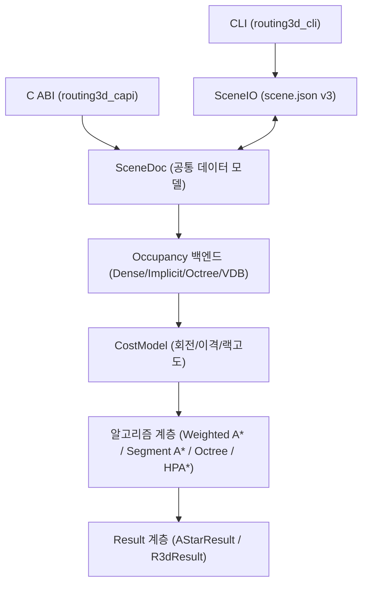

# Routing3D C++ 엔진 API 발표자료
### 코어 아키텍처, C ABI 및 C# Wrapper 설명서
**작성일**: 2026-06-22
**발표자**: AI 자동 배관 설계 개발팀

---

## Slide 2. 최근 업데이트 및 갱신 내용

* **런타임 진단 API 추가 (2026-06-22)**
  - `r3d_get_runtime_report()` API를 추가하여 빌드 플래그, 활성 씬 수, 실제 라우팅/런타임/추적 옵션 등을 UTF-8 JSON 형태로 즉시 확인 가능
* **Route Split 진단 보강**
  - Trace JSONL 진단에 `effective_options`, `route_split_plan`, `route_split_segment` 등의 이벤트를 수집하여 분할 경로 검증 강화
* **Segment A* 및 HPA* 최적화**
  - JPS-3D-lite 직선 확장 및 HPA* Portal-based Macro Guide 탐색 추가

---

## Slide 3. Routing3D C++ 코어 엔진 개요

* **3D 격자 공간 이산화**
  - 물리 공간을 정육면체 격자(Cell) 단위로 나누어 표현
  - 모든 수치 단위는 `mm`를 기본 규격으로 사용
* **6방향 직교(Orthogonal) 경로 탐색**
  - 상/하/좌/우/앞/뒤(6-neighbor) 이동만 허용하는 배관 설계 제약 반영
* **하이브리드 공간 설계**
  - 장애물 및 기배치 배관의 점유 상태를 다중 백엔드 맵에서 처리
  - C ABI를Facade로 제공하여 C# WPF Viewer 및 Python 등 이종 환경 연동

---

## Slide 4. 소프트웨어 구성도



---

## Slide 5. 구성 계층 및 책임 범위

* **외부 호출 계층**: P/Invoke 브릿지용 `routing3d_capi`, 데모 및 배치용 `routing3d_cli`
* **저장/직렬화 계층**: UTF-8 기반 `scene.json` (버전 3) 직렬화 및 기존 `scene.txt` 읽기 호환
* **점유맵 계층**: 공간 점유 판단 및 Voxelization (`Dense`, `Implicit`, `Octree`, `OpenVDB`)
* **라우팅 알고리즘 계층**: 단일 배관 최단 경로, 다중 배관 순차 협상, 옥트리 점프 가이드, HPA* 및 CBS-lite

---

## Slide 6. 1단계: 격자 설정 및 입력 준비

* **격자 설정**
  - `cell_mm`: 단일 셀 한 변의 길이 (예: 50.0mm, 25.0mm, 10.0mm 등)
  - `origin`: 전체 격자의 공간적 원점 `Vec3(x, y, z)` (mm 단위)
  - `shape`: `(nx, ny, nz)` 형태의 각 축방향 격자 크기(개수)
* **장애물(Obstacle) 등록**
  - World 좌표 기준 최소/최대 축 정렬 박스(AABB) 형태로 공간에 입력
  - 점유 백엔드는 AABB와 걸치는 격자 영역을 `BLOCKED` 처리

---

## Slide 7. 2단계: 점유맵 생성 및 Voxelization

* **정적 장애물 Voxelization**
  - 입력된 AABB를 격자 스케일로 스냅하여 내부 셀 범위(`CellRange`) 계산
  - `grid_box_range()` 함수를 거쳐 정수 격자 인덱스로 매핑
* **백엔드 선정 규칙**
  - OpenVDB 빌드가 활성화되어 있다면 대형 격자 시 `VdbOccupancy` 사용
  - OpenVDB 비활성 상태에서 전체 셀이 **500만 개** 초과 시 `ImplicitOccupancy` 사용
  - 그 외의 일반 영역에서는 고속 처리를 위해 `DenseOccupancy` 선택

---

## Slide 8. 3단계: 단일 배관 라우팅 흐름

```text
[시작/목표 좌표 입력] -> [Grid Cell 변환] -> [스냅 체크]
                                                 |
[역추적 (Path 생성)] <- [목표 도달] <- [A* Priority Queue 탐색]
```
1. 시작/목표 좌표가 점유 영역 내부인지 판단
2. 점유되어 있다면 `snap_to_free_cell()`을 호출해 주변의 가장 가까운 빈 셀로 자동 스냅
3. Priority Queue 기반 A* 탐색 가동
4. 탐색 성공 시 `came` 맵을 역방향 추적해 순차적 경로 셀 목록 생성

---

## Slide 9. 4단계: 다중 배관 순차 라우팅

* **우선순위 정렬**
  - 배관 관경(`diameter_mm`) 크기, 또는 전체 최단/최장 길이에 따라 작업 순서 정렬
* **작업 점유맵 복사**
  - 이전 단계까지 완료된 경로 점유맵 정보를 복사하여 독립적으로 탐색
* **배관 점유 마킹 및 Dilation**
  - 각 배관 경로 탐색 성공 시 해당 경로를 `mark_pipe()` 처리
  - 관경 크기에 맞추어 Manhattan 6방향 반경만큼 점유를 부풀려 마킹

---

## Slide 10. 5단계: 후처리 및 개선 라우팅

* **경로 꺾임 제거 (Unkink)**
  - A* 가중치 및 조명 등으로 인해 미세하게 우회하는 직교 꺾임 구간을 같은 길이 내에서 최단 직선으로 펴주는 후처리
* **최소 직선 길이 보장 (Min Straight)**
  - 배관 시공 시 필요한 피팅 엘보 부속품 마진 확보
  - `min_straight_cells` 혹은 `r3d_set_min_straight_mm()`에 설정된 거리만큼 코너 전환 전후의 최소 직선을 확보

---

## Slide 11. 기본 기하 데이터 모델

* **Cell (격자 좌표)**: `int32_t i, j, k` 구조로 3D 정수 인덱스 표현
* **Vec3 (물리 좌표)**: `double x, y, z` 구조로 실제 공간 상의 mm 위치 표현
* **AABB (축 정렬 박스)**: `Vec3 lo, hi` 구조로 장애물의 크기 영역 정의
```cpp
struct Cell { int i, j, k; };
struct Vec3 { double x, y, z; };
struct AABB { Vec3 lo, hi; };
```
* 모든 격자 변환은 `floor` 기반의 일관된 기하 공식을 따름

---

## Slide 12. World 좌표 ↔ Grid Cell 좌표 변환 공식

* **World to Cell**
  $$i = \lfloor \frac{x - origin.x}{cell\_mm} \rfloor$$
  $$j = \lfloor \frac{y - origin.y}{cell\_mm} \rfloor$$
  $$k = \lfloor \frac{z - origin.z}{cell\_mm} \rfloor$$
* **Cell to World (셀 중심 좌표)**
  $$x = origin.x + (i + 0.5) \times cell\_mm$$
  $$y = origin.y + (j + 0.5) \times cell\_mm$$
  $$z = origin.z + (k + 0.5) \times cell\_mm$$

---

## Slide 13. RouteTask 데이터 모델

* **배관의 논리적 작업 정의**
```cpp
struct RouteTask {
    Vec3 start_mm;
    Vec3 end_mm;
    std::string utility;
    std::string utility_group;
    double diameter_mm;
    int32_t goal_dir; // -1: 제약없음, 0~5: NEIGHBORS_6
};
```
* `goal_dir`: 도착점에 진입할 때의 방향 강제 설정
* `diameter_mm`: 간격 확보 및 우선순위 정렬 시 주요 인자로 활용

---

## Slide 14. RouteParams 비용 파라미터

* **w_turn**: 회전 시 발생하는 비용 가중치 (기본값: 500.0)
* **w_clear**: 장애물 인근 통과 시 거리 기반 패널티 (기본값: 10.0)
* **w_heur**: Weighted A*의 휴리스틱 승수 (기본값: 1.0)
* **w_corridor**: 선호 가이드 영역 외곽 통과 시 패널티 (기본값: 0.0)
* **clearance_radius**: 이격 분석 시 최대 탐색 반경 (기본값: 2)
* **clearance_connectivity**: Clearance BFS 범위 (6-neighbor 또는 26-neighbor)

---

## Slide 15. 결과 반환 모델 (AStarResult)

```cpp
struct AStarResult {
    bool success;
    std::vector<Cell> path;
    double length_mm;
    double cost_mm;
    int32_t turns;
    int64_t expanded_nodes;
    double elapsed_ms;
    RouteFail fail;
};
```
* **RouteFail** 실패 사유 정의 코드:
  - `0=None`, `1=StartBlocked`, `2=GoalBlocked`, `3=CorridorMiss`, `4=ExpansionLimit`, `5=GoalDirBlocked`, `6=NoPath`

---

## Slide 16. DenseOccupancy 백엔드

* **메모리 저장 구조**
  - 전체 격자 공간 크기(`nx * ny * nz`)에 맞춰 1바이트 크기의 `uint8_t` 선형 벡터 구성
  - `lin = i + nx * (j + ny * k)` 규칙의 인덱싱 사용
* **장점**: 메모리 주소 연속성으로 인해 가장 빠른 셀 점유 조회 속도 보장
* **단점**: 격자 공간이 커지면(예: 수억 개 셀) 메모리 사용량이 급증하여 적합하지 않음

---

## Slide 17. SparseOccupancy 백엔드

* **메모리 저장 구조**
  - 점유된 셀 좌표만을 `std::unordered_set<uint64_t>` 형태의 해시셋으로 보관
* **64비트 좌표 패킹 (Packing) 공식**
  - 각 i, j, k 정수 축 좌표를 21비트씩 시프트 연산하여 64비트 정수 하나로 병합
  $$\text{key} = (i \ \& \ 0x1FFFFF) \ | \ ((j \ \& \ 0x1FFFFF) \ll 21) \ | \ ((k \ \& \ 0x1FFFFF) \ll 42)$$
* **특징**: 장애물 주변의 점유 셀이 극소수일 때 메모리를 절약할 수 있으나, 탐색 루프에서 오버헤드 존재

---

## Slide 18. ImplicitOccupancy 백엔드

* **동작 원리**
  - 정적 장애물 AABB 리스트를 복셀 격자화(Voxelization)하지 않고 그대로 유지
  - 라우팅으로 마킹되는 동적 배관 정보만 해시셋(`marked_`)에 보관
* **질의 수행 방식**
  - 특정 셀 `Cell(i, j, k)` 조회 시, `SpatialBoxIndex` 트리에서 해당 영역과 교차하는 장애물 AABB가 있는지 검사
* **특징**: 수억 격자 이상의 대형 공간에서 공간 데이터 실체화 없이 장애물 정보를 조회하여 메모리 오버헤드가 극소화됨

---

## Slide 19. SpatialBoxIndex 구현 사양

* **구조 설계**
  - 월드 좌표 공간을 일정 주기의 버킷(`bucket_mm` 단위) 유니폼 격자로 분할
  - 각 버킷 버퍼에 해당 공간을 걸치고 있는 장애물 AABB 목록 인덱스를 보관
* **주요 함수**
  - `overlaps(qlo, qhi)`: 입력 쿼리 범위와 장애물이 만나는지 실시간 판정
  - `nearest_dist(p, max_dist)`: 포인트 `p`로부터 가장 근접한 장애물 표면까지의 거리 계산 ( clearance 계산에 사용)

---

## Slide 20. VdbOccupancy 백엔드

* **동작 원리**
  - OpenVDB 라이브러리의 `BoolGrid` 구조를 내부에 캡슐화 (Pimpl 디자인 패턴)
  - 빈 공간을 계층 트리 노드로 축소 보관하여 물리 디스크/메모리 캐싱 최적화
* **복셀 마킹**
  - `fill()` 연산을 활용해 완전 점유된 거대 솔리드 장애물 영역을 타일 형태로 압축 저장
* **장점**: 대규모 공장 씬의 바닥 슬래브, 기둥 구조물 처리 시 우수한 메모리 밀도 제공

---

## Slide 21. OctreeOccupancy 개념

* **어댑티브 복셀 분할 (Adaptive Voxel Split)**
  - 완전 빈 공간은 큰 옥트리 잎(Leaf) 노드로 압축 유지
  - 장애물 표면이나 충돌 경계면만 촘촘히 8분할하여 Fine Cell 크기까지 재귀 세분화
* **동적 마킹의 이원화**
  - 실시간 경로 마킹은 옥트리 트리를 재구성하지 않고 별도의 `marked_` 해시셋에 반영

---

## Slide 22. OctreeOccupancy 데이터 구조

* **노드 구성 (OctNode)**
```cpp
struct OctNode {
    int32_t x0, y0, z0; // 잎의 시작 Fine-cell 좌표
    int32_t side;       // 잎 한 변에 들어가는 Fine-cell 개수 (2^n)
    int8_t state;       // -1=MIXED, 0=FREE, 1=BLOCKED
    int32_t children[8];// 자식 노드 인덱스 (-1이면 Leaf)
    int32_t parent;     // 부모 노드 인덱스
};
```
* `max_jump()`: 특정 축방향으로 충돌 장애물을 만나기 직전까지 이동 가능한 최대 격자 단위 도약 길이 계산

---

## Slide 23. AABB Voxelization 변환 알고리즘

* **기하학적 투영 규칙**
  - 실수 영역의 AABB 범위를 격자 범위 `[lo, hi]` 정수로 포함 변환
```cpp
Cell lo = grid_world_to_cell(box.min_xyz, origin, cell_mm);
Cell hi = grid_world_to_cell(box.max_xyz, origin, cell_mm);
// 경계 포함 보정
CellRange range;
range.lo = lo;
range.hi = Cell{hi.i + 1, hi.j + 1, hi.k + 1};
```
* **Clamp 처리**
  - 격자 바깥 영역으로 산출된 범위는 `[0, shape)` 내부 영역으로 한계 조정

---

## Slide 24. A* 및 Weighted A* 알고리즘

* **A* 비용 모델**
  $$f(n) = g(n) + h(n)$$
  - $g(n)$: 시작 노드로부터의 누적 경로 비용
  - $h(n)$: 목표 지점까지의 맨해튼 거리 기반 휴리스틱
* **Weighted A* 확장**
  $$f(n) = g(n) + w\_heur \times h(n)$$
  - $w\_heur > 1.0$ 가중치를 적용하여, 약간의 차선 경로를 허용하는 대신 상태 노드 탐색량을 극적으로 감소시킴

---

## Slide 25. Weighted A* 탐색 비용 계산식

* **이동 단계를 거칠 때 비용 누적 규칙**
```text
next_g = current_g
       + cell_mm
       + (direction_changed ? w_turn : 0)
       + (clearance_cost * w_clear)
       + (tier_cost * w_tier)
       + (corridor_cost * w_corridor)
```
* **w_heur_near**: 목표점 반경 내에 도달하는 경우 가중치를 점진적으로 낮추어($\approx 1.0$) 도착 직전 코너 꺾임 품질을 정밀하게 복원

---

## Slide 26. Anytime A* 개선 루프

* **ARA* 단순화 모델 기법**
  - 고정된 시간 내에서 Incumbent(현재까지의 최선의 성공 경로)를 개선하는 래퍼
```text
[시작: 가중치 3.0] -> [1차 탐색: Incumbent 등록]
                           |
[가중치 2.0으로 탐색] <- [INCUMBENT 비교: 비용 단축 여부 검증]
                           |
[종료: 시간 Budget 도달] -> [incumbent 반환]
```
1. 최초에는 큰 가중치(예: 3.0)로 빠른 경로 탐색 성공
2. 가중치 스텝(예: 0.5)을 깎아가며 반복 탐색 시도
3. 신규 경로 비용이 기존 최선 해보다 적으면 대체
4. 시간 제한(`time_budget_ms`) 경과 시 즉시 탐색 중단 및 incumbent 반환

---

## Slide 27. Segment A* / JPS-3D-lite 개요

* **인접 1셀 확장 방식의 문제점**
  - 대형 직선 랙(Rack) 통로에서 수천 개의 노드가 중복 생성되어 큐 부하 가중
* **Segment A* 도약 기법**
  - 6방향 수직/수평 라인을 따라 한 번에 전진 가능한 직선 단위로 큐에 확장 등록
  - 갱신된 **JPS-3D-lite** 모드는 강제 이웃 장애물 모서리(Forced-neighbor), 목표 투영 축 교차점, 최대 직선 길이(`segment_max_cells`) 지점만 압축 추출하여 큐 연산을 최적화

---

## Slide 28. JPS-3D-lite 탐색점 검출 규칙

```text
[장애물 모서리 발견 (Forced Neighbor)] -------> [Jump Point 등록]
[현재 Ray 상에 목표 축(X, Y, Z) 교차] ------> [Jump Point 등록]
[장애물 충돌 직전 (Ray End)] ---------------> [Jump Point 등록]
```
* 직선으로 진행하는 도중 측면 셀 장벽이 깨지거나 새로 생기는 모퉁이 점을 탐색 점프 지점으로 정의
* 최종 복원 시에는 중간 경로 노드들을 Fine Cell 연속 경로로 조밀화(`densify()`)하여 반환하므로 일반 path 출력과 완벽히 호환됨

---

## Slide 29. Clearance 및 이격도 계산

* **Dense / Sparse 방식**
  - 전체 장애물 격자에서 시작해 빈 공간으로 거리를 팽창시키는 Bounded Multi-source BFS를 미리 기동
* **Implicit / VDB 방식**
  - 탐색 진행 중 셀이 큐에서 전개될 때, `SpatialBoxIndex`를 사용해 최근접 장애물 표면까지의 Euclidean 거리를 실시간으로 질의
  $$\text{Clearance Cost} = \max(0.0, \text{radius} - \text{actual\_distance})$$

---

## Slide 30. 배관 점유 마킹 (mark_pipe)

* **배관 간섭 회피 메커니즘**
  - 배관이 성공적으로 라우팅되면, 해당 배관의 좌표들을 점유 맵에 `BLOCKED`로 마킹
* **관경 간격(Dilation) 확보 알고리즘**
```text
[성공 경로 셀 선택] -> [Manhattan BFS 팽창 적용] -> [인접 셀 마킹]
```
  - `radius` 크기에 맞춰서 6방향 인접 이웃 셀 영역으로 순차 팽창 탐색을 수행하여 추가 복셀을 마킹
  - 다음 배관 탐색 시 이미 팽창 마킹된 복셀을 자연스럽게 우회하도록 유도

---

## Slide 31. Rip-up & Reroute 재배치

* **배관 차단 병목 현상**
  - 선순위 배관들이 공간을 독점하여 후순위 배관의 경로가 차단되는 문제
* **Rip-up 처리 파이프라인**
  1. 실패한 배관 작업 발견
  2. 기배치된 배관을 무시하고 장애물만 있는 상태에서 최단 경로(Ideal Path) 탐색
  3. Ideal Path를 가로막고 있는 기배치 배관 목록(Blockers) 식별
  4. Blocker 개수가 제한값(`max_ripup`) 이하이면, Blocker를 임시 제거하고 실패 배관을 먼저 배치한 뒤 Blocker들을 재배치 수행

---

## Slide 32. 대형 공간 처리를 위한 10대 최적화 전략

| 번호 | 전략 명칭 | 핵심 동작 및 물리 구조 |
|---|---|---|
| 1 | **OpenVDB** | 복셀 볼륨을 계층 구조의 타일로 압축하여 대형 구조물 메모리 경감 |
| 2 | **Implicit Occupancy** | 장애물을 복셀화하지 않고 Spatial AABB Index로 온디맨드 질의 |
| 3 | **Octree Occupancy** | 빈 공간을 큰 잎으로 묶고 경계면만 분할해 도약 연산에 활용 |
| 4 | **Segment A*** | JPS-3D-lite 기반의 직선 단위 도약 확장으로 탐색 수 극축 |
| 5 | **Octree-guided Fallback** | 옥트리 탐색 경로를 가이드 삼아 Fine 격자 탐색을 국소 범위로 제한 |
| 6 | **TMT Route Split** | 하나의 작업을 수직/수평 3구간으로 끊어 탐색 스케일 축소 |
| 7 | **Hashed A*** | 대형 닫힌 셋(Closed Set)을 배열 대신 해시맵 구조로 교체 |
| 8 | **Hierarchical Corridor** | 대략적인 Coarse 경로의 corridor 내부에서만 Fine 정밀 검증 |
| 9 | **HPA\* Chunk-Portal** | 격자를 Chunk로 쪼개고 포탈 그래프를 구성해 거시 가이드 선출 |
| 10| **Expansion Cap** | 최대 확장 한도(`R3D_MAX_EXP`) 강제를 통해 시간 무한 루프 차단 |

---

## Slide 33. Hierarchical Corridor Routing

```text
[시작/목표 Cell] -> [Coarse 해상도로 축소] -> [Coarse 가이드 탐색]
                                                     |
[최종 fine 경로] <- [Corridor 내부 fine 탐색] <- [Corridor 팽창 (Dilation)]
```
1. Fine 셀 좌표를 거친 Coarse 해상도 격자(예: 1/8 해상도)로 스냅 축소
2. Coarse 격자 내에서 Weighted A* 가이드 경로 탐색
3. Coarse 가이드 경로 주변을 지정 반경(`hier_radius`)만큼 팽창하여 3D 터널 모양의 Corridor 셋 구성
4. 원래의 Fine 해상도 점유 맵에서 생성된 Corridor 내부 셀로만 제한하여 최종 Fine A* 탐색을 가속화

---

## Slide 34. HPA* Portal-based Macro Guide

* **공간 분할 및 추상 그래프**
  - Coarse 격자 공간을 정육면체 단위 블록(`R3D_HPA_CHUNK`, 기본값: 8)으로 논리적 분할
  - 인접 Chunk 사이의 경계 통과 지점을 탐색하여 대표 포탈(Portal) 노드로 등록
* **Abstract Graph A***
  - 동일 Chunk 내 포탈 간 연결성 및 인접 Chunk 포탈 쌍을 그래프 에지(Edge)로 매핑
  - 포탈 그래프 상에서 가이드 탐색 수행 후 실패 시 기존 Coarse A*로 Fallback

---

## Slide 35. Octree-guided fine corridor fallback

* **동작 시점**
  - 다중 배관 탐색 시, 장애물 밀집도가 너무 높아 일반 A* Probe 연산 횟수가 `hier_probe` 상한선을 초과할 때 대체 가동
* **알고리즘**
  1. 정적 장애물 AABB를 옥트리 빌드하여 `OctreeOccupancy` 구성
  2. 옥트리를 이용해 빠르게 도약하는 Macro Path 탐색
  3. Macro Path 주변 공간을 `corridor_radius`만큼 확장하여 fine-cell corridor 영역 확보
  4. 기존 Dense/Implicit/Vdb 원본 맵의 Corridor 경계 내에서 정밀 Fine A* 검증 완료

---

## Slide 36. TruckIn / Middle / Terminal (TMT) 분할 라우팅

* **배관 설계의 TMT 도메인 지식 반영**
  - 시작 설비 PoC에서 수직 하강/상승(TruckIn) → 주 랙 통로 수평 주행(Middle Trunk) → 목표 설비로 하강/상승(Terminal)
* **self-blocking 방지 설계**
  - 한 배관의 3구간 탐색이 모두 완료되어 최종 병합되기 전까지는 맵에 마킹하지 않으므로 구간 간 자승 간섭 차단
  - 한 구간이라도 탐색 실패 시 direct A*로 복귀

---

## Slide 37. TMT Waypoint 분할 규칙

* **수평/수직 분할점 자동 도출**
  - 시작 셀 `s`, 목표 셀 `g`, 트렁크 기준 높이 `trunk_k`
  - $Waypoint_1 = s$
  - $Waypoint_2 = (s.i, s.j, trunk\_k)$ : TruckIn 종단
  - $Waypoint_3 = (g.i, g.j, trunk\_k)$ : Middle 종단
  - $Waypoint_4 = g$
* **Trunk 높이 Z 결정 알고리즘**
  1. 사용자 명시 높이(`trunk_z_mm`)가 있으면 해당 고도로 설정
  2. 명시 높이가 없고 랙 레벨(`rack_levels`)이 정의되어 있다면, $\max(s.k, g.k) + 4$ 에 근접한 선호 랙 고도 선택
  3. 최후 수단으로 $\max(s.k, g.k) + 4$ 단계를 자동 Trunk 높이로 적용

---

## Slide 38. 실전 Exhaust 배관 6가지 라우팅 비교 설계

* **실험 대상 환경**
  - DDW_AI_DB 프로젝트 1 / WTNHJ02 / 25mm 정밀 격자
  - 장비 주변 배관 다발 군집 20개 작업 대상 일괄 배치
* **비교 방식 분류 (S1 ~ S6)**
  - **S1**: Weighted A* baseline (가이드/스텁/패턴 없는 기본형)
  - **S2**: PoC snap + learned face (기존설계 ANN 면 방향 보정 및 snap)
  - **S3**: Stub endpoints + A* (매칭된 기존 배관 종단 stub 스케일 단축)
  - **S4**: Existing-design corridor (S3에 기존 설계 추종 corridor 가중치 반영)
  - **S5**: Learned rack + bundle (S3에 대표 랙 높이 및 번들 패턴 적용)
  - **S6**: Follow existing + local repair (기존선 재현 복제 후 막힌 구간 국소 수리)

---

## Slide 39. S1 ~ S6 라우팅 정량 비교 결과

| ID | 라우팅 전략 | 성공 여부 | 소요 시간(s) | 총 길이(mm) | 꺾임 횟수 | rackZ 비율 | 비고 |
|---|---|---|---|---|---|---|---|
| **S1** | Weighted A* baseline | 20 / 20 | 92.96 | 315,175 | 147 | 0.0% | 기준 fallback 경로 |
| **S2** | PoC snap + face | 20 / 20 | 91.60 | 315,100 | 149 | 0.0% | 접속점 사전보정 |
| **S3** | Stub endpoints | 20 / 20 | 3.53 | 67,650 | 31 | 93.1% | 탐색 스케일 급감 |
| **S4** | Existing corridor | 20 / 20 | 3.29 | 67,650 | 32 | 88.8% | 최속 탐색 속도 |
| **S5** | Learned rack/bundle | 20 / 20 | 3.31 | 67,650 | 31 | 93.1% | 랙Z 만족도 최고 |
| **S6** | Follow & Local repair | 시간초과 | - | - | - | - | 9분 경과 수동종료 |

---

## Slide 40. Exhaust 비교 결론 및 운영 가이드

* **실전 최우선 적용 가이드**
  - Exhaust 배관 랙 설계 모델 시 **S3** 및 **S5** 옵션을 우선 적용
  - 다발 정렬 및 기존 선로와의 완벽한 동조 검토 시 **S4** 옵션을 병행 검토
* **S1/S2의 용도**
  - PoC 진입 접속로가 막히거나 내부 오류 발생 시의 예비 복구선으로 유지
* **S6(Local Repair) 배제 사유**
  - 전체 경로 복제 복구 시, 수리 범위 제한(Cap) 및 세그먼트 타임아웃 방어막이 구현되기 전까지는 대량 배치 작업의 기본값으로 사용 금지

---

## Slide 41. CBS-lite 협상 라우팅 깊이 설정

* **블로커 간의 재귀 양보 메커니즘**
  - rip-up 이후에도 막힌 배관이 생기면, 충돌 원인을 유발한 1차 blocker 및 2차 blocker의 blocker 노드를 찾아 순서를 밀어주고 양보 유도
* **깊이(Depth) 설정과 연산 복잡도**
  - depth 가 0 이면 CBS-lite 비활성화
  - depth 가 1~2 이면 안정적인 선에서 충돌 완화 처리 작동 (WPF 뷰어 CBS 체크 시 depth=2 인가)
  - depth 가 3 이상인 경우, 연산 대상 조합이 기하급수적으로 폭발하여 실행 타임아웃 위험이 생기므로 주의가 필요함

---

## Slide 42. C ABI 명세: 상태 코드 (R3dStatus)

* **R3D_OK (0)**: 모든 명령 및 메모리 가동 정상 완료
* **R3D_ERR_ARG (1)**: 핸들 null 포인터 전달, 음수 인덱스 등 인자 오류
* **R3D_ERR_PARSE (2)**: 입력받은 scene.json 텍스트 파싱 및 복원 실패
* **R3D_ERR_RUNTIME (3)**: 엔진 탐색 내부에서 예상치 못한 메모리 할당 제한, open list 예외 발생
* **R3D_ERR_RANGE (4)**: 등록된 배관 수 범위 밖의 인덱스로 결과 조회를 시도할 때 반환

---

## Slide 43. C ABI Level 1: 문자열 scene API

* **동작 사양**
  - 엔진 인스턴스를 사용자가 직접 핸들링하지 않고, 인스턴스 생성부터 라우팅, 결과 덤프와 파괴를 API 한 줄로 일괄 대행 처리
```c
R3dStatus r3d_route_scene_text(
    const char* scene_text,      // 입력 scene.json 문자열 (UTF-8)
    const char* mode,            // "single", "multi", "ripup" 중 선택
    const char* priority,        // "longest", "shortest", "utility" 등
    char** out_scene_text        // 완료 후 덤프된 scene.json 출력 주소
);
void r3d_free_string(char* s);   // 출력 텍스트 전용 메모리 해제 함수
```

---

## Slide 44. C ABI Level 2: 엔진 핸들 생성 및 격자 설정

* **엔진 수명 주기 및 파라미터 연동**
```c
R3dEngine* e = r3d_create(); // 엔진 핸들 동적 할당 생성

R3dGrid grid = { 50.0, 0.0, 0.0, 0.0, 120, 120, 60 };
r3d_set_grid(e, &grid); // 격자 원점 및 형태 정보 지정

R3dParams p = {0};
p.cell_mm = 50.0;
p.w_turn = 500.0;
p.w_clear = 10.0;
p.w_heur = 1.0;
p.clearance_radius = 2;
p.clearance_connectivity = 6;
r3d_set_params(e, &p); // 비용 인자 지정
```

---

## Slide 45. C ABI: 장애물 및 태스크 동적 추가

* **장애물 영역 및 라우팅 태스크 추가 API**
```c
// 정적 장애물 AABB 등록 (world_mm 단위)
r3d_add_obstacle(e, 0.0, 0.0, 0.0, 6000.0, 6000.0, 250.0);

// 시각화용 가상 통과 통로(Passthrough) 정보 지정
r3d_add_passthrough(e, 1000.0, 1000.0, 500.0, 2000.0, 2000.0, 800.0);

// 신규 라우팅 태스크 추가
int32_t task_id = r3d_add_task(e,
    275.0, 3025.0, 1525.0,  // 시작 좌표 (mm)
    5725.0, 3025.0, 1525.0,  // 목표 좌표 (mm)
    "PA", "Gas"              // Utility / Group 명칭
);
```

---

## Slide 46. C ABI: 라우팅 실행 및 결과 조회

* **다중 배관 일괄 실행 및 버퍼 복사**
```c
r3d_route_multi(e, "longest"); // 관경/길이 정렬 다중 순차 배치 기동

R3dResult result;
r3d_get_result(e, task_id, &result); // 성공 여부, turns, path_len 수집

if (result.success && result.path_len > 0) {
    // path_len * 3 (i,j,k) 공간의 버퍼 동적 할당
    int32_t* path_buffer = (int32_t*)malloc(sizeof(int32_t) * 3 * result.path_len);
    r3d_copy_path(e, task_id, path_buffer, result.path_len);

    // 복사 완료된 격자 좌표들 가공 처리 수행
    free(path_buffer);
}
```

---

## Slide 47. C ABI: 옥트리 제어 및 Leaf 조회

* **옥트리 잎 노드 열거를 통한 3D 가시화 연동**
```c
R3dOctreeLeaf leaves[4096];
int32_t out_leaf_count = 0;

// 1) 버퍼 크기가 0일 때 전체 생성된 노드 개수 사전 파악 (Size Query)
r3d_enum_octree_leaves(e, NULL, 0, &out_leaf_count);

// 2) 실제 버퍼를 확보하여 잎들의 world 좌표 및 크기, Block 상태 복사
int32_t copy_limit = out_leaf_count < 4096 ? out_leaf_count : 4096;
r3d_enum_octree_leaves(e, leaves, copy_limit, &out_leaf_count);
```
* 각 리프의 `state` 정보(`0=FREE`, `1=BLOCKED`)를 바탕으로 3D 뷰어 화면에서 적응형 복셀 박스로 표현

---

## Slide 48. C# Managed Wrapper 구조

* **C# Routing3DEngine 클래스**
  - `IDisposable` 인터페이스를 구현하여 네이티브 C++ `R3dEngine` 핸들의 동적 해제(`r3d_destroy`)를 관리
* **형상 표현을 위한 공통 record 타입 선언**
```csharp
public readonly record struct OctreeLeaf(
    float X0Mm, float Y0Mm, float Z0Mm,
    float SizeMm,
    int State
);
public class RouteResult {
    public bool Success { get; set; }
    public IReadOnlyList<Cell> Path { get; set; } = Array.Empty<Cell>();
    public double LengthMm { get; set; }
    public int Turns { get; set; }
    public long ExpandedNodes { get; set; }
    public int Fail { get; set; }
}
```

---

## Slide 49. C# P/Invoke 브릿지 및 DLL 마샬링

```csharp
internal static class NativeMethods {
    [DllImport("routing3d_capi", CallingConvention = CallingConvention.Cdecl)]
    public static extern IntPtr r3d_create();

    [DllImport("routing3d_capi", CallingConvention = CallingConvention.Cdecl)]
    public static extern void r3d_destroy(IntPtr e);

    [DllImport("routing3d_capi", CallingConvention = CallingConvention.Cdecl)]
    public static extern int r3d_enum_octree_leaves(
        IntPtr e,
        [Out] R3dOctreeLeaf[]? buf,
        int maxCount,
        out int outCount
    );
}
```
* **마샬링 규칙**: 64비트 호환을 위해 x64 환경 빌드를 강제하며, 복사 배열 버퍼에는 `[Out]` 마샬링 속성을 지정

---

## Slide 50. C# 8단계 튜토리얼 아웃라인

* **`Routing3DTutorialSteps.cs` 런타임 실행 단계**
  - **1단계**: 10mm 미세 격자 구성 및 turn penalty 파라미터 주입
  - **2단계**: 기둥, 벽체, 설비 장애물 AABB 추가
  - **3단계**: diameter_mm 관경 및 goal_dir 방향 제약 조건 주입
  - **4단계**: 단일 타스크 Octree Jump A* 기동 및 잎 데이터 복사
  - **5단계**: 대형 격자용 Hierarchical Corridor 라우팅 수행
  - **6단계**: 다중 배관 일괄 라우팅 및 cbs depth=2 설정
  - **7단계**: Waypoint 리스트를 Task Segment로 연쇄 가동
  - **8단계**: `DumpSceneText()`를 호출해 디스크에 `scene.json`으로 보관

---

## Slide 51. C# 다중 배관 라우팅 실시간 Progress 처리

* **배치 가동 진행률 및 중도 취소 수집**
```csharp
engine.RouteMultiProgress("diameter", progress => {
    // phase == 1 일 때 하나의 배관이 완배치되었음을 의미
    if (progress.Phase == 1) {
        Console.WriteLine($"Task {progress.TaskIndex} 완료. " +
            $"결과: {progress.Success}, 길이: {progress.LengthMm:N1}mm");
    }

    // UI 스레드 취소 상태 수집 시 1을 반환하면 배관 배치 루프 cooperative 중단 작동
    return IsUserCancelled ? 1 : 0;
});
```

---

## Slide 52. CLI 및 CMake 빌드 옵션

* **CMake 주요 옵션 스위치**
  - `-DUSE_OPENVDB=ON` : OpenVDB 백엔드 연동 활성화
  - `-DBUILD_PYTHON_BINDINGS=ON` : 파이썬 바인딩 컴파일 활성화
* **CLI 실행 명령어 패턴**
```powershell
# 내장 가상 데모 씬 가동 및 출력 JSON 저장
routing3d_cli.exe demo --out result.scene.json

# scene.json 파일을 로드해 순차 다중 라우팅 수행
routing3d_cli.exe route --in scene.json --out routed.scene.json --mode multi --priority longest

# 라우팅 완료 씬의 정량 요약 정보 콘솔 출력
routing3d_cli.exe summary --in scene.json
```

---

## Slide 53. Trace JSONL 진단 로그 규격

* **목적**: 라우팅 중 생성된 방문 격자, 탐색 거부 후보 등의 정보를 실시간 누적 기록하여 Replay Viewer에서 시각화 재생
```json
{"event": "trace_header", "version": "3", "shape": [120, 120, 60]}
{"event": "task_begin", "task_id": 0, "start": [5,60,30], "goal": [115,60,30]}
{"event": "expand_cell", "cell": [10,60,30], "g": 250.0, "h": 5250.0, "dir": 0}
{"event": "candidate_reject", "cell": [10,61,30], "reason": "ClearanceViolation"}
{"event": "route_split_plan", "trunk_k": 10, "waypoints": [[5,60,1], [5,60,10]]}
{"event": "route_path", "path_len": 110, "path_cells": [[5,60,30], [6,60,30]]}
```
* `r3d_flush_trace()`: 로그 버퍼의 즉각적인 플러싱을 통해 파일 잠금(Locking) 완화

---

## Slide 54. 라우팅 실패 원인 추적 디버깅 절차

```text
[실패 사유 (fail_reason) 확인]
     |
     +---> StartBlocked / GoalBlocked  --> 접속점 주변 장애물 간섭 제거 / Snap 반경 확장
     |
     +---> ExpansionLimit  --------------> R3D_MAX_EXP 상한선 상향 조정 / Corridor 확장
     |
     +---> GoalDirBlocked  --------------> 진입 강제 방향 k축 주변 장애물 탐색 및 완화
     |
     +---> NoPath  ----------------------> 기존 배관 병목 확인 및 CBS-lite depth 활성화
```
* **scene.json 재현 고정**:
  - 오류 발생 시 `r3d_dump_scene_text()`를 호출해 해당 시점의 입력 상황을 즉시 scene.json 파일로 추출한 후, 독립 CLI 도구를 통해 디버깅 수행

---

## Slide 55. 확인된 한계점 및 보완 개발 우선순위

* **P1: 비대화된 `routing3d_capi.cpp` 구조 개선**
  - C ABI 소스에 가이드 로직, TMT 분할, CBS 양보 오케스트레이션이 섞여 있어 복잡함
  - **대책**: 라우팅 파이프라인 전용 서비스 도메인 모듈로 리팩토링 분리 권장
* **P1: Trace JSONL 공유 읽기 잠금**
  - 실시간 재생 시 대용량 파일에 쓰기가 누적되면서 락 문제 발생 가능
  - **대책**: Append 전용 공유 모드 열기 및 로그 파일 세그먼테이션(Rotation) 도입
* **P2: Anytime API의 다중 라우팅 확장**
  - Anytime Weighted A*가 현재 단일 태스크 탐색으로 묶여 있음
  - **대책**: Progress 다중 라우팅에 각 태스크별 시간 분배를 연동하는 로직 추가
