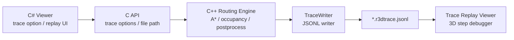

# Routing3D 경로탐색 추적 로그 및 3D 검증 뷰어 개발계획서

- 갱신일시: 2026-06-20 00:00 KST
- 대상: Routing3D C++ 엔진, C API, C# Viewer
- 목적: 자동 라우팅 탐색 과정을 JSONL 로그로 남기고, 로그를 다시 읽어 3D 복셀맵에서 시작/목적지/확장 복셀/후보 탈락 지점을 단계별로 검증한다.

## 1. 개발 목표

현재 Viewer는 최종 경로와 일부 결과 정보는 보여주지만, A* 탐색 중 어느 복셀이 확장되었는지, 어떤 후보 복셀이 충돌/범위/최소 직관 조건 때문에 탈락했는지 추적하기 어렵다.

이번 기능의 목표는 다음과 같다.

1. 라우팅 시작 시점의 격자, 원점, 셀 크기, 작업 정보를 기록한다.
2. 시작/목적지 셀과 snap 전후 셀을 기록한다.
3. A* 탐색 중 실제 확장 복셀을 `expand_cell` 이벤트로 기록한다.
4. 후보 복셀이 제외되는 이유를 `candidate_reject` 이벤트로 기록한다.
5. 후처리, 최종 경로 마킹, 작업 종료 통계를 기록한다.
6. C# Trace Replay Viewer에서 로그를 열어 이벤트별 3D 검증, 필터링, 자동 재생을 수행한다.

## 2. 전체 구성



## 3. 구현 현황

### Stage 1. Trace 기반 구조

- `R3dTraceOptions` 추가
- C API 추가:
  - `r3d_set_trace_options`
  - `r3d_set_trace_file`
  - `r3d_flush_trace`
- C# Viewer에서 탐색 로그 활성화 옵션 추가
- 로그 저장 위치:
  - Viewer 실행 폴더 하위 `logs`
  - 파일명 예: `routing_trace_YYYYMMDD_HHMMSS_project_label_Ntasks.r3dtrace.jsonl`

### Stage 2. A* 탐색 이벤트 기록

- `astar_weighted`에 선택형 trace callback 추가
- 실제 확장 복셀 기록:
  - 이벤트 타입: `expand_cell`
  - 주요 필드: `task`, `expanded_nodes`, `cell`, `dir`, `run`, `required`
- 후보 탈락 기록:
  - 이벤트 타입: `candidate_reject`
  - 주요 필드: `task`, `expanded_nodes`, `reason`, `from`, `to`, `dir`, `run`, `required`
- 후보 탈락 reason:
  - `out_of_bounds`: 격자 범위 밖
  - `blocked`: 점유/장애물 셀
  - `corridor_gate`: 계층 corridor 제한 밖
  - `min_straight`: 최소 직관 길이 미달
- 이벤트 폭증 방지:
  - `sample_every` 간격으로 샘플링
  - 태스크별 `max_events_per_task` 제한

### Stage 3. Trace Replay Viewer 개선

- 로그 열기 기능
- 이벤트 리스트 표시
- 3D 복셀 표시:
  - 시작 셀: Green
  - 목적지 셀: Red
  - snap 시작 셀: DeepSkyBlue
  - snap 목적지 셀: Yellow
  - 확장 복셀: Gold
  - 탈락 후보 복셀: OrangeRed
- 필터 기능:
  - Task 번호
  - Event Type
  - 텍스트 검색
- 자동 재생:
  - Play/Pause
  - 재생 간격 ms 슬라이더
  - 필터된 이벤트 기준 First/Prev/Next/Last 이동

## 4. JSONL 로그 포맷

로그는 JSON Lines 형식이다. 한 줄이 하나의 이벤트이며, 대형 탐색 로그에서도 순차 읽기와 필터링이 쉽다.

### trace_header

```json
{"type":"trace_header","version":1,"engine":"routing3d_capi","cell_mm":25.0,"origin":[0,0,0],"shape":[420,380,180],"task_count":20,"obstacle_count":123}
```

### occupancy_summary

```json
{"type":"occupancy_summary","blocked_count":123456}
```

### task_begin

```json
{"type":"task_begin","order":0,"task":129,"source_cell":[48,20,100],"target_cell":[208,48,100],"snapped_source":[49,20,100],"snapped_target":[208,48,100],"utility":"ACID","group":"Exhaust"}
```

### snap

```json
{"type":"snap","task":129,"kind":"start","from":[48,20,100],"to":[49,20,100]}
```

### expand

진행률 요약 이벤트다.

```json
{"type":"expand","order":0,"task":129,"expanded_nodes":1000,"progress01":0.42}
```

### expand_cell

실제 확장된 복셀 이벤트다.

```json
{"type":"expand_cell","order":0,"task":129,"expanded_nodes":1000,"cell":[80,35,100],"dir":0,"run":4,"required":4}
```

### candidate_reject

후보 복셀이 제외된 이유를 기록한다.

```json
{"type":"candidate_reject","order":0,"task":129,"expanded_nodes":1000,"reason":"blocked","from":[80,35,100],"to":[81,35,100],"dir":0,"run":4,"required":0}
```

### task_end

```json
{"type":"task_end","order":0,"task":129,"success":true,"aborted":false,"fail_reason":0,"length_mm":3250.0,"turns":2,"expanded_nodes":14811,"elapsed_ms":220.5,"path_len":131}
```

### postprocess

```json
{"type":"postprocess","task":129,"stage":"unkink","min_run_cells":4,"before_points":140,"after_points":126,"before_turns":4,"after_turns":2}
```

### route_mark

```json
{"type":"route_mark","task":129,"path_points":126,"radius_cells":3}
```

## 5. Viewer 사용 방법

1. C# Viewer에서 탐색 로그 옵션을 켠다.
2. 자동설계를 실행한다.
3. 생성된 `.r3dtrace.jsonl` 파일을 Trace Replay Viewer에서 연다.
4. 필요한 Task 번호를 입력해 해당 배관만 필터링한다.
5. Type 필터에서 `candidate_reject` 또는 `expand_cell`을 선택한다.
6. Play 버튼으로 이벤트를 순차 재생하거나 Next/Prev로 수동 검토한다.
7. 탈락 후보가 많은 지점에서 reason을 확인해 충돌, corridor 제한, 최소 직관 제한 중 원인을 구분한다.

## 6. 성능 및 저장 정책

탐색 로그는 매우 커질 수 있으므로 기본적으로 샘플링한다.

- 기본 샘플 간격: `1000` expanded nodes
- 기본 태스크별 최대 이벤트 수: `20000`
- 환경 변수:
  - `R3D_TRACE_SAMPLE_EVERY`
  - `R3D_TRACE_MAX_EVENTS`

정밀 디버깅이 필요하면 샘플 간격을 줄인다. 단, 대형 프로젝트에서는 로그 파일 크기와 Viewer 로딩 시간이 증가한다.

## 7. 남은 개발 목록

1. `octree_occupancy` 전용 탐색 경로에도 동일한 trace callback 연결
2. `candidate_accept`, `open_push`, `closed_skip` 등 세부 A* 이벤트 옵션화
3. 장애물 종류별 reject reason 세분화
   - equipment
   - duct
   - existing pipe
   - clearance
4. Replay Viewer에서 최근 N개 이벤트 누적 표시
5. Replay Viewer에서 최종 경로와 탐색 이벤트를 동시에 오버레이
6. 로그 파일 크기 최적화를 위한 binary trace 포맷 검토
7. 대형 로그 비동기 로딩 및 가상화

## 8. 검증 결과

- C++ `routing3d_capi` Release 빌드 성공
- C++ 테스트 `capi`, `realdata`, `category` 통과
- C# Viewer Release x64 빌드 성공
- `git diff --check` 통과

