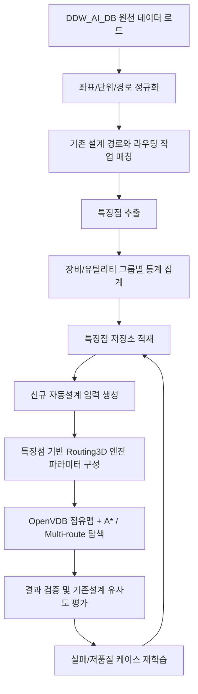

# DDW_AI_DB 기존 배관설계 특징점 분석 및 자동배관설계 적용 방안

작성일: 2026-06-14  
대상: Routing3D / DDW_AI_DB / PostgreSQL / OpenVDB 기반 직교형 3D 라우팅 엔진  
목표: 사람이 설계한 기존 배관 데이터를 장비별, 유틸리티 그룹별, 유틸리티별로 분석하여 신규 자동배관설계가 기존 설계와 유사한 배치, 접속, 그룹화, 회피 특성을 따르도록 한다.

---

## 1. 목적과 기본 방향

자동배관설계의 목표는 단순히 최단 경로를 찾는 것이 아니다. 실제 설계자는 장비의 PoC에서 바로 최단거리로 덕트나 레터럴까지 연결하지 않고, 다음과 같은 설계 의도를 반영한다.

- 장비별로 선호하는 출발 방향과 출발면이 있다.
- 덕트/레터럴 PoC별로 선호하는 진입 방향과 진입면이 있다.
- 같은 장비 또는 같은 유틸리티 그룹의 배관은 일정 높이의 공용 레인이나 트렁크로 모이는 경향이 있다.
- 기존 설계는 장애물 회피뿐 아니라 유지보수 공간, 장비 접근성, 배관 간격, 관경, 시공성을 함께 고려한다.
- 유틸리티별로 흔한 경로 높이, 수직 상승/하강 패턴, 회랑, 번들 간격이 다르다.
- 같은 장비라도 Exhaust, CDA, PCW, UPW 등 유틸리티 종류에 따라 설계 패턴이 달라진다.

따라서 자동설계는 다음 2단 구조가 되어야 한다.

1. **기존설계 특징점 학습 계층**  
   DDW_AI_DB의 기존 경로, 장비, PoC, 덕트/레터럴, 장애물 데이터를 분석하여 설계자가 반복적으로 사용한 패턴을 추출한다.

2. **특징점 기반 자동설계 계층**  
   추출된 패턴을 라우팅 엔진의 시작/종단 보정, 비용함수, 회랑 유도, 그룹 배관, 우선순위, 충돌회피 조건으로 주입한다.

현재 Routing3D.Viewer에는 이미 다음 기반 기능이 존재한다.

- 기존 설계배관 표시: `TB_ROUTE_PATH`, `TB_ROUTE_SEGMENTS`, `TB_ROUTE_SEGMENT_DETAIL`
- 장비/덕트/레터럴/장애물 점유맵 구성
- PoC 표면 투영 및 자유 셀 스냅
- 기존 배관 스텁 추출 및 스텁 라우팅
- 장비/유틸리티 그룹별 라우팅
- 기존설계 패턴 `PatternStore`
- 그룹배관 패턴 `BundleStore`
- 자동설계 비교 리포트 `AutoDesignReport`

본 문서는 이 기반을 확장하여 실제 제품 수준의 “기존설계 유사 자동배관설계”로 발전시키기 위한 전체 프로세스와 데이터 구조를 정의한다.

---

## 2. 입력 데이터와 기준 엔티티

### 2.1 주요 DB 테이블

현재 프로젝트 코드에서 확인되는 DDW_AI_DB 주요 테이블은 다음과 같다.

| 구분 | 테이블 | 용도 |
|---|---|---|
| 프로젝트/공간 | `TB_SPACE_GROUP_INFO`, `TB_BIM_SPACE_INFO` | 프로젝트 또는 공간 그룹, 설계 범위, 공간 AABB |
| 장애물 | `TB_BIM_OBSTACLE` 또는 `TB_BIM_OBSTACLES` | 충돌 회피 대상 AABB |
| 장비 | `TB_EQUIPMENTS`, `TB_BIM_EQUIPMENT` | 장비/부대장비 AABB, 메인 장비 여부, 장비명 |
| 덕트/레터럴 | `TB_DUCT`, `TB_LATERAL_PIPE`, `TB_DUCT_LATERAL` | 종단 접속 대상, 유틸리티 분기 대상, AABB |
| 라우팅 작업 | `TB_ROUTE_PATH` | 장비 PoC에서 덕트/레터럴 PoC까지의 기존 설계 작업 단위 |
| 경로 세그먼트 | `TB_ROUTE_SEGMENTS` | 기존 경로의 세그먼트 묶음, 순서, 경로 GUID |
| 경로 상세 | `TB_ROUTE_SEGMENT_DETAIL` | 실제 폴리라인 좌표, 부속 위치, 세부 segment point |
| 스텁 패턴 | `TB_ROUTE_SEGMENT_TEMPLATE` | 장비 출발 스텁, 덕트 진입 스텁의 방향/면/rise 학습 기반 |
| 그룹배관 패턴 | `TB_ROUTE_DESIGN_GROUP` | 기존 배관 번들/그룹 멤버십, 장비/유틸리티 그룹 기준 묶음 |

실제 DB에는 프로젝트마다 테이블명 또는 컬럼명이 조금 다를 수 있으므로, 로더 계층에서는 별칭 매핑을 유지해야 한다. 예를 들어 `TB_DUCT`/`TB_LATERAL_PIPE`와 `TB_DUCT_LATERAL`은 동일한 개념의 다른 정규화 수준으로 취급한다.

### 2.2 자동설계의 기본 작업 단위

자동설계 작업 단위는 다음 키로 정의한다.

```text
ProjectId
MainEquipmentName
EquipmentName
UtilityGroup
Utility
SourcePoC
TargetPoC
PipeDiameter / Size
TargetOwnerName / DuctName / LateralName
```

가장 중요한 그룹화 기준은 다음 순서다.

1. 프로젝트
2. 메인 장비
3. 장비 또는 부대장비
4. 유틸리티 그룹
5. 유틸리티
6. 관경/사이즈
7. 출발 PoC와 종단 PoC

사람의 설계 의도는 대체로 “개별 PoC 하나”보다 “동일 장비의 동일 유틸리티 그룹 묶음”에서 강하게 나타난다. 따라서 학습과 자동설계 모두 개별 작업 단위뿐 아니라 그룹 단위를 기본으로 가져야 한다.

---

## 3. 전체 프로세스

### 3.1 전체 흐름



### 3.2 단계별 상세

#### 단계 1. 프로젝트 데이터 로드

프로젝트 또는 공간 그룹을 선택하면 다음 데이터를 같은 좌표계로 로드한다.

- 장애물 AABB
- 장비/부대장비 AABB
- 장비 PoC
- 덕트/레터럴 AABB
- 덕트/레터럴 PoC
- 기존 설계 배관 폴리라인
- 배관 부속, 엘보, 티, 밸브, 플랜지, 리듀서 등 연결부
- 기존 설계의 유틸리티 그룹, 유틸리티, 관경, 소유 장비명

이 단계에서는 아직 라우팅하지 않는다. 데이터의 누락, 좌표 이상, 범위 이상, 순서 오류를 먼저 진단한다.

#### 단계 2. 좌표 및 경로 정규화

기존 설계 데이터는 CAD/BIM 추출 과정에서 미세 오차가 있을 수 있다. 자동설계 학습에 사용하려면 다음 정규화가 필요하다.

- mm 단위 통일
- 프로젝트 원점 기준 좌표 변환
- 10mm, 25mm, 50mm, 100mm 등 분석 cell 크기에 맞춘 grid index 변환
- 거의 같은 점 병합
- 아주 짧은 segment 제거
- 직교형 경로의 축 정렬 보정
- 중복 점 제거
- segment 순서 정렬
- 수평/수직 segment 분리

기존 설계가 완전 직교형이 아니더라도, 배관 자동설계 엔진은 직교형 Routing을 목표로 하므로 학습용 경로는 X/Y/Z 축 segment로 정규화한다.

#### 단계 3. 기존 설계 경로와 작업 매칭

`TB_ROUTE_PATH`의 출발 PoC/종단 PoC와 `TB_ROUTE_SEGMENT_DETAIL`의 폴리라인을 매칭한다.

매칭 기준은 다음과 같다.

- 기존 배관 시작점과 작업 SourcePoC 거리
- 기존 배관 끝점과 작업 TargetPoC 거리
- 반대 방향 매칭 가능성
- 유틸리티 그룹/유틸리티 일치 여부
- 장비명/대상 owner 이름 일치 여부
- 동일 프로젝트/공간 그룹 여부

방향 판정은 다음 비용이 작은 쪽을 선택한다.

```text
forwardCost  = dist(taskStart, pipeStart) + dist(taskEnd, pipeEnd)
reverseCost  = dist(taskStart, pipeEnd)   + dist(taskEnd, pipeStart)
pipeDirection = forwardCost <= reverseCost ? forward : reverse
```

이 매칭은 이후 스텁 추출, 코너 복제, 기존설계 유사도 평가의 기준이 된다.

#### 단계 4. 특징점 추출

기존 설계 한 건에서 추출할 특징점은 크게 6종이다.

1. PoC 접속 특징
2. 스텁 특징
3. 경로 형상 특징
4. 그룹/번들 특징
5. 충돌/회피 특징
6. 설계 품질/유사도 지표

각 특징은 개별 배관 단위와 그룹 단위로 모두 저장한다.

#### 단계 5. 장비/유틸리티 그룹별 집계

개별 경로 특징점은 그대로 자동설계에 쓰기 어렵다. 다음 기준으로 집계해야 한다.

```text
(project_id, main_equipment, equipment_name, utility_group, utility, diameter_bucket)
(project_id, main_equipment, utility_group, utility)
(project_id, utility_group, utility)
(project_id, utility_group)
(global, utility_group, utility)
```

정확히 일치하는 패턴이 없을 때도 사용할 수 있도록 fallback 계층을 둔다.

```text
장비+유틸리티 정확 매칭
→ 장비+유틸리티그룹
→ 유틸리티그룹+유틸리티
→ 유틸리티그룹
→ anchor kind 기본값
```

#### 단계 6. 특징점 저장

특징점은 PostgreSQL에 저장한다. 단순 통계는 일반 테이블에 저장하고, 유사 PoC 검색이 필요한 데이터는 pgvector 또는 별도 ANN 인덱스를 사용한다.

현재 구현의 `PatternStore`, `BundleStore`는 다음 저장소를 읽는다.

- `TB_ROUTE_SEGMENT_TEMPLATE`: 장비 출발면, 덕트 진입면, 스텁 rise
- `TB_ROUTE_DESIGN_GROUP`: 기존 배관 그룹/번들 멤버십

추가로 본 문서에서는 `route_feature_*` 테이블군을 제안한다.

#### 단계 7. 자동설계 적용

신규 라우팅 작업에 대해 저장된 특징점을 조회하고, 라우팅 엔진에 다음 형태로 반영한다.

- SourcePoC를 학습된 장비 출발면으로 표면 투영
- TargetPoC를 학습된 덕트/레터럴 진입면으로 표면 투영
- 기존 스텁 패턴을 사용해 PoC 주변 고정 구간 생성
- 그룹별 공용 rack z 레벨 주입
- 번들 회랑 corridor cell 주입
- 유틸리티별 관경/간격 기반 pipe radius 적용
- 기존 설계와 유사한 코너/waypoint 후보 생성
- 다중 배관 라우팅 순서 최적화
- 이미 배치된 배관을 점유맵에 반영하여 충돌 회피

#### 단계 8. 검증과 재학습

자동설계 결과는 기존 설계와 비교하여 다음 지표로 평가한다.

- 성공률
- 경로 길이 차이
- 꺾임 수 차이
- PoC 접속면 일치율
- rack level 일치율
- 기존 경로 회랑 일치율
- 번들 밀집도
- 배관 간격 위반 수
- 충돌 수
- 과도한 우회율
- 사람이 보기 어려운 지그재그 segment 수

검증 결과가 낮은 케이스는 특징점 추출 오류, 데이터 누락, 장애물 모델링 오류, 라우팅 파라미터 오류 중 하나로 분류하여 재학습한다.

---

## 4. 분석해야 할 핵심 특징점

### 4.1 PoC 접속면 특징

사람 설계에서 가장 중요한 특징 중 하나는 “PoC가 어느 면으로 빠져나오고 어느 면으로 들어가는가”이다.

예시는 다음과 같다.

- 장비 하부에서 배관이 나오는 경우: `EQUIP = -z`
- 덕트 상부로 배관이 들어가는 경우: `DUCT = +z`
- 측면 접속이 많은 장비: `EQUIP = +x`, `-x`, `+y`, `-y`
- 특정 유틸리티만 측면 진입하는 경우

추출 방법은 다음과 같다.

1. 기존 경로의 첫 segment 방향을 계산한다.
2. SourcePoC가 장비 AABB 내부 또는 표면 근처에 있는지 확인한다.
3. 첫 segment의 dominant axis를 구한다.
4. 장비 밖으로 나가는 방향을 장비 출발면으로 기록한다.
5. 기존 경로의 마지막 segment 방향을 계산한다.
6. TargetPoC가 덕트/레터럴 AABB 내부 또는 표면 근처에 있는지 확인한다.
7. 덕트로 진입하는 방향의 반대 방향을 덕트 진입면으로 기록한다.

저장 예시는 다음과 같다.

```text
anchor_kind = EQUIP
utility_group = EXHAUST
utility = EXH
face = -z
vote_count = 128
confidence = 0.82
avg_rise_mm = 600
```

자동설계 적용 방식은 다음과 같다.

- SourcePoC가 장비 내부이면 학습된 face 방향으로 장비 표면 밖 `0.5 cell` 이상 이동한다.
- 이동 후에도 점유 셀이면 face 방향으로 최대 N cell march한다.
- 실패하면 주변 자유 셀 탐색으로 fallback한다.
- TargetPoC도 동일하게 덕트/레터럴 표면 밖으로 투영한다.

이 처리를 하지 않으면 장비/덕트가 점유맵에 솔리드로 들어간 경우 PoC 자체가 막힌 셀이 되어 라우팅이 실패하거나, 덕트/장비를 관통하는 비현실적 경로가 생성된다.

### 4.2 스텁 특징

스텁은 PoC 주변의 짧은 고정 설계 구간이다. 보통 다음 형태를 가진다.

```text
장비 PoC → 수직 상승/하강 → 수평 전환 → 공용 rack 또는 회랑 진입
덕트 PoC → 표면 접속 → 짧은 수직/수평 전환 → 공용 회랑 진입
```

스텁에서 분석할 특징점은 다음과 같다.

| 특징 | 의미 |
|---|---|
| start_face | 장비에서 나오는 면 |
| end_face | 덕트/레터럴에 들어가는 면 |
| rise_mm | PoC에서 rack/회랑까지 수직 이동량 |
| stub_length_mm | 스텁 전체 길이 |
| first_axis | 첫 segment 축 |
| second_axis | 두 번째 segment 축 |
| bend_count | 스텁 내 엘보 수 |
| local_points | PoC 기준 상대 좌표 폴리라인 |
| confidence | 동일 패턴 반복 신뢰도 |

기존 `TB_ROUTE_SEGMENT_TEMPLATE`는 이 개념을 일부 담고 있다.

- `SEGMENT_ROLE = A_EQUIP_STUB`: 장비 출발 스텁
- `SEGMENT_ROLE = C_DUCT_ENTRY`: 덕트 진입 스텁
- `START_DIR_UNIT`, `END_DIR_UNIT`: 방향 벡터
- `LOCAL_POINTS_JSON`: PoC 기준 상대 폴리라인

자동설계에서는 가능한 경우 스텁을 먼저 고정 구간으로 만들고, A*는 스텁 끝점끼리 연결하도록 한다. 이렇게 하면 PoC 주변의 접속 모양이 기존 설계와 훨씬 유사해진다.

### 4.3 경로 형상 특징

개별 기존 배관의 전체 경로에서 다음 지표를 추출한다.

| 특징 | 설명 |
|---|---|
| total_length_mm | 전체 배관 길이 |
| manhattan_length_mm | PoC 간 직교 최단 길이 |
| detour_ratio | total_length / manhattan_length |
| bend_count | 축 전환 횟수 |
| vertical_length_ratio | 전체 길이 중 Z segment 비율 |
| horizontal_length_ratio | 전체 길이 중 XY segment 비율 |
| z_histogram | 경로가 많이 쓰는 높이 분포 |
| main_rack_z | 가장 긴 수평 segment의 대표 Z |
| dominant_axis | 주 수평 진행 방향 X/Y |
| bbox | 경로 AABB |
| clearance_min | 장애물/장비와 최소 이격 |
| route_complexity | 길이, 꺾임, 우회율을 합친 복잡도 |

자동설계 활용 방식은 다음과 같다.

- `main_rack_z`는 `rack_levels` 후보로 사용한다.
- `dominant_axis`는 trunk 방향 후보로 사용한다.
- `detour_ratio`가 높은 유틸리티는 장애물 회피 비용을 낮추거나 회랑 유도를 강화한다.
- `bend_count`가 낮은 그룹은 꺾임 패널티를 높인다.
- `vertical_length_ratio`가 일정한 그룹은 시작/종단 스텁 rise를 강하게 적용한다.

### 4.4 그룹배관/번들 특징

사람 설계는 동일 장비 또는 동일 유틸리티 그룹의 배관을 공용 회랑으로 묶는 경향이 있다. 이를 자동화하려면 개별 경로보다 그룹 특징이 중요하다.

분석할 특징점은 다음과 같다.

| 특징 | 설명 |
|---|---|
| bundle_id | 기존 설계에서 함께 움직이는 배관 묶음 |
| owner_name | 메인 장비 또는 대상 장비 |
| utility_group | 유틸리티 그룹 |
| utility | 유틸리티 |
| member_route_guids | 번들에 속한 기존 배관 GUID 목록 |
| trunk_zs | 공용 trunk 높이 후보 |
| trunk_axis | 공용 trunk 주 진행축 |
| trunk_centerline | 공용 회랑 중심선 |
| pitch_mm | 인접 배관 간 평균 간격 |
| lane_count | 병렬 레인 수 |
| shared_length_ratio | 전체 경로 중 번들 공유 비율 |
| branch_point_distribution | trunk에서 개별 PoC로 갈라지는 위치 분포 |

현재 `TB_ROUTE_DESIGN_GROUP`과 `BundleStore`는 그룹 멤버십을 다루고 있다. 향후에는 trunk 높이, pitch, centerline까지 저장하면 자동설계 품질이 크게 올라간다.

자동설계 적용 방식은 다음과 같다.

- 같은 장비/유틸리티 그룹 작업을 batch로 묶는다.
- batch 내 경로에 동일한 rack z 후보를 부여한다.
- 기존 번들 centerline 주변에 corridor cell을 생성한다.
- A* 비용함수에 corridor attraction을 준다.
- 배관 간 충돌을 피하기 위해 pipe radius와 pitch를 적용한다.
- 순차 라우팅 후 이미 배치된 배관을 점유맵에 mark한다.

### 4.5 장애물-배관 연관 특징

기존 설계에서 장애물은 단순히 “통과할 수 없는 박스”가 아니다. 기둥, H-beam, 장비 프레임, 벽체, 덕트 지지대 같은 구조물은 배관의 꺾임 위치, 우회 방향, rack 높이, 배관 간격, PoC 접속부 형상을 직접 결정한다. 따라서 자동배관설계가 사람 설계와 유사해지려면 장애물과 배관의 공간적 관계를 별도 특징점으로 학습해야 한다.

장애물 유형별 일반적인 영향은 다음과 같다.

| 장애물 유형 | 설계 영향 | 자동설계 적용 방향 |
|---|---|---|
| 기둥 | 좌/우 우회, 기둥 전후 조기 꺾임, 최소 이격 확보 | 기둥 AABB 팽창, 선호 우회 side 학습, 조기 bend waypoint 생성 |
| H-beam | 상부/하부 통과 가능 여부, 플랜지/웹 방향에 따른 우회 | beam 방향성 저장, 상/하/측면 우회 비용 차등 적용 |
| 벽체/큰 구조물 | 장거리 측면 우회, 특정 side 통과 금지 | 금지 영역 확대, 우회 corridor 후보 생성 |
| 장비 프레임 | 유지보수 공간 확보, 장비 접근면 회피 | maintenance clearance zone 생성, 접근면 penalty 적용 |
| 덕트/레터럴 | 종단 접속 대상이면서 동시에 점유 장애물 | PoC 표면 투영, 접속부만 허용하고 본체 관통 금지 |
| 기존 배관 | 신규 배관과 간격 유지, 병렬 bundle 형성 | pipe radius mark, pitch 유지, bundle attraction 적용 |

분석할 특징점은 다음과 같다.

| 특징 | 설명 |
|---|---|
| obstacle_id | 장애물 식별자 또는 AABB hash |
| obstacle_type | COLUMN, H_BEAM, WALL, FRAME, EQUIPMENT, DUCT, LATERAL 등 |
| obstacle_axis | H-beam/벽체처럼 방향성이 있는 객체의 주축 X/Y/Z |
| obstacle_aabb | 장애물 AABB |
| route_path_guid | 연관 기존 배관 GUID |
| nearest_segment_index | 장애물과 가장 가까운 기존 배관 segment |
| nearest_distance_mm | 장애물과 배관 centerline의 최근접 거리 |
| clearance_mm | 관경을 고려한 실제 표면 이격 추정값 |
| pipe_diameter_mm | 배관 관경 또는 추정 관경 |
| expanded_clearance_mm | 관경/보온/시공 여유를 반영한 요구 이격 |
| bypass_side | 장애물을 +x/-x/+y/-y/+z/-z 중 어느 방향으로 우회했는지 |
| bypass_axis | 우회에 사용된 주 이동축 |
| bend_before_distance_mm | 장애물 전 몇 mm 지점에서 꺾임이 시작되는지 |
| bend_after_distance_mm | 장애물 후 몇 mm 지점에서 원래 진행으로 복귀하는지 |
| avoidance_z_delta_mm | 우회 과정에서 상승/하강한 높이 변화량 |
| avoidance_extra_length_mm | 장애물 회피 때문에 증가한 경로 길이 |
| pass_through_flag | 통과 가능 객체 여부 |
| relation_confidence | 해당 장애물이 실제 우회 원인일 가능성 |

장애물-배관 연관성은 다음 기준으로 판정한다.

1. 배관 segment와 장애물 AABB의 최근접 거리를 계산한다.
2. 관경, 보온두께, 최소 시공 이격을 반영해 장애물 AABB를 확장한다.
3. 확장 AABB와 배관 segment가 가깝거나 교차하면 후보 관계로 등록한다.
4. 장애물 전후 일정 거리 안에 꺾임점이 있으면 해당 장애물이 꺾임 원인일 가능성을 높인다.
5. 꺾임 전 진행 방향과 꺾임 후 진행 방향을 비교해 우회 방향을 산출한다.
6. 같은 유형/같은 유틸리티 그룹에서 반복되는 우회 side와 bend distance를 집계한다.

장애물과 꺾임의 인과성은 단순 거리만으로 판단하지 말고 다음 score로 계산한다.

```text
relation_score = 0.35 * proximity_score
               + 0.25 * bend_near_obstacle_score
               + 0.15 * expanded_aabb_intersection_score
               + 0.15 * route_direction_change_score
               + 0.10 * repeated_pattern_score
```

- `proximity_score`: 장애물과 segment가 가까울수록 높음
- `bend_near_obstacle_score`: 장애물 전후에 꺾임점이 있을수록 높음
- `expanded_aabb_intersection_score`: 관경/이격 반영 AABB와 경로가 접할수록 높음
- `route_direction_change_score`: 장애물 근처에서 축 전환이 명확할수록 높음
- `repeated_pattern_score`: 같은 장애물 유형과 유틸리티에서 반복될수록 높음

자동설계에서는 이 특징을 다음처럼 사용한다.

- 장애물 AABB를 관경과 최소 이격만큼 팽창하여 점유맵에 반영한다.
- 기둥/H-beam 같은 구조물은 “hard obstacle”과 “soft clearance zone”을 분리한다.
- 기존 설계에서 자주 선택한 우회 side에는 낮은 비용을 부여한다.
- 사람이 보통 꺾기 시작한 거리만큼 장애물 전방에 waypoint 후보를 만든다.
- H-beam의 상부/하부 통과 가능성은 beam 방향성과 높이 조건으로 판단한다.
- 장애물 바로 앞 급격한 지그재그는 penalty를 높이고, 일정 거리 전부터 부드럽게 우회하도록 한다.
- pass-through 객체는 완전 금지하지 않고 낮은 penalty 또는 조건부 통과로 처리한다.

즉, 장애물 관련 설계 지식은 다음 세 계층으로 나눠 적용하는 것이 좋다.

```text
Hard zone: 실제 충돌 금지 영역
Soft clearance zone: 이격 확보를 위해 비용을 높이는 영역
Preferred bypass corridor: 기존설계에서 사람이 자주 사용한 우회 방향/회랑
```

이렇게 하면 자동설계가 단순히 장애물을 피해 최단 경로를 찾는 수준을 넘어, 기둥과 H-beam 앞에서 사람이 미리 꺾고, 충분한 이격을 두고, 기존 rack/회랑으로 복귀하는 형태를 재현할 수 있다.

### 4.6 배관 부속/시공성 특징

`TB_ROUTE_SEGMENT_DETAIL`에 엘보, 티, 밸브, 플랜지, 리듀서, 유니온, 클램프 등 부속 정보가 있으면 다음 특징을 추출한다.

| 특징 | 설명 |
|---|---|
| fitting_type | 부속 종류 |
| fitting_position | 부속 위치 |
| fitting_near_poc | PoC 근처 부속 여부 |
| elbow_spacing | 엘보 간 거리 |
| valve_access_clearance | 밸브 접근 공간 |
| reducer_before_after | 리듀서 전후 관경 변화 |

자동설계에서 바로 모든 부속을 생성하지 않더라도, 최소한 다음 규칙은 반영해야 한다.

- 너무 짧은 직관 후 연속 엘보 금지
- 밸브/플랜지 주변 접근 공간 확보
- 리듀서/티 위치는 장비 또는 덕트 접속부 주변으로 제한
- 관경이 큰 유틸리티는 코너 최소 직선 길이를 크게 설정

---

## 5. 핵심 알고리즘

### 5.1 기존 경로 정규화 알고리즘

입력: 기존 설계 폴리라인 `P0..Pn`  
출력: 직교 정규화 폴리라인 `Q0..Qm`

1. 연속 중복점 제거
2. 길이 `epsilon` 이하 segment 제거
3. 각 segment의 dominant axis 계산
4. segment가 축과 약간 틀어진 경우 dominant axis로 보정
5. 축이 바뀌는 지점만 코너로 유지
6. 매우 짧은 지그재그 segment는 주변 segment와 병합
7. PoC 근처 시작/끝점은 DB의 SourcePoC/TargetPoC로 보정

이 과정은 “학습용” 정규화다. 원본 데이터를 삭제하지 말고 원본 폴리라인과 정규화 폴리라인을 모두 보관해야 한다.

### 5.2 PoC-anchor 매칭 알고리즘

입력: PoC 좌표, 장비/덕트/레터럴 AABB 목록  
출력: anchor 객체와 상대좌표

1. PoC를 포함하는 AABB를 먼저 찾는다.
2. 포함 AABB가 없으면 일정 거리, 예: 3000mm 이내의 최근접 AABB를 찾는다.
3. 후보가 여러 개이면 장비명, target owner, utility, 카테고리 일치를 우선한다.
4. anchor 내부 상대좌표를 계산한다.

```text
rel_x = (poc_x - min_x) / (max_x - min_x)
rel_y = (poc_y - min_y) / (max_y - min_y)
rel_z = (poc_z - min_z) / (max_z - min_z)
```

이 상대좌표는 같은 종류의 덕트/장비에서 유사 PoC를 찾는 데 사용한다.

### 5.3 접속면 학습 알고리즘

입력: 정규화 경로, source anchor, target anchor  
출력: source face, target face, confidence

1. 시작점 이후 첫 유효 segment를 찾는다.
2. segment 방향 벡터를 dominant axis face로 변환한다.
3. Source anchor가 장비이면 해당 방향을 장비 출발면으로 기록한다.
4. 끝점 이전 마지막 유효 segment를 찾는다.
5. target으로 들어가는 방향의 반대 방향을 target 접속면으로 기록한다.
6. `(anchor_kind, utility_group, utility)`별로 voting한다.
7. 최다 vote face와 전체 대비 비율을 confidence로 저장한다.

```text
confidence = winning_face_count / total_count
```

추천 기준은 다음과 같다.

- confidence >= 0.70: 자동설계에 강하게 적용
- 0.45 <= confidence < 0.70: 후보 face로 적용하되 주변 자유 셀 탐색 허용
- confidence < 0.45: ANN 또는 최근접-면 fallback 사용

### 5.4 스텁 추출 알고리즘

입력: 기존 경로, SourcePoC, TargetPoC  
출력: source stub, target stub

1. SourcePoC에서 시작하여 첫 번째 공용 trunk 후보에 도달할 때까지의 segment를 source stub으로 본다.
2. TargetPoC에서 역방향으로 첫 번째 공용 trunk 후보에 도달할 때까지의 segment를 target stub으로 본다.
3. trunk 후보는 다음 조건으로 판단한다.
   - 여러 배관이 같은 z 또는 같은 XY 회랑을 공유한다.
   - 긴 수평 segment가 존재한다.
   - PoC 근처 국부 segment보다 길이가 길다.
4. stub의 local point를 PoC 기준 상대좌표로 저장한다.
5. 동일 키의 stub을 clustering하여 대표 template을 만든다.

대표 template은 medoid 방식이 적합하다.

```text
대표 스텁 = 같은 클러스터 내 다른 스텁들과 평균 거리 합이 가장 작은 실제 스텁
```

평균 좌표를 만들면 실제 설계에 없는 애매한 스텁이 생길 수 있으므로, 초기에는 medoid가 안전하다.

### 5.5 Rack level 추출 알고리즘

입력: 기존 배관 경로 그룹  
출력: rack z 후보 목록

1. 각 경로의 수평 segment만 추출한다.
2. segment 길이로 가중치를 준 z histogram을 만든다.
3. histogram peak를 찾는다.
4. 가까운 z peak는 병합한다.
5. 장비/유틸리티 그룹별 대표 z를 산출한다.

```text
z_score[z] += horizontal_segment_length
rack_z = local maxima of z_score
```

자동설계에서는 rack z를 grid index로 변환하여 `rack_levels`로 라우팅 엔진에 전달한다.

### 5.6 번들/회랑 추출 알고리즘

입력: 동일 장비/동일 유틸리티 그룹의 기존 경로 집합  
출력: bundle group, trunk centerline, pitch

1. 각 경로를 grid cell 또는 segment 단위로 rasterize한다.
2. 같은 z, 같은 방향, 가까운 XY 거리의 긴 segment를 후보로 묶는다.
3. 일정 길이 이상 병렬로 진행하는 경로들을 bundle로 정의한다.
4. bundle별 centerline을 산출한다.
5. 인접 배관 간 거리를 계산하여 pitch를 산출한다.
6. bundle 멤버 route GUID 목록을 저장한다.

자동설계에서는 bundle centerline 주변을 corridor cell로 만들어 A*가 그 주변을 선호하게 한다.

### 5.7 기존설계 corridor attraction 알고리즘

기존 설계와 유사하게 만들기 위한 핵심은 “강제”가 아니라 “유도”다. 기존 경로와 동일한 셀만 허용하면 신규 장애물이나 누락 데이터에서 실패가 많아진다.

권장 방식은 다음과 같다.

- 기존 경로 또는 bundle centerline을 grid cell로 rasterize한다.
- 주변 N cell을 dilate하여 corridor를 만든다.
- corridor 내부 이동 비용을 낮춘다.
- corridor 밖 이동도 허용하되 비용을 높인다.
- 장애물/점유맵 충돌은 corridor보다 우선한다.

```text
cost = base_cost
     + bend_penalty
     + vertical_penalty
     + obstacle_clearance_penalty
     - corridor_attraction
     - rack_level_attraction
```

즉, 기존설계를 따라가면 싸지만 충돌이 있으면 돌아갈 수 있어야 한다.

### 5.8 장애물-배관 관계 학습 알고리즘

입력: 장애물 AABB 목록, 기존 배관 폴리라인, 배관 관경  
출력: 장애물별 우회 side, 꺾임 거리, 이격 profile

1. 장애물 유형을 분류한다. 기둥, H-beam, 벽체, 장비 프레임, 덕트/레터럴, 기존 배관을 구분한다.
2. 장애물 AABB를 관경, 보온두께, 최소 이격거리만큼 확장한다.
3. 각 기존 배관 segment와 확장 AABB의 최근접 거리를 계산한다.
4. 확장 AABB와 가까운 segment를 후보 관계로 저장한다.
5. 장애물 전후 window 안에 있는 bend point를 찾는다.
6. bend point 전후 방향 변화를 분석하여 우회 side와 bypass axis를 구한다.
7. 장애물 전방 bend distance와 후방 복귀 distance를 계산한다.
8. 동일 `(obstacle_type, obstacle_axis, utility_group, utility)` 단위로 반복 패턴을 집계한다.
9. confidence가 높은 우회 side, clearance, bend distance를 자동설계 profile로 저장한다.

장애물별 우회 방향은 다음 기준으로 산출한다.

```text
approach_dir = direction(segment before obstacle)
escape_dir   = direction(segment around obstacle)
return_dir   = direction(segment after obstacle)
bypass_side  = dominant axis of escape vector relative to obstacle center
```

기둥처럼 수직 구조물은 XY 우회가 주가 되므로 `+x/-x/+y/-y` side를 우선한다. H-beam은 주축과 높이를 함께 보아야 하며, 상부 우회(`+z`), 하부 통과(`-z`), 측면 우회(`+x/-x/+y/-y`)를 모두 후보로 둔다.

자동설계 적용 시에는 다음 profile을 만든다.

```text
obstacle_avoidance_profile = {
  obstacle_type,
  obstacle_axis,
  utility_group,
  utility,
  preferred_bypass_side,
  preferred_clearance_mm,
  preferred_bend_before_mm,
  preferred_bend_after_mm,
  preferred_z_delta_mm,
  confidence
}
```

이 profile은 A*의 비용함수와 waypoint 후보 생성에 동시에 사용한다.
### 5.9 다중 배관 순서 알고리즘

동일 장비/유틸리티 그룹의 배관은 하나씩 독립적으로 라우팅하면 나중 배관이 막히거나 그룹성이 깨진다. 다음 순서가 필요하다.

1. 관경이 큰 배관 우선
2. 길이가 긴 배관 우선
3. trunk 공유도가 높은 배관 우선
4. 공간 제약이 큰 PoC 우선
5. 실패한 배관은 rip-up 후 재시도

현재 엔진의 `route_multi`에는 longest 우선 전략이 존재한다. 여기에 관경, PoC 혼잡도, 기존 설계 bundle 중심성을 추가하면 좋다.

추천 priority score는 다음과 같다.

```text
priority = 0.35 * normalized_diameter
         + 0.25 * normalized_manhattan_length
         + 0.20 * poc_congestion_score
         + 0.15 * bundle_centrality
         + 0.05 * utility_priority
```

### 5.10 유사도 평가 알고리즘

기존 설계와 자동설계를 비교할 때 단순 길이만 보면 안 된다. 다음 composite score를 사용한다.

```text
similarity = 0.20 * endpoint_face_score
           + 0.20 * corridor_overlap_score
           + 0.15 * rack_z_score
           + 0.15 * bend_similarity_score
           + 0.10 * length_similarity_score
           + 0.10 * bundle_group_score
           + 0.10 * clearance_quality_score
```

각 점수는 0~1로 정규화한다.

- endpoint_face_score: 출발/종단 접속면 일치
- corridor_overlap_score: 기존 경로 또는 bundle corridor와 겹치는 비율
- rack_z_score: 주요 수평 segment의 z가 기존 rack z와 가까운 정도
- bend_similarity_score: 꺾임 수 차이가 작을수록 높음
- length_similarity_score: 길이 차이가 작을수록 높음
- bundle_group_score: 같은 그룹 배관끼리 공용 레인으로 묶이는 정도
- clearance_quality_score: 충돌 없음, 최소 이격 만족

---

## 6. 특징점 저장구조 제안

### 6.1 기존 저장소 활용

현재 구현에서 이미 사용하는 저장소는 유지한다.

#### `TB_ROUTE_SEGMENT_TEMPLATE`

용도: 장비 출발 스텁과 덕트 진입 스텁의 접속면/rise/template 학습

주요 컬럼 개념:

```text
SEGMENT_ROLE          -- A_EQUIP_STUB, C_DUCT_ENTRY
UTILITY_GROUP
UTILITY
START_DIR_UNIT
END_DIR_UNIT
LOCAL_POINTS_JSON
```

활용:

- `PatternStore.TryLoad()`에서 `(anchor_kind, utility_group, utility)`별 face voting
- 장비 PoC 표면 투영
- 덕트 PoC 표면 투영
- fallback 계층: exact → group → kind

#### `TB_ROUTE_DESIGN_GROUP`

용도: 기존 배관의 그룹/번들 멤버십

주요 컬럼 개념:

```text
GROUP_ID
EQUIPMENT_NAME
UTILITY_GROUP
UTILITY
MEMBER_COUNT
MEMBER_ROUTE_GUIDS
```

활용:

- `BundleStore.TryLoad()`에서 route GUID별 group id 로드
- 그룹배관 표시
- bundle corridor 생성
- 동일 장비/유틸리티 자동설계 batch 구성

### 6.2 추가 권장 테이블

#### 6.2.1 `route_feature_path`

개별 기존 배관 경로의 정량 특징 저장.

```sql
CREATE TABLE IF NOT EXISTS route_feature_path (
    id bigserial PRIMARY KEY,
    project_id integer NOT NULL,
    route_path_guid text NOT NULL,
    main_equipment_name text,
    equipment_name text,
    target_owner_name text,
    utility_group text,
    utility text,
    pipe_size text,
    diameter_mm double precision,
    source_poc_name text,
    target_poc_name text,
    source_x double precision,
    source_y double precision,
    source_z double precision,
    target_x double precision,
    target_y double precision,
    target_z double precision,
    total_length_mm double precision,
    manhattan_length_mm double precision,
    detour_ratio double precision,
    bend_count integer,
    vertical_length_mm double precision,
    horizontal_length_mm double precision,
    main_rack_z double precision,
    dominant_axis text,
    bbox_min_x double precision,
    bbox_min_y double precision,
    bbox_min_z double precision,
    bbox_max_x double precision,
    bbox_max_y double precision,
    bbox_max_z double precision,
    normalized_points_json jsonb,
    created_at timestamptz DEFAULT now(),
    UNIQUE(project_id, route_path_guid)
);
```

#### 6.2.2 `route_feature_anchor`

PoC 접속면과 anchor 상대좌표 저장.

```sql
CREATE TABLE IF NOT EXISTS route_feature_anchor (
    id bigserial PRIMARY KEY,
    project_id integer NOT NULL,
    route_path_guid text NOT NULL,
    anchor_kind text NOT NULL,       -- EQUIP, DUCT, LATERAL
    anchor_name text,
    utility_group text,
    utility text,
    face text,                       -- +x, -x, +y, -y, +z, -z
    direction_unit double precision[],
    rel_pos double precision[],       -- anchor AABB 내부 상대좌표 [0..1]^3
    rise_mm double precision,
    confidence double precision,
    sample_count integer DEFAULT 1,
    created_at timestamptz DEFAULT now()
);
```

#### 6.2.3 `route_feature_stub_template`

스텁 대표 template 저장. 기존 `TB_ROUTE_SEGMENT_TEMPLATE`가 충분하면 해당 테이블을 대체하지 않고 보강 뷰로 사용할 수 있다.

```sql
CREATE TABLE IF NOT EXISTS route_feature_stub_template (
    id bigserial PRIMARY KEY,
    project_id integer,
    anchor_kind text NOT NULL,       -- EQUIP, DUCT, LATERAL
    main_equipment_name text,
    equipment_name text,
    utility_group text,
    utility text,
    pipe_size text,
    face text NOT NULL,
    avg_rise_mm double precision,
    avg_stub_length_mm double precision,
    avg_bend_count double precision,
    local_points_json jsonb NOT NULL,
    vote_count integer NOT NULL,
    confidence double precision NOT NULL,
    created_at timestamptz DEFAULT now()
);
```

#### 6.2.4 `route_feature_bundle_template`

그룹배관/번들 회랑 저장.

```sql
CREATE TABLE IF NOT EXISTS route_feature_bundle_template (
    id bigserial PRIMARY KEY,
    project_id integer NOT NULL,
    bundle_id integer NOT NULL,
    main_equipment_name text,
    equipment_name text,
    utility_group text,
    utility text,
    trunk_axis text,
    trunk_zs double precision[],
    trunk_centerline_json jsonb,
    pitch_mm double precision,
    lane_count integer,
    shared_length_ratio double precision,
    member_route_guids text[],
    confidence double precision,
    created_at timestamptz DEFAULT now(),
    UNIQUE(project_id, bundle_id)
);
```

#### 6.2.5 `route_feature_obstacle_relation`

장애물과 배관의 연관성, 우회 방향, 꺾임 위치, 이격 패턴을 저장한다.

```sql
CREATE TABLE IF NOT EXISTS route_feature_obstacle_relation (
    id bigserial PRIMARY KEY,
    project_id integer NOT NULL,
    route_path_guid text NOT NULL,
    obstacle_id text,
    obstacle_type text,
    obstacle_axis text,
    utility_group text,
    utility text,
    pipe_size text,
    diameter_mm double precision,
    obstacle_min_x double precision,
    obstacle_min_y double precision,
    obstacle_min_z double precision,
    obstacle_max_x double precision,
    obstacle_max_y double precision,
    obstacle_max_z double precision,
    nearest_segment_index integer,
    nearest_distance_mm double precision,
    clearance_mm double precision,
    expanded_clearance_mm double precision,
    bypass_side text,
    bypass_axis text,
    bend_before_distance_mm double precision,
    bend_after_distance_mm double precision,
    avoidance_z_delta_mm double precision,
    avoidance_extra_length_mm double precision,
    pass_through_flag boolean DEFAULT false,
    relation_score double precision,
    created_at timestamptz DEFAULT now()
);
```

권장 인덱스:

```sql
CREATE INDEX IF NOT EXISTS ix_route_feature_obstacle_relation_key
ON route_feature_obstacle_relation(project_id, obstacle_type, utility_group, utility, bypass_side);

CREATE INDEX IF NOT EXISTS ix_route_feature_obstacle_relation_route
ON route_feature_obstacle_relation(project_id, route_path_guid);
```

이 테이블은 자동설계에서 장애물 유형별 우회 비용과 waypoint 후보를 만들 때 사용한다. 특히 기둥/H-beam처럼 반복적으로 등장하는 구조물은 `obstacle_type`, `obstacle_axis`, `utility_group`, `utility` 단위로 집계하여 preferred bypass profile을 만든다.
#### 6.2.6 `route_feature_group_profile`

자동설계에서 빠르게 조회할 집계 profile.

```sql
CREATE TABLE IF NOT EXISTS route_feature_group_profile (
    id bigserial PRIMARY KEY,
    project_id integer,
    main_equipment_name text,
    equipment_name text,
    utility_group text,
    utility text,
    diameter_bucket text,
    preferred_source_face text,
    preferred_target_face text,
    preferred_rack_zs double precision[],
    preferred_axis text,
    avg_pitch_mm double precision,
    avg_detour_ratio double precision,
    avg_bend_count double precision,
    avg_vertical_ratio double precision,
    grouping_factor double precision,
    sample_count integer,
    confidence double precision,
    updated_at timestamptz DEFAULT now()
);
```

이 테이블은 자동설계 조회 성능을 위해 필요하다. 매번 개별 경로 feature를 다시 집계하지 않고, 라우팅 시작 시 profile만 읽어서 엔진 파라미터를 만든다.

### 6.3 인덱스 권장

```sql
CREATE INDEX IF NOT EXISTS ix_route_feature_path_key
ON route_feature_path(project_id, main_equipment_name, utility_group, utility);

CREATE INDEX IF NOT EXISTS ix_route_feature_anchor_key
ON route_feature_anchor(project_id, anchor_kind, utility_group, utility, face);

CREATE INDEX IF NOT EXISTS ix_route_feature_group_profile_key
ON route_feature_group_profile(project_id, main_equipment_name, equipment_name, utility_group, utility);

CREATE INDEX IF NOT EXISTS ix_route_feature_bundle_key
ON route_feature_bundle_template(project_id, main_equipment_name, utility_group, utility);
```

PoC 상대좌표와 접근 방향으로 ANN 검색을 하려면 pgvector를 사용할 수 있다.

```sql
-- 예: rel_pos[3] + approach_dir[3] = 6차원 vector
-- extension vector 필요
CREATE EXTENSION IF NOT EXISTS vector;

ALTER TABLE route_feature_anchor
ADD COLUMN IF NOT EXISTS poc_context_vec vector(6);

CREATE INDEX IF NOT EXISTS ix_route_feature_anchor_vec
ON route_feature_anchor USING ivfflat (poc_context_vec vector_l2_ops);
```

---

## 7. 자동설계 적용 방안

### 7.1 라우팅 전처리

신규 설계 작업이 들어오면 다음 순서로 준비한다.

1. 프로젝트/공간의 grid와 OpenVDB 점유맵 생성
2. 장애물, 장비, 덕트, 레터럴, 부대장비를 solid occupancy로 추가
3. 시작 장비 PoC와 종단 덕트/레터럴 PoC를 읽는다.
4. 작업을 장비/유틸리티 그룹/유틸리티별 batch로 묶는다.
5. 각 batch에 대해 `route_feature_group_profile`을 조회한다.
6. exact profile이 없으면 fallback profile을 조회한다.
7. 접속면, rack z, bundle corridor, pitch, pipe radius를 결정한다.

### 7.2 PoC 보정

PoC 보정은 자동설계 품질에 가장 큰 영향을 준다.

```text
원본 SourcePoC
→ 장비 내부 여부 확인
→ 학습 source face 조회
→ 장비 표면 밖으로 Lift
→ 해당 방향으로 자유 셀 march
→ 실패 시 주변 자유 셀 Snap
→ A* 시작점 확정
```

TargetPoC도 같은 방식으로 처리한다.

```text
원본 TargetPoC
→ 덕트/레터럴 anchor 확인
→ 학습 target face 조회
→ 덕트/레터럴 표면 밖으로 Lift
→ 해당 방향으로 자유 셀 march
→ 실패 시 주변 자유 셀 Snap
→ A* 종단점 확정
```

이때 표시용 최종 경로는 원본 PoC에서 시작/종료해야 한다. 즉, 라우팅 내부 시작점은 보정된 자유 셀이지만, 결과 polyline은 다음처럼 합성한다.

```text
원본 SourcePoC
+ source stub 또는 보정 연결 segment
+ A* path
+ target stub 또는 보정 연결 segment
+ 원본 TargetPoC
```

### 7.3 스텁 우선 설계

기존설계와 유사하게 만들려면 PoC 주변은 A*에 맡기기보다 스텁 template을 우선 적용하는 것이 좋다.

적용 순서:

1. 작업과 가장 잘 맞는 기존 배관을 찾는다.
2. 기존 배관에서 source stub과 target stub을 추출한다.
3. 신규 PoC 기준으로 stub local points를 변환한다.
4. stub 끝점이 자유 공간이면 A* 시작/종료점으로 사용한다.
5. stub 끝점이 막혀 있으면 face 기반 Lift/Snap으로 fallback한다.
6. A*는 stub 끝점 사이만 탐색한다.

장점:

- PoC 접속부가 사람 설계와 유사해진다.
- 장비/덕트 관통 문제가 줄어든다.
- 불필요한 PoC 근처 지그재그가 줄어든다.
- 기존 설계 리포트에서 길이/꺾임 비교가 쉬워진다.

### 7.4 Rack level 유도

학습된 rack z는 엔진에 `rack_levels`로 넣는다.

권장 비용 구조:

```text
rack level 위에서 수평 이동: 비용 감소
rack level 밖에서 긴 수평 이동: 비용 증가
불필요한 z 변경: 비용 증가
PoC 주변 필수 수직 이동: 허용
```

주의할 점은 rack level을 “강제”하면 실패율이 증가한다는 것이다. 장애물 또는 기존 배관 혼잡이 있으면 다른 높이로 우회할 수 있어야 한다.

### 7.5 Bundle corridor 유도

그룹배관 패턴이 있으면 다음을 적용한다.

- bundle centerline 주변 N cell을 corridor로 생성
- corridor 내부 이동 비용 감소
- 같은 batch의 배관이 corridor에 모이도록 유도
- 이미 배치된 배관과의 간격은 pipe radius/pitch로 유지
- branch 구간에서는 개별 PoC 방향으로 분기 허용

현재 코드의 `BuildDesignCorridorCells`, `BuildBundleCorridorCells`, `SetCorridorCells` 개념을 확장하면 된다.

### 7.6 관경/간격 반영

기존 설계 유사성뿐 아니라 실제 배관 설계에서는 관경과 간격이 중요하다.

추천 적용:

- `SOURCE_SIZE` 또는 `pipe_size`에서 diameter를 추정한다.
- 알 수 없으면 유틸리티별 기본 관경을 사용한다.
- 엔진에 task별 pipe radius를 설정한다.
- 이미 라우팅된 배관은 반경만큼 점유맵에 mark한다.
- 다른 배관과의 최소 간격은 `r1 + r2 + gap_mm`로 적용한다.

### 7.7 장애물 회피 profile 적용

장애물-배관 연관 특징점은 라우팅 전처리와 비용함수에 동시에 적용한다.

1. 장애물 유형을 분류한다.
2. 관경/보온/시공 여유를 기준으로 hard zone과 soft clearance zone을 만든다.
3. `route_feature_obstacle_relation`에서 같은 장애물 유형, 유틸리티 그룹, 유틸리티의 우회 profile을 조회한다.
4. profile confidence가 높으면 선호 우회 side 방향에 preferred bypass corridor를 만든다.
5. 장애물 전방에는 `preferred_bend_before_mm` 기준 waypoint 후보를 만든다.
6. 장애물 후방에는 `preferred_bend_after_mm` 기준 복귀 waypoint 후보를 만든다.
7. H-beam은 `obstacle_axis`와 beam 높이를 기준으로 상부/하부/측면 우회 후보 비용을 다르게 준다.
8. 경로가 soft clearance zone을 지나면 비용을 높이고, preferred corridor를 지나면 비용을 낮춘다.

권장 비용식은 다음과 같다.

```text
cost = base_cost
     + hard_collision_block
     + soft_clearance_penalty
     + sharp_bend_near_obstacle_penalty
     - preferred_bypass_side_bonus
     - learned_bend_distance_bonus
```

이 방식은 장애물을 무조건 크게 팽창시켜 경로를 과도하게 막는 방식보다 안정적이다. 실제 충돌은 금지하면서도, 사람이 자주 택한 우회 방향과 꺾임 위치를 비용으로 유도할 수 있다.
### 7.8 다중 라우팅과 rip-up

여러 배관을 동시에 설계할 때는 순차 A*만으로는 부족하다.

권장 절차:

1. priority score가 높은 배관부터 라우팅
2. 성공 경로를 점유맵에 mark
3. 실패 배관은 보류
4. 실패가 많으면 혼잡 구간의 일부 경로를 rip-up
5. corridor 비용과 rack 후보를 조정하여 재시도
6. 최대 반복 횟수 후 실패 사유 리포트 생성

실패 사유는 다음으로 분류한다.

- 시작 PoC 접근 불가
- 종단 PoC 접근 불가
- grid scope 부족
- 장애물 완전 차단
- 기존 배관 혼잡
- rack/corridor 유도가 너무 강함
- 관경/간격 조건 과도

---

## 8. 운영용 학습 파이프라인

### 8.1 배치 학습 프로세스

권장 실행 단위는 프로젝트별 batch다.

```text
1. project_id 선택
2. DDW_AI_DB 원천 데이터 로드
3. 기존 경로 정규화
4. route_path_guid별 feature 추출
5. 장비/유틸리티 그룹별 profile 집계
6. bundle/template 탐지
7. feature 테이블 upsert
8. 자동설계 replay 검증
9. 리포트 저장
```

### 8.2 증분 학습

모든 프로젝트를 매번 재학습하면 비용이 크다. 다음 기준으로 증분 학습한다.

- `TB_ROUTE_PATH` 변경 시간
- `TB_ROUTE_SEGMENT_DETAIL` 변경 시간
- 프로젝트별 last_learned_at
- route_path_guid별 hash

추천 hash:

```text
route_hash = hash(route_path_guid + ordered segment points + utility + equipment + target)
```

hash가 바뀐 경로만 다시 feature 추출하고, 관련 group profile만 재집계한다.

### 8.3 품질 게이트

학습 데이터를 그대로 믿으면 안 된다. 다음 데이터는 제외하거나 낮은 weight를 둔다.

- PoC와 기존 경로 시작/끝 거리가 너무 먼 경로
- segment 순서가 깨진 경로
- 총 길이가 PoC Manhattan 거리보다 비정상적으로 짧은 경로
- 꺾임 수가 과도하게 많은 경로
- 장비/덕트 anchor를 찾지 못한 경로
- 유틸리티 또는 장비명이 비어 있는 경로
- 장애물을 관통하는 경로

품질 score가 낮은 경로는 feature 저장은 하되 `is_training_usable = false`로 관리하는 것이 좋다.

---

## 9. 자동설계 결과 리포트

자동설계 후 다음 리포트를 생성해야 한다.

### 9.1 작업별 리포트

| 항목 | 내용 |
|---|---|
| route_path_guid | 기준 기존 배관 GUID 또는 신규 GUID |
| equipment | 장비명 |
| utility_group | 유틸리티 그룹 |
| utility | 유틸리티 |
| success | 성공 여부 |
| length_mm | 자동설계 길이 |
| existing_length_mm | 기존 설계 길이 |
| bend_count | 자동설계 꺾임 수 |
| existing_bend_count | 기존 꺾임 수 |
| face_match | 접속면 일치 여부 |
| corridor_overlap | 기존 corridor와 겹침 비율 |
| collision_count | 충돌 수 |
| warning | 품질 경고 |

### 9.2 그룹별 리포트

| 항목 | 내용 |
|---|---|
| main_equipment | 메인 장비 |
| utility_group | 유틸리티 그룹 |
| utility_count | 유틸리티 수 |
| task_count | 작업 수 |
| success_rate | 성공률 |
| grouping_factor | 그룹배관 유사도 |
| avg_length_delta | 기존 대비 길이 차이 |
| avg_bend_delta | 기존 대비 꺾임 차이 |
| rack_z_match | rack z 일치율 |
| bundle_match | 번들 유사도 |

### 9.3 시각 검증

Helix3D/WPF 또는 별도 리포트에서 다음 레이어를 동시에 볼 수 있어야 한다.

- 장애물
- 장비/부대장비
- 덕트/레터럴
- 기존 설계 배관
- 자동설계 배관
- PoC 마커
- 점유맵
- 방문맵
- 충돌맵
- 학습된 rack level
- 학습된 bundle corridor

기존 설계와 자동설계를 같은 색상 체계로 비교하면 설계자 검토 시간이 크게 줄어든다.

---

## 10. 적용 우선순위

### 10.1 1단계: 현재 구현 안정화

- DDW_AI_DB project 선택 UI 안정화
- 장비/덕트/레터럴/기존 설계 표시 정확도 검증
- PoC marker와 기존 경로 매칭 검증
- `PatternStore`의 face 학습 결과 표시
- `BundleStore`의 그룹 멤버 표시
- 자동설계 결과와 기존설계 비교 리포트 생성

### 10.2 2단계: feature 저장소 구축

- `route_feature_path`
- `route_feature_anchor`
- `route_feature_stub_template`
- `route_feature_bundle_template`
- `route_feature_group_profile`

위 테이블을 만들고 프로젝트별 batch 학습을 구현한다.

### 10.3 3단계: 자동설계 엔진 적용 강화

- face confidence 기반 PoC 보정
- 스텁 template 기반 접속부 생성
- rack z 후보 주입
- bundle corridor 주입
- 관경별 pipe radius 적용
- 작업 priority 개선
- 실패 케이스 rip-up/retry

### 10.4 4단계: 유사도 기반 튜닝

- 기존 설계 replay benchmark 구축
- 설계 유사도 score 자동 계산
- 유틸리티 그룹별 비용 가중치 자동 튜닝
- 실패 사유 자동 분류
- 설계자 승인/수정 결과를 재학습 데이터로 저장

---

## 11. 권장 아키텍처

```mermaid
flowchart LR
    DB[(DDW_AI_DB PostgreSQL)] --> Loader[Scene/Route Loader]
    Loader --> Normalizer[Route Normalizer]
    Normalizer --> Extractor[Feature Extractor]
    Extractor --> Store[(Feature Store)]
    Store --> Profile[Group Profile Resolver]
    Profile --> Planner[Auto Design Planner]
    Planner --> Engine[OpenVDB Routing3D Engine]
    Engine --> Result[Route Result]
    Result --> Validator[Similarity/Collision Validator]
    Validator --> Report[Report + Viewer]
    Validator --> Store
```



구성 모듈은 다음처럼 나누는 것이 좋다.

| 모듈 | 역할 |
|---|---|
| `DbSceneLoader` | 프로젝트 공간, 장애물, 장비, 덕트, PoC 로드 |
| `ExistingRouteLoader` | 기존 배관 polyline 및 segment detail 로드 |
| `RouteNormalizer` | 직교화, 중복점 제거, grid 변환 |
| `RouteFeatureExtractor` | 개별 경로 특징점 추출 |
| `RoutePatternLearner` | 접속면, 스텁, rack, bundle 집계 |
| `RouteFeatureStore` | PostgreSQL feature table read/write |
| `RouteProfileResolver` | 신규 작업에 맞는 profile fallback 조회 |
| `AutoRoutePlanner` | routing batch, priority, engine param 구성 |
| `RouteValidator` | 충돌/유사도/품질 평가 |
| `AutoDesignReport` | CSV/HTML/PDF/Viewer 리포트 |

---

## 12. 핵심 설계 원칙

1. **최단거리보다 기존 설계 의도를 우선한다.**  
   최단 경로는 baseline으로만 사용하고, 실제 자동설계는 스텁, rack, bundle, corridor, 접속면을 반영해야 한다.

2. **패턴은 강제가 아니라 비용 유도여야 한다.**  
   기존 설계 corridor를 반드시 통과하게 하면 신규 장애물이나 변경된 장비 배치에서 실패한다. 비용을 낮춰 선호하게 만들고, 막히면 우회할 수 있어야 한다.

3. **PoC 주변은 별도 규칙으로 처리한다.**  
   장비/덕트는 점유맵에서 solid이므로 PoC를 직접 A* 시작/끝으로 쓰면 실패하기 쉽다. 반드시 surface lift와 snap이 필요하다.

4. **개별 경로보다 그룹 단위가 중요하다.**  
   사람이 설계한 배관의 자연스러움은 동일 유틸리티 그룹이 공용 레인으로 모이는 데서 나온다.

5. **학습 feature와 원본 DB는 분리한다.**  
   원본 DDW_AI_DB는 변경하지 않고, 분석 결과는 별도 feature table에 저장해야 추적과 재학습이 쉽다.

6. **모든 자동설계 결과는 설명 가능해야 한다.**  
   왜 이 face를 선택했는지, 왜 이 rack z를 썼는지, 어떤 기존 경로와 매칭했는지 리포트에 남겨야 설계자가 신뢰할 수 있다.

---

## 13. 구현 체크리스트

### DB/학습

- [ ] 프로젝트별 기존 경로 로드 쿼리 정리
- [ ] route_path_guid 기준 경로 정규화
- [ ] SourcePoC/TargetPoC와 기존 경로 매칭 검증
- [ ] anchor AABB 매칭 구현
- [ ] 접속면 voting 구현
- [ ] 스텁 template 추출 구현
- [ ] rack z histogram 구현
- [ ] bundle detection 구현
- [ ] 장애물-배관 연관 feature 추출 구현
- [ ] 기둥/H-beam 우회 profile 집계 구현
- [ ] feature table DDL 적용
- [ ] feature upsert 구현
- [ ] group profile materialization 구현

### 자동설계

- [ ] feature profile resolver 구현
- [ ] PoC surface lift에 confidence 적용
- [ ] 스텁 우선 라우팅 적용
- [ ] rack_levels 주입
- [ ] bundle corridor 주입
- [ ] 관경별 radius 적용
- [ ] 장애물 hard/soft clearance zone 적용
- [ ] 장애물별 preferred bypass corridor 적용
- [ ] priority 기반 multi-route 적용
- [ ] 실패 케이스 retry/rip-up 적용

### 검증/시각화

- [ ] 기존 설계와 자동설계 overlay
- [ ] feature layer 표시: rack, corridor, stub, face
- [ ] 작업별 similarity score 표시
- [ ] 그룹별 success/grouping report 표시
- [ ] 실패 사유 자동 분류
- [ ] 설계자 승인/수정 feedback 저장

---

## 14. 결론

DDW_AI_DB의 기존 설계 데이터는 단순한 “과거 경로 좌표”가 아니라, 장비별·유틸리티 그룹별 설계자의 반복 의사결정이 누적된 데이터다. 이를 자동설계에 사용하려면 원본 경로를 그대로 복사하는 방식이 아니라, 다음 특징점으로 분해해서 저장해야 한다.

- 장비 출발면과 덕트 진입면
- PoC 주변 스텁 형상
- 공용 rack 높이
- 그룹배관/bundle 회랑
- 유틸리티별 관경/간격/우회 성향
- 기둥, H-beam, 벽체 등 장애물 유형별 우회 방향과 꺾임 위치
- 기존 설계 대비 유사도와 품질 지표

Routing3D 엔진에는 이미 OpenVDB 점유맵, 직교형 A*, multi-route, PoC lift/snap, 스텁 라우팅, pattern store, bundle store의 기반이 있으므로, 다음 개발의 핵심은 “특징점 저장소와 feature resolver”를 제품 수준으로 정리하는 것이다.

최종 목표 구조는 다음과 같다.

```text
DDW_AI_DB 기존설계
→ 특징점 학습
→ 장비/유틸리티 그룹 profile 저장
→ 신규 PoC 작업 입력
→ profile 기반 PoC 보정/스텁/rack/bundle/corridor 적용
→ OpenVDB Routing3D 탐색
→ 기존설계 유사도 검증
→ 설계자 검토 및 재학습
```

이 구조로 구현하면 자동배관설계는 단순 최단경로 엔진이 아니라, 프로젝트별 설계 습관과 장비별 배관 배치 규칙을 반영하는 설계 보조 엔진으로 발전할 수 있다.

