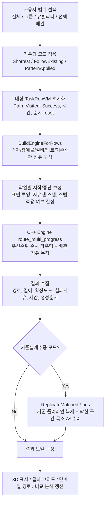
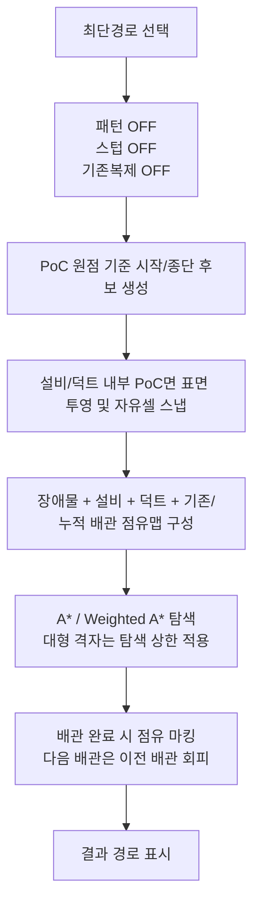
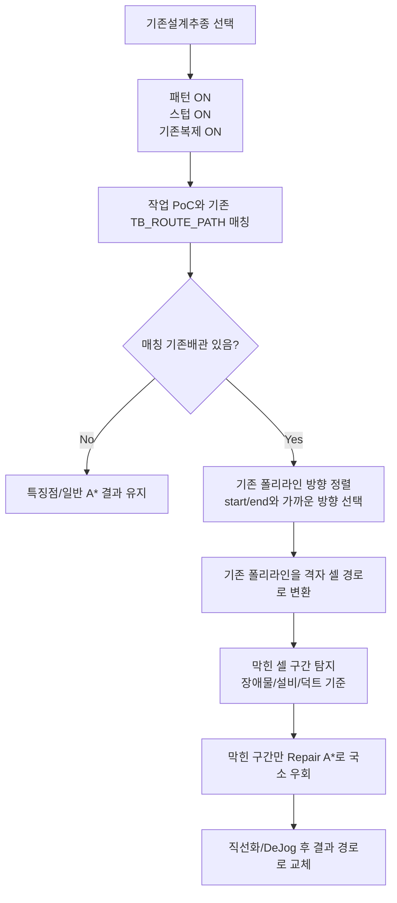
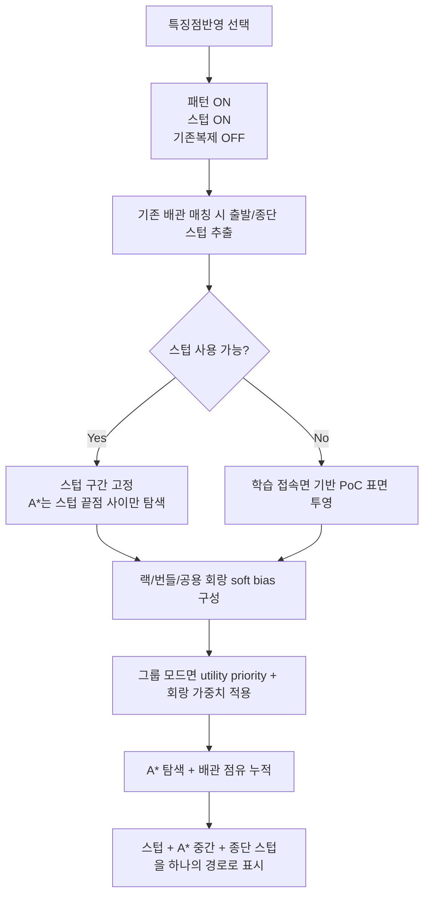

# Routing3D 경로탐색 방식 3종 상세 문서

작성일: 2026-07-02
대상: Routing3D Viewer / C++ Engine 기반 자동경로설계
범위: `최단경로`, `기존설계추종`, `특징점반영` 3가지 모드의 프로세스, 알고리즘, 예상 결과, 장단점

---

## 1. 요약

Routing3D Viewer의 경로 방식은 UI에서 3가지로 선택된다.

| 방식 | 내부 모드 | 핵심 목적 | 권장 사용 |
|---|---|---|---|
| 최단경로 | `RoutingMode.Shortest` | 기존 설계 패턴 없이 충돌회피 A*로 연결 가능 경로 탐색 | 단일 배관 검증, 자유공간 연결성 확인, 알고리즘 기준선 |
| 기존설계추종 | `RoutingMode.FollowExisting` | 매칭되는 기존 설계 폴리라인을 최대한 복제하고 막힌 구간만 수리 | 기존 설계와 가장 유사한 결과가 필요할 때 |
| 특징점반영 | `RoutingMode.PatternApplied` | 기존 설계에서 학습한 스텁, 접속면, 랙/회랑/번들 특징을 반영 | 일반 자동설계 기본값, 다중 Exhaust 배관 라우팅 |

중요한 해석:

- 현재 “최단경로”는 **현실 설계상 가장 짧은 배관**이라는 뜻이 아니다.
- 실제 의미는 **현재 엔진 점유맵에서 장애물, 설비, 덕트, 기존배관, 이미 생성된 배관과 이격 조건을 모두 피하는 격자 A* 경로**이다.
- 따라서 기존 설계가 덕트/장비 주변의 접속 관례를 따라 짧게 붙어 있는 경우, 최단경로 모드는 오히려 AABB 바깥으로 크게 우회해 더 긴 결과를 만들 수 있다.

---

## 2. 공통 자동경로 프로세스

세 방식은 모드별 전처리와 후처리는 다르지만, 큰 실행 흐름은 같다.



공통으로 적용되는 주요 엔진 설정:

- 격자: 현재 프로젝트/그룹 AABB 기반 `GridMeta`.
- 점유:
  - `TB_BIM_OBSTACLE` 중 통과 객체가 아닌 장애물.
  - 설비 `TB_BIM_EQUIPMENT`.
  - 덕트/레터럴 `TB_DUCT_LATERAL`.
  - 이미 라우팅된 다른 배관.
- 배관 간 이격:
  - per-task 관경 반경 활성.
  - 배관 표면 최소 gap 60 mm 적용.
- 꺾임/직선성:
  - 회전 비용 `w_turn = 500`.
  - 클리어런스 비용 `w_clear = 10`.
  - 후처리 최소 런 흡수 `SetMinStraight(2.0)`.
  - 절대 최소 직선 길이 `R3D_MIN_STRAIGHT_MM`는 기본 0, 환경변수로 opt-in.
- 대형 격자:
  - 해시/암시적 점유 기반으로 메모리 폭발을 줄임.
  - 최단경로 모드는 대형 격자에서 탐색 상한을 별도로 둠.
- 진행 콜백:
  - `route_multi_progress`로 각 배관 완료 순서, 시간, 확장노드, 성공/실패를 UI에 반영.

---

## 3. 모드 선택 시 내부 플래그

Viewer의 `ApplyRoutingMode()`는 다음과 같이 내부 기능을 켜고 끈다.

| 모드 | `_usePatterns` | `_useStubRouting` | `_useDesignReplicate` | 그룹 회랑 |
|---|---:|---:|---:|---:|
| 최단경로 | OFF | OFF | OFF | OFF |
| 기존설계추종 | ON | ON | ON | OFF |
| 특징점반영 | ON | ON | OFF | ON |

의미:

- `_usePatterns`: 기존 설계에서 학습한 접속면, 랙 높이, 번들/회랑 정보를 사용할지 결정.
- `_useStubRouting`: 기존 설계 배관의 출발/종단 스텁 형상을 고정 구간으로 사용할지 결정.
- `_useDesignReplicate`: 기존 설계 폴리라인을 결과 경로로 복제하고 막힌 구간만 수리할지 결정.
- 그룹 회랑: 같은 그룹/유틸리티 배관을 기존 설계 회랑 또는 번들 중심선 근처로 유도하는 soft bias.

---

## 4. 최단경로 방식

### 4.1 목적

최단경로 방식은 패턴, 스텁, 기존설계 회랑을 사용하지 않고 A* 기반으로 시작점과 종단점을 연결한다.

다만 실제 구현에서는 완전한 수학적 최단경로라기보다 다음 조건을 만족하는 **충돌회피 격자 경로**이다.

- 장애물/설비/덕트/레터럴 AABB와 충돌하지 않아야 한다.
- 이미 생성된 배관과 물리 이격을 만족해야 한다.
- 배관 관경과 60 mm gap을 고려해 다음 배관의 점유 영역을 막는다.
- 회전 비용, 클리어런스 비용, 휴리스틱 가중치가 적용된다.

### 4.2 프로세스



### 4.3 알고리즘 특성

최단경로 모드의 주요 탐색 비용은 다음 요소의 합으로 볼 수 있다.

```text
f(n) = g(n) + w_heur * h(n)

g(n): 실제 누적 비용
  - 셀 이동 비용
  - 꺾임 비용
  - 장애물 근접 클리어런스 비용
  - 회랑/랙 비용. 최단경로 모드에서는 거의 사용하지 않음

h(n): 목표까지 휴리스틱 거리
w_heur: 대형 격자에서 탐색량을 줄이기 위한 가중치
```

대형 격자에서는 `w_heur`가 1보다 클 수 있다. 이 경우 경로는 더 빨리 나오지만, 엄밀한 최적 최단경로 보장은 약해진다.

### 4.4 예상 결과

장점:

- 기존 설계 데이터가 없어도 경로를 찾을 수 있다.
- 특정 장애물 상태에서 “연결 가능한가”를 검증하기 좋다.
- 패턴이나 기존 설계 편향이 없어서 알고리즘 기준선으로 쓰기 좋다.

단점:

- Exhaust처럼 기존 설계 접속 형태가 중요한 배관에서는 경로가 길어질 수 있다.
- PoC가 장비/덕트 내부에 있을 때 표면 투영과 자유셀 스냅만으로 접속 형태를 만들기 때문에, 사람이 설계한 스텁보다 부자연스러운 수직/수평 우회가 발생할 수 있다.
- 여러 배관을 순차 라우팅하면 앞 배관이 점유한 셀이 뒤 배관의 장애물이 되므로 순서에 민감하다.
- 밀집 구간에서는 탐색량과 시간이 급격히 증가한다.

### 4.5 기존설계보다 더 길어지는 대표 원인

1. 기존 설계는 덕트/장비 접속부에 “붙는” 형상을 사용하지만, 최단경로는 AABB 솔리드를 회피한다.
2. 기존 설계는 랙/공용 레인/스텁 방향을 알고 있지만, 최단경로는 그 정보를 사용하지 않는다.
3. 기존 배관과 이미 생성된 배관을 장애물로 보므로, 뒤쪽 배관은 크게 우회할 수 있다.
4. 장애물 AABB가 실제 형상보다 보수적으로 크면, 빈 공간처럼 보이는 곳도 격자상 막힌 셀로 처리될 수 있다.
5. 대형 격자에서 weighted A*와 탐색 상한을 쓰면, 연결 우선 경로가 나와도 설계상 최단과 다를 수 있다.

따라서 최단경로 결과가 기존설계보다 길다면, 다음을 확인해야 한다.

- 해당 구간의 장비/덕트 AABB가 실제보다 과대인지.
- 기존 설계가 통과한 객체가 현재 장애물로 등록되어 있는지.
- 기존 배관 또는 이미 생성된 자동경로가 뒤 배관을 막고 있는지.
- PoC 표면 투영 위치가 기존 설계 접속면과 다른지.
- `특징점반영` 또는 `기존설계추종` 모드에서 길이와 꺾임 수가 개선되는지.

---

## 5. 기존설계추종 방식

### 5.1 목적

기존설계추종 방식은 매칭되는 기존 설계 배관이 있을 때 그 폴리라인을 최대한 그대로 사용한다. 장애물이나 변경된 점유 때문에 막힌 구간만 국소 A*로 수리한다.

목표는 “연결 가능한 새 경로”보다 “기존 설계와 가장 유사한 경로”이다.

### 5.2 프로세스



### 5.3 매칭 기준

기존 배관 매칭은 시작/종단 PoC와 기존 배관의 source/target 위치 거리를 비교한다.

```text
score = min(
  dist(task.start, existing.source) + dist(task.end, existing.target),
  dist(task.start, existing.target) + dist(task.end, existing.source)
)
```

허용 거리 이내에서 score가 가장 작은 기존 배관을 선택한다.

### 5.4 알고리즘 특성

기존설계추종은 크게 두 단계이다.

1. 복제:
   - 기존 설계 폴리라인을 현재 작업의 시작/종단 PoC 방향으로 정렬한다.
   - 기존 폴리라인을 격자 셀 경로로 변환한다.

2. 수리:
   - 현재 장애물/설비/덕트 점유와 겹치는 구간을 찾는다.
   - 막힌 구간 전후 자유 셀 사이를 별도 A*로 연결한다.
   - 성공하면 기존 폴리라인 대부분을 유지하고 막힌 구간만 우회한다.

### 5.5 예상 결과

장점:

- 기존 설계와 가장 유사하다.
- 사람 설계의 랙, 스텁, 접속 관례를 가장 잘 보존한다.
- 경로가 짧고 자연스럽게 나올 가능성이 높다.
- 장애물이 일부 바뀐 경우, 변경 구간만 고쳐 빠르게 결과를 낼 수 있다.

단점:

- 기존 설계 매칭이 없으면 효과가 없다.
- 기존 설계 자체가 현재 장애물/설비 모델과 충돌하면 수리 실패 또는 국소 우회가 생긴다.
- 기존 설계 오류도 그대로 따라갈 수 있다.
- 새 배관끼리의 최종 충돌 회피는 순수 A* 신규 설계보다 약할 수 있으므로 검증이 필요하다.

권장 사용:

- 기존 설계 데이터를 신뢰할 수 있고, 자동경로가 기존 결과와 유사해야 하는 프로젝트.
- 기존 설계 변경 영향 분석.
- “기존과 비슷하게, 막힌 곳만 고쳐라”가 요구사항인 경우.

---

## 6. 특징점반영 방식

### 6.1 목적

특징점반영 방식은 Routing3D의 기본 권장 모드이다. 기존 설계를 그대로 복제하지는 않지만, 기존 설계에서 학습한 특징을 A* 탐색에 반영한다.

반영되는 특징:

- 출발/종단 스텁.
- 장비/덕트 접속면.
- 랙 높이.
- 유틸리티/그룹별 공용 회랑.
- 번들 중심선.
- 기존 설계와 유사한 수직/수평 접속 형태.

### 6.2 프로세스



### 6.3 스텁 적용

기존 설계 매칭 배관이 있으면 다음을 수행한다.

1. 기존 배관의 source/target 스텁을 추출한다.
2. 현재 작업 PoC 방향과 기존 배관 방향을 정렬한다.
3. 출발 스텁과 종단 스텁을 고정 구간으로 둔다.
4. A*는 두 스텁의 끝점 사이 자유공간만 탐색한다.
5. 표시 경로는 다음 구조가 된다.

```text
전체 자동경로 = 출발 스텁 + A* 탐색 경로 + reverse(종단 스텁)
```

효과:

- PoC가 장비/덕트 내부에 있어도 기존 설계처럼 자연스럽게 표면으로 빠져나온다.
- A* 탐색 구간이 짧아져 속도가 빨라진다.
- 최단경로 모드의 과도한 수직/수평 우회를 줄인다.

### 6.4 회랑/랙/번들 적용

특징점반영 모드는 기존 설계 또는 학습 테이블에서 공용 경로 성향을 가져온다.

적용 방식:

- `rack_levels`: 특정 z 높이를 선호한다.
- `corridor_cells`: 기존 설계 또는 번들 중심선 주변 셀을 선호한다.
- `w_corridor`: 회랑 밖으로 벗어나면 비용을 더한다.
- 그룹 라우팅 시 같은 유틸리티를 공용 트렁크/레인으로 모으는 효과가 생긴다.

주의:

- 회랑은 hard constraint가 아니라 soft bias이다.
- 장애물/이격 조건 때문에 필요하면 회랑 밖으로 나갈 수 있다.
- 회랑 가중치가 너무 강하면 경로가 길어지거나 막힌 회랑을 고집할 수 있다.

### 6.5 예상 결과

장점:

- 기존설계와 유사한 접속/스텁/랙 패턴을 반영한다.
- 기존설계추종보다 새 장애물과 다중 배관 충돌 회피에 유연하다.
- 최단경로보다 일반적으로 짧고 자연스러운 결과가 나온다.
- Exhaust 다중 배관처럼 기존 설계 관례가 강한 업무에 적합하다.

단점:

- 기존 설계 매칭이나 학습 데이터 품질에 영향을 받는다.
- 잘못된 스텁/접속면 학습이 있으면 오히려 불필요한 우회가 생길 수 있다.
- 회랑 bias는 최적성보다 설계 유사성을 우선하므로, 어떤 단일 배관은 최단경로보다 길 수 있다.

권장 사용:

- 기본 자동설계.
- 다중 Exhaust, Acid, ALKA 등 같은 유틸리티 그룹의 반복 배관.
- 기존 설계와 비슷하면서도 충돌회피를 보장해야 하는 경우.

---

## 7. 세 방식 비교

| 항목 | 최단경로 | 기존설계추종 | 특징점반영 |
|---|---|---|---|
| 기존 설계 필요 | 불필요 | 필요 | 있으면 강력, 없어도 동작 |
| 기존 설계 유사도 | 낮음 | 가장 높음 | 높음 |
| 충돌회피 유연성 | 높음 | 중간 | 높음 |
| 다중 배관 안정성 | 순서 영향 큼 | 기존 형상 의존 | 가장 균형적 |
| 속도 | 복잡 공간에서 느림 | 매칭 성공 시 빠름 | 보통 빠름 |
| 경로 길이 | 현실 설계보다 길 수 있음 | 보통 가장 짧거나 기존과 동일 | 보통 짧고 자연스러움 |
| 실패 원인 해석 | 장애물/격자/순서 영향 명확 | 매칭/복제/수리 실패 | 학습/스텁/회랑 품질 영향 |
| 추천도 | 진단/기준선 | 기존 설계 유지 | 기본 운영 |

---

## 8. 다중 배관에서 경로 생성 순서의 의미

Routing3D는 여러 배관을 동시에 최적화하는 전역 최적화기가 아니라, 우선순위에 따라 배관을 순차 라우팅하고 완료된 배관을 다음 배관의 점유 장애물로 누적한다.

따라서 순서가 중요하다.

```text
1번 배관 라우팅 → 1번 배관 점유 마킹
2번 배관 라우팅 → 장애물 + 1번 배관 회피
3번 배관 라우팅 → 장애물 + 1,2번 배관 회피
...
```

순서 기준:

- 일반적으로 관경이 큰 배관을 먼저 라우팅한다.
- 그룹/특징점 모드에서는 유틸리티별 묶음과 회랑을 고려한다.
- 결과 그리드의 `순서` 컬럼은 실제 엔진 완료 순서를 1부터 표시한다.

장점:

- 굵은 배관이 먼저 좋은 공간을 확보한다.
- 후속 작은 배관은 우회가 상대적으로 쉽다.

단점:

- 앞 배관이 나쁜 위치를 선점하면 뒤 배관이 길어지거나 실패할 수 있다.
- 최단경로 모드에서는 이 현상이 특히 두드러진다.
- CBS/rip-up을 켜면 일부 blocker를 재배치할 수 있지만, 완전한 전역 최적화는 아니다.

---

## 9. 모드별 결과 검증 방법

### 9.1 UI 검증

1. 같은 범위와 같은 셀 크기로 세 모드를 각각 실행한다.
2. 결과 그리드에서 다음 컬럼을 비교한다.
   - 순서
   - 길이
   - 꺾임
   - 시간
   - 확장 노드
3. 경로 행을 클릭한다.
   - 자동경로: 분홍색.
   - 매칭 기존경로: 오렌지색.
4. 하단 단계별 경로에서 구간을 클릭한다.
   - 해당 구간이 흰색으로 강조되는지 확인한다.
   - 꺾임 사유에 `장애물 회피 - 객체명`이 표시되는지 확인한다.

### 9.2 정량 지표

권장 비교 지표:

| 지표 | 설명 |
|---|---|
| 성공률 | 전체 대상 중 성공 배관 수 |
| 총 길이 | 모든 성공 경로 길이 합 |
| 평균 길이 | 배관당 평균 길이 |
| 총 꺾임 | 전체 꺾임 수 |
| 평균 시간 | 배관당 탐색 시간 |
| 확장 노드 | 탐색 난이도와 속도 원인 |
| 기존 대비 길이 차 | 자동경로와 기존경로의 차이 |
| 장애물 간섭 샘플 | 기존/자동 경로의 간섭 여부 |

### 9.3 해석 기준

- 최단경로가 가장 짧지 않다:
  - 정상일 수 있다.
  - 이 모드는 기존 설계 스텁/회랑을 무시하고 AABB를 보수적으로 회피한다.

- 기존설계추종이 가장 자연스럽다:
  - 매칭 기존배관이 있고 기존 설계가 현재 모델과 충돌하지 않으면 예상된 결과다.

- 특징점반영이 가장 실무적으로 좋다:
  - 기존을 그대로 복제하지 않으면서 스텁/랙/회랑을 반영하므로, 다중 배관에서는 보통 가장 균형이 좋다.

---

## 10. 권장 운영 시나리오

### 10.1 일반 자동설계

권장:

```text
특징점반영
```

이유:

- 스텁과 접속면을 반영한다.
- 다중 배관에서 공용 회랑/랙 패턴을 사용할 수 있다.
- 기존설계보다 환경 변화에 유연하다.

### 10.2 기존 설계와 최대한 동일해야 하는 경우

권장:

```text
기존설계추종
```

이유:

- 기존 폴리라인을 직접 복제한다.
- 막힌 구간만 국소 수리하므로 결과 해석이 쉽다.

주의:

- 기존 설계 매칭이 실패하면 기대한 효과가 없다.
- 복제 결과도 충돌/이격 검증을 반드시 확인해야 한다.

### 10.3 알고리즘 진단 또는 연결 가능성 확인

권장:

```text
최단경로
```

이유:

- 패턴과 기존 설계 영향 없이 순수 연결성을 볼 수 있다.
- 장애물/격자/점유맵 문제를 찾기 좋다.

주의:

- 실무 최종 경로로 바로 쓰기에는 경로가 길거나 부자연스러울 수 있다.
- 결과가 기존설계보다 길다고 해서 항상 버그는 아니다.

---

## 11. 개선 방향

### 11.1 최단경로 명칭 개선

현재 UI의 “최단경로”는 오해 소지가 있다. 다음 중 하나로 바꾸는 것을 권장한다.

- `충돌회피 A*`
- `순수 A*`
- `패턴 미적용 A*`

실제 설계 최단이라는 의미가 아니기 때문이다.

### 11.2 최단경로의 과도한 우회 개선

가능한 개선:

- 장애물 AABB를 객체 OBB/FCL capsule 충돌로 정밀화.
- 덕트/장비 접속부는 통과 가능한 접속 포트로 별도 모델링.
- 최단경로에도 선택적으로 접속면만 반영하는 하이브리드 모드 추가.
- 기존설계와의 비교 길이 차가 큰 경우 자동 경고.
- 배관 순서 재시도/rip-up 범위 확대.

### 11.3 특징점반영의 품질 개선

가능한 개선:

- 스텁 추출 품질 검증.
- 잘못된 기존 설계 매칭 감지.
- 회랑 bias 강도 자동 조절.
- 그룹별/유틸리티별 랙 높이 학습 통계 강화.

---

## 12. C++ Routing3D 엔진 A* 파라미터 적용 비교

세 가지 방식은 C++ 엔진의 A* 구현을 각각 다른 알고리즘으로 교체하는 구조가 아니다. Viewer(C#)가 같은 C++ 엔진에 전달하는 **시작/종단점, 스텁/회랑/복제 여부, 비용 파라미터, 후처리 옵션**을 다르게 구성한다.

공통 실행 함수는 일반적으로 다음 흐름을 탄다.

```text
Viewer RouteRowsAsync
  -> BuildEngineForRows
  -> Engine.SetGrid
  -> Engine.SetParams
  -> 장애물/설비/덕트/기존배관 AddObstacle
  -> Engine.AddTask / SetTaskDiameter / SetTaskGoalDir
  -> Engine.RouteMultiProgress
  -> Engine.GetResult / UI 결과 반영
```

### 12.1 공통 A* 비용 파라미터

`BuildEngineForRows()`에서 세 모드 모두 기본적으로 다음 C++ 엔진 파라미터를 사용한다.

```csharp
_engine.SetParams(
    g.CellMm,
    500,   // w_turn
    10,    // w_clear
    2,     // clearance_radius
    6,     // clearance_connectivity
    wCorridor: wCorr,
    corridorRadius: 2,
    rackLevels: rackLevels,
    wHeur: wHeur,
    wHeurNear: wHeurNear
);
```

| 파라미터 | 값/범위 | A*에서의 의미 |
|---|---:|---|
| `cellMm` | 현재 격자 크기 | 한 셀 이동의 기본 공간 해상도 |
| `w_turn` | 500 | 꺾임 비용. 엘보/방향 전환이 많은 경로를 불리하게 만든다. |
| `w_clear` | 10 | 장애물 근접 비용. 장애물 가까운 셀을 불리하게 만든다. |
| `clearance_radius` | 2 cell | 장애물 주변 몇 셀까지 클리어런스 페널티를 줄지 결정한다. |
| `clearance_connectivity` | 6 | 직교 6방향 기준으로 클리어런스/이동을 평가한다. |
| `wCorridor` | 모드별 | 기존 설계 회랑, 번들 중심선, 랙 주변을 선호하게 하는 soft bias. |
| `corridorRadius` | 2 cell | 회랑 주변 영향 반경. |
| `rackLevels` | 모드별 | 선호 Z 레벨. 특정 랙 높이를 비용상 유리하게 만든다. |
| `wHeur` | 격자/모드별 | Weighted A* 휴리스틱 가중치. 값이 클수록 빠르지만 최적성은 약해진다. |
| `wHeurNear` | 대형 격자 기본 1.0 | 목표 근처에서 휴리스틱을 완화해 막다른길/혼잡을 줄인다. |

A*의 개념적 비용식은 다음과 같다.

```text
f(n) = g(n) + wHeur * h(n)

g(n) = 이동 비용
     + 꺾임 비용(w_turn)
     + 장애물 근접 비용(w_clear)
     + 회랑 이탈 비용(wCorridor)
     + 랙/번들/배관 이격 관련 비용

h(n) = 목표까지의 휴리스틱 거리
```

공통 후처리/제약도 함께 적용된다.

| 설정 | 값 | 의미 |
|---|---:|---|
| `SetPerTaskRadius(true)` | ON | 작업별 관경으로 배관 점유 반경을 계산한다. |
| `SetPipeGap(60.0)` | 60 mm | 배관 표면 간 최소 이격을 강제한다. |
| `SetMinStraight(2.0)` | 2 x diameter | 짧은 런/엘보를 후처리로 흡수해 제작성을 높인다. |
| `SetMinStraightMm()` | 기본 0 | 환경변수 `R3D_MIN_STRAIGHT_MM`가 있을 때 A* 단계에서 최소 직선 길이를 강제한다. |
| `SetCbsDepth()` | OFF 또는 2 | CBS 옵션이 켜진 경우 blocker 양보/rip-up을 수행한다. |
| `SetSegmentAstar()` | 기본 ON | 긴 직선 segment 확장 후 기존 A* fallback. |
| `SetOctreeGuide()` | 기본 OFF | 환경변수로 켜면 octree macro guide 회랑을 생성한다. |

### 12.2 모드별 플래그와 C++ A* 입력 차이

| 항목 | 최단경로 | 기존설계추종 | 특징점반영 |
|---|---|---|---|
| `_usePatterns` | OFF | ON | ON |
| `_useStubRouting` | OFF | ON | ON |
| `_useDesignReplicate` | OFF | ON | OFF |
| 그룹 회랑 `corridor` | OFF | OFF | ON |
| A* 시작/종단 | PoC 표면투영/스냅점 | 스텁 또는 기존 폴리라인 수리점 | 스텁 끝점 또는 학습 접속면 스냅점 |
| C++ A* 역할 | 전체 경로 직접 탐색 | 막힌 기존 폴리라인 구간 수리 | 스텁 사이 중간 경로 탐색 |
| `wCorridor` | 거의 0 | 복제 수리 엔진에서는 0 | `cellMm * 0.5` 또는 `cellMm * 0.2` |
| `rackLevels` | 없음 | 제한적 | 학습/번들/그룹 랙 높이 반영 |
| 후처리 | A* 결과 그대로 + 공통 정리 | 기존 폴리라인 복제 후 막힌 곳만 A* 수리 | 스텁 + A* + 종단 스텁 결합 |

### 12.3 최단경로에서의 A* 동작

최단경로 모드는 패턴과 스텁을 끄고 C++ A*에 가장 직접적인 문제를 넣는다.

```csharp
_usePatterns = false;
_useStubRouting = false;
_useDesignReplicate = false;
```

동작 순서:

1. 원본 PoC가 설비/덕트 내부에 있으면 표면으로 투영한다.
2. 투영된 점이 여전히 막혀 있으면 가까운 자유 셀로 스냅한다.
3. 출발 자유 셀과 종단 자유 셀 사이를 A*가 직접 탐색한다.
4. 완료된 배관은 점유로 마킹되어 다음 배관의 장애물이 된다.

대형 격자에서는 다음 보정이 들어간다.

```text
if grid cell count > 300,000:
    wHeur = 2.0

if mode == Shortest and weighted:
    wHeur = 1.4
    env R3D_SHORTEST_WHEUR로 override 가능

if mode == Shortest and grid cell count > 5,000,000:
    max_expansions = R3D_SHORTEST_MAX_EXP or 8,000,000
```

해석:

- `wHeur=1.0`이면 더 정확한 A*에 가깝지만 매우 느릴 수 있다.
- `wHeur>1.0`이면 목표 지향성이 강해져 빠르지만 엄밀한 최단성은 약해진다.
- 최단경로 모드는 회랑/스텁을 쓰지 않기 때문에 덕트 접속부 주변에서 설계 관례를 모른다.
- 따라서 기존 설계보다 긴 우회 경로가 나올 수 있다.

### 12.4 기존설계추종에서의 A* 동작

기존설계추종은 C++ A*가 전체 경로를 새로 찾는 방식이 아니다. 핵심은 기존 폴리라인 복제와 국소 수리다.

```csharp
_usePatterns = true;
_useStubRouting = true;
_useDesignReplicate = true;
```

동작 순서:

1. 현재 작업 PoC와 기존 `TB_ROUTE_PATH`의 source/target을 거리 기준으로 매칭한다.
2. 매칭된 기존 폴리라인을 현재 작업 방향에 맞춰 정렬한다.
3. 기존 폴리라인을 격자 셀 경로로 변환한다.
4. 장애물/설비/덕트와 겹치는 막힌 구간을 찾는다.
5. 막힌 구간 전후 자유 셀 사이만 별도 A*로 연결한다.
6. 수리 성공 시 기존 폴리라인 대부분을 보존한다.

수리용 A*는 별도 엔진에서 다음과 유사한 파라미터를 사용한다.

```csharp
rep.SetParams(
    g.CellMm,
    500,
    10,
    2,
    6,
    wHeur: weighted ? 2.0 : 1.0,
    wHeurNear: weighted ? 1.0 : 0.0
);
```

해석:

- C++ A*는 “기존 경로 전체”가 아니라 “막힌 구간 repair”에 집중한다.
- 기존 설계가 현재 장애물과 충돌하지 않으면 매우 빠르고 기존과 거의 같은 결과가 나온다.
- 기존 설계가 잘못 매칭되거나 현재 모델과 충돌하면 국소 수리 실패 또는 불필요한 우회가 생길 수 있다.

### 12.5 특징점반영에서의 A* 동작

특징점반영은 실무 기본 모드다. 기존 폴리라인을 그대로 복제하지는 않지만, 기존 설계에서 얻은 특징을 C++ A* 비용과 입력점에 반영한다.

```csharp
_usePatterns = true;
_useStubRouting = true;
_useDesignReplicate = false;
```

동작 순서:

1. 매칭 기존 배관이 있으면 출발/종단 스텁을 추출한다.
2. 스텁 시작점은 현재 PoC로 고정한다.
3. A* 시작/종단은 스텁 끝점으로 설정한다.
4. C++ A*는 스텁 끝점 사이의 중간 구간만 탐색한다.
5. 최종 표시 경로는 `출발 스텁 + A* 중간 경로 + 종단 스텁`이 된다.
6. 그룹/유틸리티 라우팅에서는 기존 설계 회랑, 번들 중심선, 랙 높이를 soft bias로 넣는다.

회랑 비용은 다음 방식으로 결정된다.

```text
if groupMode or designCorridor or bundleCorridor or featureSpine:
    wCorridor = cellMm * 0.5
else if rackBundling or bundlePattern has rack:
    wCorridor = cellMm * 0.2
else:
    wCorridor = 0
```

해석:

- `wCorridor`는 hard constraint가 아니라 soft bias다.
- 장애물/배관 이격 때문에 필요하면 회랑 밖으로 나갈 수 있다.
- 스텁을 쓰므로 A* 탐색 구간이 짧아지고, PoC 주변 접속 형상이 기존 설계와 비슷해진다.
- 기존설계추종보다 유연하고, 최단경로보다 실무 설계에 가깝다.

### 12.6 세 방식의 A* 파라미터 관점 결론

| 관점 | 최단경로 | 기존설계추종 | 특징점반영 |
|---|---|---|---|
| A* 문제 크기 | 가장 큼. PoC 근처부터 전체 연결 탐색 | 가장 작음. 막힌 구간만 수리 | 중간. 스텁 끝점 사이만 탐색 |
| 휴리스틱 영향 | 큼. 대형 격자에서 `wHeur=1.4` 이상 | 수리 구간에서만 영향 | 중간. 회랑/스텁이 탐색을 안내 |
| 회랑 비용 | 거의 없음 | 없음 | 핵심 사용 |
| 기존 설계 정보 | 사용 안 함 | 폴리라인 직접 사용 | 스텁/접속면/랙/회랑으로 간접 사용 |
| 결과 길이 | 장애물 AABB 회피 때문에 길어질 수 있음 | 기존 설계와 거의 동일 | 기존 설계와 유사하면서 충돌회피 |
| 탐색 시간 | 복잡 공간에서 가장 느림 | 매칭 성공 시 가장 빠름 | 보통 빠름 |

실무적으로는 다음처럼 해석하는 것이 맞다.

- 최단경로: C++ A*의 순수 충돌회피 능력과 점유맵 상태를 확인하는 진단 모드.
- 기존설계추종: 기존 폴리라인을 기준 경로로 두고 C++ A*는 repair solver로 쓰는 모드.
- 특징점반영: C++ A*를 주 탐색기로 쓰되, 스텁/회랑/랙 파라미터로 설계 경험을 주입하는 모드.

---

## 13. 결론

세 모드는 목적이 다르다.

- 최단경로는 기준선과 진단용이다.
- 기존설계추종은 기존 결과 재현용이다.
- 특징점반영은 실무 자동설계 기본 모드다.

WTNHJ02 Exhaust 같은 실제 배관에서는 기존 설계의 스텁, 접속면, 랙/회랑 패턴이 경로 품질에 큰 영향을 준다. 따라서 최종 운영에서는 `특징점반영`을 기본으로 사용하고, 기존 설계와 최대한 같아야 할 때 `기존설계추종`, 원인 분석이나 연결성 검증이 필요할 때 `최단경로`를 사용하는 것이 가장 합리적이다.
